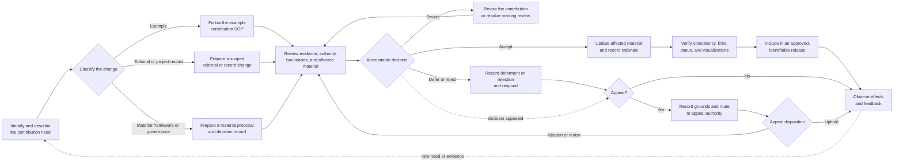

# SOP: Contributing to the AI-Native Operating Framework

**Status:** Approved 
**Accountable owner:** Founding steward or future governing body 
**Process manager:** Framework maintainer 
**Effective date:** 2026-07-30 
**Review triggers:** Framework release, governance change, licensing change,
repeated contribution problem, disputed decision, publication-safety incident,
or evidence that the process discourages useful participation

## Contribution License

By submitting material for inclusion in this repository, a contributor agrees
to license that contribution under the repository's [MIT License](LICENSE.md).
The contributor confirms that they have the right to submit the material under
those terms. No separate contributor license agreement is required.

## Participation

All repository participation is governed by the
[Code of Conduct](CODE_OF_CONDUCT.md). Do not include sensitive information in
an issue, pull request, appeal, review, or supporting evidence. Follow the
[security and sensitive-disclosure policy](SECURITY.md) for credentials,
private information, unsafe publication, or security-sensitive conditions. Use
the private reporting route in the Code of Conduct for conduct concerns.

## 1. Purpose, Scope, and Expected Outcome

This SOP governs how a contribution to the AI-Native Operating Framework is
proposed, prepared, reviewed, decided, incorporated, communicated, and
maintained.

It applies to:

- charter amendments;
- material changes to the operating framework, SOP content standard, shared
  operating memory standard, standards maintenance method, or glossary;
- governance and decision records;
- framework examples;
- editorial corrections;
- and specifications, reviews, research, planning, or historical records.

New examples and material example revisions must also follow the specialized
[example contribution SOP](examples/CONTRIBUTING.md). That SOP governs example
provenance, domain review, publication safety, boundaries, and maintenance. This
SOP governs how the resulting contribution enters the repository and framework
decision process.

The expected outcome is a contribution that:

- addresses a clear need;
- is classified and reviewed according to its effect;
- respects the framework's authority and business boundaries;
- states its evidence, sources, rights, assistance, and limitations honestly;
- receives an accountable and recorded decision;
- updates all affected material consistently when accepted;
- and preserves a response and change history.

Contribution does not itself grant authority, acceptance, publication, or
professional validation.

## Contribution Flow at a Glance

The diagram summarizes the path; the classification, authority, evidence, and
completion requirements below govern the contribution.

## 2. Roles, Responsibilities, and Authority

### Founding Steward or Future Governing Body

The steward or future governing body is accountable for the integrity of the
framework and:

- decides charter amendments and material framework changes;
- accepts or rejects decision records;
- resolves escalated conflicts and material dissent;
- approves release baselines;
- and determines when another authority may decide a class of contribution.

The current founding steward is identified in [Governance](GOVERNANCE.md).

### Framework Maintainer

The framework maintainer manages the contribution process and:

- receives or records proposed contributions;
- confirms classification and required review;
- checks completeness, duplication, boundaries, and affected material;
- coordinates contributor, editorial, domain, control, and governance review;
- makes editorial and project-record decisions within delegated authority;
- routes material decisions to the accountable authority;
- records decisions and responses;
- integrates accepted contributions;
- and monitors contribution feedback and review triggers.

The maintainer cannot approve a change outside delegated authority or waive
rights, safety, professional, or governance requirements they do not own.

### Contributor

The contributor:

- describes the problem and requested outcome;
- classifies the proposed change in good faith;
- supplies evidence, sources, rights, assumptions, and limitations;
- drafts a focused contribution;
- identifies affected documents and downstream consequences;
- discloses material human and AI assistance;
- responds to review findings;
- and does not represent a proposal as accepted before an accountable decision.

### Reviewers

Reviewers assess only the matters within their role or stated expertise.
Depending on the contribution, review may involve:

- framework maintainers and standards authors;
- practitioners affected by the operating meaning;
- domain, policy, legal, privacy, security, safety, licensing, or other control
  authorities;
- editors;
- example maintainers;
- and contributors or readers affected by the change.

Review does not transfer decision authority unless governance explicitly
delegates it.

### Release Maintainer

The release maintainer identifies the approved version, effective date,
material changes, known limitations, responsible steward, and superseded
material. This role may be performed by the framework maintainer.

### AI Participation

AI may assist with research, drafting, comparison, consistency review, link
checking, and other contribution work under the same business controls applied
to other participants. AI does not hold framework authority, grant rights,
supply real-world experience it does not have, or substitute for accountable
domain review.

## 3. Trigger, Prerequisites, Inputs, and Authoritative Sources

### Trigger

This SOP begins when a person or participating AI identifies:

- an error, ambiguity, contradiction, omission, or outdated statement;
- evidence that the framework or contribution process is not working as
  intended;
- a proposed clarification or material change;
- a new example or revision;
- a governance or stewardship need;
- or a project record that should be added, corrected, or preserved.

### Prerequisites

Before substantive drafting, the contributor must be able to state:

- the problem or opportunity;
- the requested outcome;
- the likely contribution class;
- why existing framework material does not already resolve it;
- which documents, examples, decisions, or users may be affected;
- what evidence or operating experience supports it;
- and any known rights, safety, professional, or publication concern.

Exploratory feedback may be recorded before every answer is known. It must not
be advanced as a ready contribution until material unknowns and review needs are
visible.

### Authoritative Sources

Use the current versions of:

- the [charter](framework/charter.md);
- the [operating framework](framework/operating-framework.md);
- the [SOP content standard](framework/sop-content-standard.md);
- the [shared operating memory standard](framework/shared-operating-memory-standard.md);
- the [standards maintenance method](framework/standards-maintenance-method.md);
- the [glossary](framework/glossary.md);
- [Governance](GOVERNANCE.md);
- accepted [framework decision records](decisions/README.md);
- the [example contribution SOP](examples/CONTRIBUTING.md), when applicable;
- and the current [MIT License](LICENSE.md).

Specifications, reviews, research, examples, and historical records may supply
context or evidence. They do not override higher-authority framework material.

## 4. Activities, Decisions, Dependencies, Handoffs, and Outputs

### 1. Record the Need

Describe:

- what is unclear, missing, incorrect, unsafe, outdated, or newly possible;
- who or what is affected;
- the requested outcome;
- available evidence or operating experience;
- known urgency and consequences of delay;
- and the contributor or accountable contact for follow-up.

Feedback becomes a contribution when it contains enough information to review
or has an assigned owner for resolving what is missing.

### 2. Classify the Contribution

Assign one primary class:

| Class | Typical scope | Decision path |
|---|---|---|
| Charter amendment | Mission, founding commitments, stewardship, or amendment rules | Charter amendment under Governance |
| Material framework change | Six concerns, SOP standard, shared operating memory, maintenance method, approved language, scope, accountability, or core boundaries | Decision record and accountable framework decision |
| Governance change | Decision authority, stewardship, contribution, appeal, or release rules | Accountable governance decision |
| Example change | New example or material revision to an example | Example contribution SOP, followed by repository acceptance |
| Editorial change | Spelling, formatting, links, or wording that does not alter meaning | Maintainer decision |
| Project record | Specification, review, research, planning, or history | Maintainer decision; no automatic framework effect |

When classification is uncertain, use the more consequential path until the
accountable authority determines otherwise. A material change must not be
introduced as an editorial correction.

### 3. Check Existing Material and Duplication

Review current framework documents, accepted decisions, open proposals,
examples, and relevant project records.

Then:

- identify whether the issue is already resolved;
- distinguish disagreement from missing documentation;
- identify conflicting or superseded material;
- determine whether another contribution should be amended instead;
- and record useful overlap rather than repeating prior work.

Close a duplicate only after pointing to the controlling material and recording
why it resolves the request.

### 4. Prepare the Contribution Record

Every substantive contribution record states:

- title and contributor;
- date and status;
- problem and requested outcome;
- contribution class;
- proposed change or artifact;
- affected documents and examples;
- evidence, sources, and operating experience;
- alternatives and consequences, when material;
- assumptions, limitations, risks, and unresolved questions;
- source rights, permissions, attribution, and publication constraints;
- disclosed assistance;
- required reviewers and decision authority;
- and expected maintenance or review triggers.

A material framework or governance change also includes a proposed decision
record using [`decisions/TEMPLATE.md`](decisions/TEMPLATE.md).

### 5. Draft the Change

Prepare the smallest complete change that resolves the stated need.

The draft:

- follows the repository authority and structure;
- uses approved framework language;
- keeps business standards independent of technology choices;
- preserves explicit human accountability;
- respects existing business lifecycles;
- avoids imposing a universal SOP layout;
- distinguishes framework requirements from examples and domain choices;
- updates affected links, navigation, definitions, examples, and decisions;
- uses a visual only when it clarifies a meaningful relationship or sequence;
- and states status, provenance, review limits, and uncertainty honestly.

Do not rewrite unrelated material merely because the contribution creates an
opportunity to do so.

### 6. Perform Contributor Review

The contributor checks:

- alignment with the charter and accepted decisions;
- consistency with the six concerns, eight SOP content areas, and six
  maintenance activities;
- consistency with shared operating memory requirements when the contribution
  affects durable sources, context, decisions, state, evidence, handoffs, or
  lessons;
- authority, accountability, controls, evidence, exceptions, and learning;
- internal links, references, and visualizations;
- publication safety, attribution, rights, and assistance disclosure;
- affected examples and project records;
- whether the change disrupts established meaning where relevant;
- and whether the contribution actually resolves its stated problem.

Record unresolved findings rather than hiding them behind polished wording.

### 7. Obtain Required Review

The framework maintainer identifies review proportionate to the contribution.

- Editorial changes require confirmation that meaning is unchanged.
- Project records require accuracy, status, provenance, and placement review.
- Examples require the specialized example reviews.
- Material framework changes require charter, decision, evidence, and
  consequence review.
- Professional or domain claims require review appropriate to the claim.
- Rights, privacy, safety, security, or publication concerns require the
  corresponding accountable authority.

Record who reviewed what, when they reviewed it, findings, limitations, and
resulting changes. AI review must not be represented as human, organizational,
or professional approval.

### 8. Submit and Triage

Use [GitHub Issues](https://github.com/bradgroux/ai-native-operating-framework/issues)
for a proposed change, question, material clarification, or appeal. Use a
[GitHub pull request](https://github.com/bradgroux/ai-native-operating-framework/pulls)
when a prepared repository change is ready for review.

The framework maintainer, currently
[`@BradGroux`](https://github.com/BradGroux), is responsible for acknowledging
receipt. The GitHub issue or pull-request number is the contributor's
confirmation that the item was recorded. If GitHub Issues are unavailable, open
a pull request whose title begins with `Contribution:` or `Appeal:` and include
the same required context in its description.

The repository's current orientation must keep these intake particulars visible
and update them if the repository location, maintainer, receipt method, or
alternate route changes.

The maintainer records receipt and determines whether to:

- accept the item for review;
- request missing information;
- reclassify it with an explanation;
- combine it with related work;
- route it to another responsible authority;
- defer it pending a named dependency;
- or close it as duplicate, unsupported, unsafe, or outside scope.

Triage is not a decision on the merits unless the maintainer holds the required
authority and records the decision.

### 9. Make and Record the Decision

The accountable authority records one outcome:

- **Accept** — the contribution is approved for integration;
- **Accept with conditions** — named conditions must be met before completion or
  release;
- **Return for revision** — correctable findings are identified;
- **Defer** — a named dependency, decision, evidence need, or review remains;
- or **Reject** — the reason and controlling framework basis are recorded.

Material dissent, unresolved risk, conditions, and superseded decisions remain
visible. Rejection or deferral must not erase the contribution record or leave
the contributor without a reason.

### 10. Integrate, Verify, and Release

For an accepted contribution:

1. update the approved document and every materially affected artifact;
2. record the decision rationale and change history;
3. verify terminology, navigation, links, diagrams, status, and boundaries;
4. confirm examples still illustrate rather than amend the framework;
5. identify the exact accepted version;
6. include the change in an approved release when required;
7. communicate the result to the contributor and affected maintainers;
8. and observe use, questions, and feedback for consequences.

If an accepted condition remains incomplete, the contribution is not complete
and must not be represented as released.

### 11. Appeal a Contribution Decision

A contributor or materially affected reviewer may appeal a triage or decision
when they believe:

- the contribution was materially misclassified;
- relevant evidence or an accepted framework requirement was not considered;
- the decision was made outside the stated authority;
- the documented contribution process was not followed;
- or the recorded reason does not support the disposition.

Submit the appeal through the same designated contribution channel and label it
as an appeal. Identify the disputed contribution and decision, the grounds,
supporting evidence, and requested resolution. An appeal does not need to repeat
the entire contribution record.

The framework maintainer records and acknowledges the appeal, preserves the
original decision, and routes it to the founding steward, future governing body,
or delegated appeal authority. When practical, the appeal reviewer should not
be the sole author of the disputed decision.

The appeal authority records one disposition:

- **Uphold** — the original decision and reason remain;
- **Revise** — the disposition, conditions, or rationale changes;
- **Reopen** — the contribution returns to review with named questions;
- or **Defer** — a named authority, evidence need, or dependency remains.

The appeal record identifies the deciding authority, review scope, evidence
considered, reason, date, and resulting action. The contributor and affected
maintainers receive the disposition. An appeal does not suspend safety, rights,
privacy, or other containment and does not authorize an unapproved framework
change.

## 5. Policies, Controls, Approvals, and Risks

- The authority established by the [charter](framework/charter.md), accepted
  [decision records](decisions/README.md), and [Governance](GOVERNANCE.md)
  applies to every contribution.
- Charter amendments and material framework changes require accountable owner
  approval.
- Examples cannot amend the framework.
- Project records cannot amend the framework merely by being added.
- Editorial changes cannot alter responsibility, authority, requirements,
  scope, or meaning.
- Sources, permissions, licensing, attribution, and assistance must be
  represented truthfully.
- Confidential, personal, proprietary, security-sensitive, unsafe, or
  improperly licensed information must not be contributed.
- Professional, operational, or real-world claims must not exceed their
  documented review.
- Publication is separate from acceptance and requires explicit authorization.
- Contributions submitted for inclusion are licensed under the MIT License as
  stated in this SOP's Contribution License section.
- A contribution must not make technology implementation part of the business
  framework.
- Review effort should be proportionate to consequence, reversibility, affected
  authority, and publication risk.

The primary risks are silent changes to framework meaning, unsupported claims,
loss of attribution or dissent, unsafe disclosure, unclear authority,
inconsistent downstream documents, and contributions that are accepted but
never maintained.

## 6. Exceptions, Escalation, Recovery, and Stop Conditions

### Exceptions and Escalation

- **Uncertain classification:** Escalate to the framework maintainer; use the
  more consequential review path until resolved.
- **Conflict with the charter or accepted decision:** Pause integration and
  route a material proposal to the accountable authority.
- **Urgent harmful error:** Mark or contain the affected material promptly,
  then complete the required review and permanent correction.
- **Missing decision authority:** Defer the contribution and name the authority
  that must be established.
- **Conflicting reviewer findings:** Record both positions and escalate to the
  authority accountable for the disputed meaning or risk.
- **Unavailable contributor:** Continue only when the record, rights, evidence,
  and requested outcome are sufficient; otherwise defer.
- **Unresolved rights or publication safety:** Stop use of the disputed
  material and seek the responsible rights, privacy, safety, or legal authority.
- **Material dissent after acceptance:** Preserve the dissent with the decision
  and allow appeal under Governance.

### Stop Conditions

Stop acceptance, integration, or release when:

- the responsible authority has not approved a material change;
- the contribution would conflict with the charter without an approved
  amendment;
- source rights, licensing, attribution, or permission remain unresolved;
- confidential, personal, unsafe, or security-sensitive information may remain;
- provenance, evidence, assistance, or review is materially misrepresented;
- professional claims exceed available review;
- required acceptance conditions remain incomplete;
- or the affected documents cannot be made internally consistent.

### Recovery

When an accepted contribution is later found materially wrong, unsafe, or
unsupported:

1. contain the problem by marking, correcting, or withdrawing affected
   material;
2. restore the last approved trustworthy state when appropriate;
3. notify the accountable owner, contributor, maintainers, and affected
   reviewers;
4. preserve the incident, decision, and recovery evidence;
5. assess related documents and examples;
6. repeat proportionate review and approval;
7. and feed the lesson into this SOP, Governance, or the framework.

## 7. Completion, Verification, and Required Evidence

A contribution is complete only when:

- its need, class, contributor, and requested outcome are recorded;
- required evidence, sources, rights, assistance, assumptions, and limitations
  are visible;
- required reviews are complete and bounded;
- the accountable authority has recorded a decision;
- accepted conditions are complete;
- all affected documents and examples are consistent;
- internal links and visualizations work;
- `scripts/validate-repository.sh` passes, or any unavailable check and its
  consequence are explicitly recorded;
- status, change history, and release information are accurate;
- the contributor and affected maintainers receive the disposition;
- and the accepted or retained version can be identified.

Retain proportionate evidence of:

- the submitted contribution and later revisions;
- triage and classification;
- sources, permissions, licensing, attribution, and assistance;
- review scope, reviewers, findings, and responses;
- alternatives, dissent, accepted risks, and conditions;
- the accountable decision and rationale;
- verification results;
- the integrated and released version, when applicable;
- contributor communication;
- any appeal, its authority, and recorded disposition;
- and later correction, supersession, withdrawal, or restoration.

File presence or publication alone does not prove that a contribution was
reviewed, accepted, or completed.

## 8. Review Ownership, Review Triggers, and Change History

The framework maintainer owns this SOP operationally. The founding steward or
future governing body approves material changes to contribution authority,
acceptance, appeals, licensing, or release requirements.

Review this SOP when:

- a framework release materially changes scope or governance;
- a contributor cannot determine how to participate;
- similar contributions receive inconsistent treatment;
- review or decision authority repeatedly becomes unclear;
- a contribution exposes a rights, safety, privacy, provenance, or professional
  review failure;
- useful contributions repeatedly stall or disappear without disposition;
- accepted changes create unanticipated downstream inconsistency;
- licensing or publication terms change;
- or community participation materially expands.

Review outcomes, turnaround problems, appeals, contributor feedback, rejected
or deferred patterns, release corrections, and observed use. Revise and
reapprove this SOP when the evidence warrants it.

| Version | Date | Status | Change | Approved by |
|---|---|---|---|---|
| Initial draft | 2026-07-30 | Draft | Framework-wide contribution SOP | Pending |
| Initial framework baseline | 2026-07-30 | Approved | Added the appeal path, GitHub intake and receipt routes, and MIT contribution terms | Founding steward |
| Version 1.0.0 memory extension | 2026-07-30 | Approved | Added shared operating memory to authoritative sources and contribution review | Founding steward |
| Version 1.0.0 release hardening | 2026-07-30 | Approved | Added repeatable validation and sensitive-disclosure controls under the release-hardening decision | Founding steward |

## Related Documents

- [Charter](framework/charter.md)
- [Operating framework](framework/operating-framework.md)
- [SOP content standard](framework/sop-content-standard.md)
- [Shared operating memory standard](framework/shared-operating-memory-standard.md)
- [Standards maintenance method](framework/standards-maintenance-method.md)
- [Governance](GOVERNANCE.md)
- [Framework decision records](decisions/README.md)
- [Example contribution SOP](examples/CONTRIBUTING.md)
- [Project records](project/README.md)
- [MIT License](LICENSE.md)
