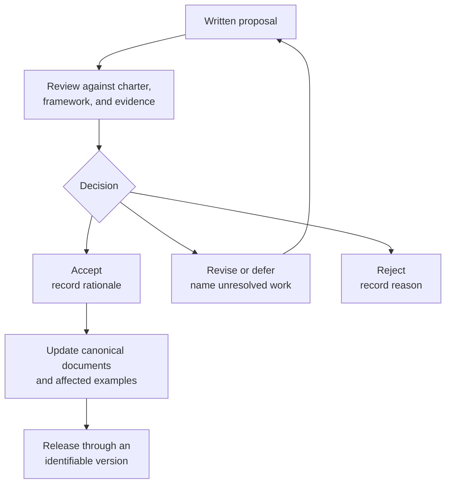
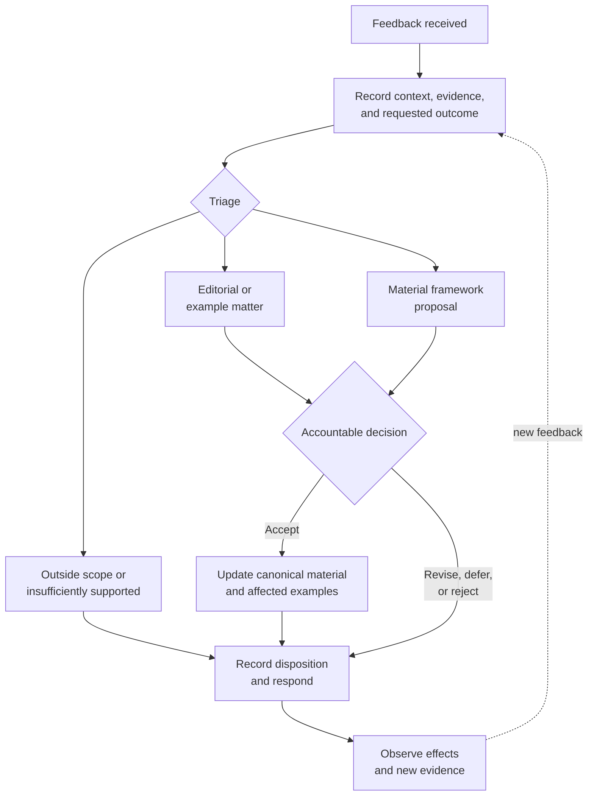

# Governance

**Status:** Approved initial repository governance 
**Founding steward:** Brad Groux 
**Last reviewed:** 2026-09-05

## Purpose

This document governs how the AI-Native Operating Framework is maintained
without allowing examples, implementations, teaching, commercial work, or
technology choices to redefine it implicitly.

The [charter](framework/charter.md) is the highest-authority framework document.
Accepted [decision records](decisions/README.md) explain material interpretations
and changes. Canonical framework language lives under
[`framework/`](framework/README.md).

The [framework contribution SOP](CONTRIBUTING.md) governs how proposed changes
are prepared, reviewed, decided, incorporated, and maintained.

## Current Stewardship

Brad Groux is the creator and founding steward. Until a broader governing body
is established, the founding steward:

- approves material framework changes;
- protects the charter and framework boundaries;
- accepts or rejects decision records;
- approves release baselines;
- appoints or confirms maintainers;
- records dissent and unresolved risk; and
- determines when governance should expand.

The framework is developed through
[Digital Meld](https://digitalmeld.io)'s research arm, alongside the related
[AI Dev Days](https://github.com/bradgroux/ai-dev-days) research and education
initiative. These affiliations do not grant either organization decision
authority outside this governance process.

Stewardship does not create professional authority over the domains represented
by framework examples.

## Open Framework Commons Adoption

The AI-Native Operating Framework adopts
[Open Framework Commons](https://github.com/BradGroux/open-framework-commons)
[`v2026.09.05`](https://github.com/BradGroux/open-framework-commons/tree/v2026.09.05),
release commit
[8868a248457dd7b663563beb243c5ebcbb8ac360](https://github.com/BradGroux/open-framework-commons/commit/8868a248457dd7b663563beb243c5ebcbb8ac360).
Commons is shared ecosystem context, not a parent framework, certification,
implementation layer, or governing authority over this framework.

The original accountable adoption is recorded in
[ADR-008](decisions/0008-adopt-open-framework-commons-v1-0-0.md). The corrected
release pin and release-integrity exception are recorded in
[ADR-009](decisions/0009-correct-open-framework-commons-v1-0-0-release-pin.md).
The historical v1.1.0 adoption remains in
[ADR-012](decisions/0012-adopt-open-framework-commons-v1-1-0.md). Current adoption
is recorded in [ADR-013](decisions/0013-calendar-editions-and-commons-adoption.md).

| Disposition | AI-Native alignment |
|---|---|
| Adopted shared principles | All nine Commons principles are adopted: people first; own the method and rent the tool; play the long game; contribute before extracting; steward what matters; keep products independent; build in the open; learn honestly; and use technology as an amplifier. |
| Product-local guidance | The charter, six concerns, eight SOP content areas, shared operating memory standard, six maintenance activities, terminology, examples, research, contribution process, governance, roadmap, releases, and implementation choices remain owned here. |
| Deferred shared principles | None for Commons `v2026.09.05`. |
| Explicit deviations | None for Commons `v2026.09.05`. |

The people-first principle means that people supply business purpose, judgment,
and accountability. It does not narrow this framework's approved meaning of
AI-native work: people and AI may both perform work under the same standards,
with explicit accountable human ownership. The contribute-before-extracting
principle is an ecosystem value, not an additional contribution prerequisite,
commercial restriction, business concern, SOP content requirement, or method
activity.

Commons v1.1.0 recognizes Focus Operating Framework as a fifth independent
product. AI-Native accepts that scope addition as ecosystem context. It does not
change this framework's purpose, method, requirements, authority, or release
ownership, and it does not create a dependency on Focus.

The Commons `v1.0.0` tag movement and AI-Native's one-time correction remain
visible in ADR-009 as historical release-integrity evidence. Commons v1.1.0 uses
a new immutable annotated tag. If a later Commons revision appears to conflict
with this framework, the conflict must remain visible until the responsible
authority decides whether to adopt, defer, or deviate. A Commons change never
amends this framework automatically.

## Decision Flow

```mermaid
flowchart TB
    P["Written proposal"]
    R["Review against charter,<br/>framework, and evidence"]
    D{"Decision"}
    A["Accept<br/>record rationale"]
    V["Revise or defer<br/>name unresolved work"]
    X["Reject<br/>record reason"]
    U["Update canonical documents<br/>and affected examples"]
    L["Release through an<br/>identifiable version"]

    P --> R --> D
    D --> A --> U --> L
    D --> V --> P
    D --> X
```

No document changes framework meaning merely by being published. A material
change requires an explicit decision and corresponding update to the canonical
documents.

## Decision Classes

### Charter Amendment

A charter amendment follows the amendment requirements in the
[charter](framework/charter.md). It requires a written proposal, review against
the mission and commitments, an accountable decision, disclosure of material
dissent, an effective date, and change history.

### Material Framework Decision

A material decision changes or interprets:

- the six business concerns;
- the SOP content standard;
- the shared operating memory standard;
- the standards maintenance method;
- approved framework language;
- framework scope or non-goals;
- accountability or authority expectations; or
- the relationship between framework core and examples.

It requires a decision record under [`decisions/`](decisions/README.md).

### Governance Change

A material change to stewardship, decision authority, contribution, conflict or
appeal handling, release approval, or governance review requires a written
decision by the founding steward or future governing body. The decision records
the reason, affected responsibilities, effective date, transition conditions,
and material dissent.

### Example Decision

Examples follow [`examples/CONTRIBUTING.md`](examples/CONTRIBUTING.md). The
framework maintainer may accept an example only as an illustration. Domain
review affects the example's stated review status; it does not amend the
framework.

### Editorial Decision

A maintainer may accept non-material corrections without a decision record.
When the effect on meaning is uncertain, use the material decision path.

## Review Participation

Review should involve the people needed for the consequence of the change:

- accountable framework ownership;
- affected standards authors and maintainers;
- practitioners who understand the represented work;
- domain or control authorities for professional claims;
- and contributors or readers affected by compatibility or clarity changes.

AI may assist with drafting, comparison, link checking, and review. It does not
hold governance authority or substitute for domain expertise.

## Community Feedback Loop

```mermaid
flowchart TB
    F["Feedback received"]
    T["Record context, evidence,<br/>and requested outcome"]
    C{"Triage"}
    E["Editorial or<br/>example matter"]
    P["Material framework<br/>proposal"]
    X["Outside scope or<br/>insufficiently supported"]
    D{"Accountable decision"}
    U["Update canonical material<br/>and affected examples"]
    R["Record disposition<br/>and respond"]
    O["Observe effects<br/>and new evidence"]

    F --> T --> C
    C --> E --> D
    C --> P --> D
    C --> X --> R
    D -- "Accept" --> U --> R
    D -- "Revise, defer,<br/>or reject" --> R
    R --> O
    O -. "new feedback" .-> T
```

Feedback may arrive through any channel designated by the steward, but it
enters framework governance only when its context, evidence, and requested
outcome are recorded. Every reviewed item receives a recorded disposition.
Accepted changes follow the appropriate decision class, return through an
identifiable release, and are observed for their effects. Rejection or deferral
also records the reason so the same question is not repeatedly rediscovered.

## Releases and Versions

An approved release identifies:

- the exact repository version;
- effective date;
- material changes;
- known limitations and review status;
- superseded versions;
- and the responsible steward.

Draft work must remain visibly distinct from an approved release. Publication
requires explicit authorization. Repository content and submitted contributions
are licensed under the [MIT License](LICENSE.md).

Before release, verify local links and headings, canonical framework invariants,
example coverage, diagrams, release metadata, publication safety, and secret
scanning through the repository's repeatable validation gate. Record any
unavailable check and its consequence rather than representing it as passed.

New editions use `YYYY.MM.DD` based on actual UTC publication date, with
annotated immutable tags `vYYYY.MM.DD`. Additional same-day editions use `.1`,
`.2`, and so on in numeric order. Compare calendar editions chronologically by
date and then numeric suffix, not as semantic versions or plain strings.
The first calendar edition follows 1.1.0. No dated aliases are added to history.

The date identifies content, not compatibility. Release notes separately state
changed reader decisions, permissions, responsibilities, authority, obligations,
and migration consequences. Narrowing an ambiguous permission can be substantive;
a small diff is not necessarily editorial. A compatible addition preserves
existing choices; new obligations or authority changes may be incompatible.
Adopters assess that meaning before replacing their chosen edition.

[ADR-013](decisions/0013-calendar-editions-and-commons-adoption.md) prospectively
supersedes only ADR-011's semantic numbering rule. Its forward-only immutability
remains. ADR-009, ADR-010, ADR-011 and historical releases retain their original
claims and identities. Follow the [executable release procedure](project/RELEASING.md).

The version 1.0.0 transition is recorded in the approved
[prepublication release-hardening decision](project/planning/prepublication-release-hardening-decision-2026-07-30.md).

The current intake destination, responsible maintainer, receipt method, and
alternate route are maintained in the
[framework contribution SOP](CONTRIBUTING.md) and surfaced in the repository
[README](README.md).

### Prepared Release Baseline

The current approved release baseline is:

- **Version:** 2026.09.05
- **Effective date:** 2026-09-05
- **Repository version:** annotated tag `v2026.09.05`
- **Material changes:** recorded in the [changelog](CHANGELOG.md)
- **Release record:** [edition 2026.09.05](project/releases/v2026.09.05.md)
- **Known limitations:** all examples are illustrative and not
  domain-validated; two source-bounded independent AI reviews of the shared
  operating memory extension are complete, but the standard has not received
  human records, privacy, security, legal, knowledge-management, or
  business-continuity review; organizational use and broader governance have
  not been exercised
- **Superseded public version:** 1.1.0, retained as an immutable historical
  release
- **Responsible steward:** Brad Groux
- **Publication destination:**
  [`github.com/bradgroux/ai-native-operating-framework`](https://github.com/bradgroux/ai-native-operating-framework)

## Commons interpretation and human boundaries

The adopted nine principles are chosen commitments, not empirical guarantees.
Contribution earns no entitlement to participation, access or reciprocity;
legitimate help and accommodation need not be earned. Continuity permits
responsible stopping and does not override consent. Openness authorizes no
private disclosure: use an authorized safe summary or withhold the material.
These shared boundaries do not replace local professional or business authority.

For a conflict, identify the adopted Commons tag and commit, both statements,
and the disputed action or representation. Pause that action while unrelated
authorized work continues. Record safe evidence, uncertainty, accountable owner,
and a reasoned decision through this repository's process. The product steward
decides local method; Commons' steward decides Commons meaning. Neither role
automatically supplies the other's authority. Resolve by correction, narrowed
scope, stopping, explicit deviation, deferral, or a separately proposed Commons
change. A deferral names a review time or concrete trigger; silence is not approval.
An adoption with exceptions must say so and name affected guidance and rationale.

Material local decisions distinguish chosen values, interpretations and claims
about effects; identify support, limits, counterexamples, changed reader choices,
and reconsideration triggers in the existing decision record. This does not
import Commons' all-product review process or require a research dossier for
editorial corrections. Fictional scenarios do not establish practical effectiveness.

## Conflicts and Appeals

Conflicting interpretations are recorded and escalated to the founding steward
or future governing body. Material dissent should remain visible with the
decision rather than being removed from history.

An appeal follows the [framework contribution SOP](CONTRIBUTING.md). It
identifies the disputed contribution and decision, grounds, evidence, and
requested resolution. The appeal and original decision remain visible together.

Appeals of maintainer decisions go to the founding steward or future governing
body. When the founding steward made the disputed decision and no broader
governing body exists, the steward conducts a documented reconsideration with
an uninvolved reviewer when practical and records that governance limitation.
The appeal disposition identifies the authority, reasoning, date, and resulting
action and is communicated to the contributor and affected maintainers.

## Governance Review

Review this document when:

- participation materially expands;
- maintainers or decision authorities change;
- repeated contribution or appeal problems occur;
- a release exposes unclear authority;
- licensing or publication changes;
- or the founding steward proposes a broader governing body.
