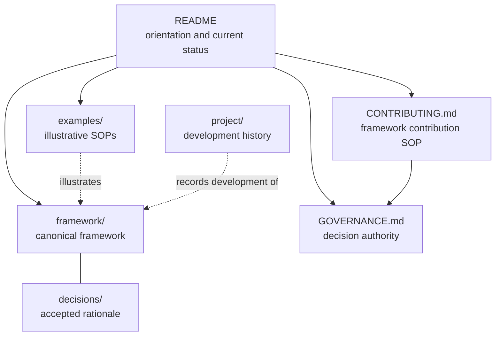

# AI-Native Operating Framework

An open business operating framework and method for defining, documenting,
applying, and improving the standards and procedures through which people and AI
perform work.

The framework is about business operations. It does not prescribe software,
schemas, protocols, agent harnesses, a universal business lifecycle, or a
machine-specific representation.

## Research and Stewardship

The AI-Native Operating Framework is developed as part of
[Digital Meld](https://digitalmeld.io)'s research arm.
[AI Dev Days](https://github.com/bradgroux/ai-dev-days) is a related research
and education initiative within the same research arm.

These relationships provide research, application, teaching, and learning
context. Neither Digital Meld nor AI Dev Days may redefine the framework
outside its documented contribution and governance processes.

## Open Framework Commons

The current repository adopts
[Open Framework Commons](https://github.com/BradGroux/open-framework-commons)
[`v1.0.0`](https://github.com/BradGroux/open-framework-commons/tree/v1.0.0),
release commit
[27870fb1d57d951b9ef5a3a86f33ef0&#54;8ee557da](https://github.com/BradGroux/open-framework-commons/commit/27870fb1d57d951b9ef5a3a86f33ef0%368ee557da),
as shared ecosystem context.

Commons supplies shared principles and boundaries; it is not a parent
framework or source of automatic requirements. The AI-Native Operating
Framework remains independent and owns its charter, business method,
terminology, examples, research, governance, roadmap, and releases. The exact
alignment and authority boundary are recorded in [Governance](GOVERNANCE.md).

## Start Here

Read the canonical framework in this order:

1. [Charter](framework/charter.md)
2. [Operating framework](framework/operating-framework.md)
3. [SOP content standard](framework/sop-content-standard.md)
4. [Shared operating memory standard](framework/shared-operating-memory-standard.md)
5. [Standards maintenance method](framework/standards-maintenance-method.md)
6. [Glossary](framework/glossary.md)

Then use:

- [Framework examples](examples/README.md) to see the framework applied across
  eleven business processes and operating patterns;
- [Framework contribution SOP](CONTRIBUTING.md) to propose, review, and decide
  any repository or framework change;
- [Example contribution SOP](examples/CONTRIBUTING.md) to add or revise an
  example;
- [Governance](GOVERNANCE.md) to understand stewardship and decisions;
- [Code of Conduct](CODE_OF_CONDUCT.md) to understand participation
  expectations;
- [Security and sensitive-disclosure policy](SECURITY.md) before reporting
  private, credential, or security-sensitive information; and
- [Decision records](decisions/README.md) to understand why the framework has
  its current shape.

## Repository Map

The solid reading path leads to current material. Dotted relationships identify
supporting explanation or history rather than additional framework
requirements.

## Repository Hierarchy

| Path | Purpose | Authority |
|---|---|---|
| `framework/` | Charter, operating framework, standards, method, and glossary | Canonical framework |
| `examples/` | Complete illustrative SOPs, structural companions, and the example contribution SOP | Explanatory; cannot amend the framework |
| `decisions/` | Accepted framework and language decisions | Rationale governing framework changes |
| `project/` | Specifications, reviews, planning records, research, and history | Development record; not framework content |
| `CONTRIBUTING.md` | Repository-wide contribution SOP | Contribution process |
| `GOVERNANCE.md` | Stewardship, decision, amendment, and release process | Repository governance |
| `CODE_OF_CONDUCT.md` | Community participation and enforcement expectations | Community standard |
| `SECURITY.md` | Private reporting and containment of sensitive disclosures | Repository safeguard |
| `CITATION.cff` | Citation metadata for the release | Release metadata |
| `scripts/validate-repository.sh` | Repeatable documentation, invariant, diagram, metadata, and publication-safety checks | Repository verification |

## Current Status

Version 1.0.0 is the complete, owner-approved initial release, dated
2026-07-30.

- [Stage 2 specification](project/specifications/stage-2.md)
- [Stage 2 completion report](project/reviews/stage-2-completion-review-2026-07-30.md)
- [Independent framework application test](project/reviews/independent-framework-application-test-2026-07-30.md)
- [Independent test disposition](project/reviews/independent-framework-application-test-disposition-2026-07-30.md)
- [Independent post-fix review](project/reviews/independent-framework-post-fix-review-2026-07-30.md)
- [Independent post-fix review disposition](project/reviews/independent-framework-post-fix-review-disposition-2026-07-30.md)
- [Shared operating memory extension specification](project/specifications/shared-operating-memory-extension.md)
- [Shared operating memory extension review](project/reviews/shared-operating-memory-extension-review-2026-07-30.md)
- [Shared operating memory independent review prompt](project/reviews/shared-operating-memory-independent-review-prompt-2026-07-30.md)
- [Independent memory application review](project/reviews/shared-operating-memory-independent-application-review-2026-07-30.md)
- [Independent memory adversarial review](project/reviews/shared-operating-memory-independent-adversarial-review-2026-07-30.md)
- [Independent memory reviews disposition](project/reviews/shared-operating-memory-independent-reviews-disposition-2026-07-30.md)
- [Current project status](project/planning/status.md)

All eleven examples are approved for inclusion as **Illustrative; not
domain-validated**. They must not be used operationally without appropriate
organizational authority and domain review.

The shared operating memory extension received two source-bounded independent
AI-assisted reviews: one application review and one adversarial review. Neither
found a blocker, material finding, or editorial finding. These reports are AI
review evidence, not human, organizational, professional, or domain validation.

The framework is available under the [MIT License](LICENSE.md). Its designated
public home is
[github.com/bradgroux/ai-native-operating-framework](https://github.com/bradgroux/ai-native-operating-framework).
Formal citation metadata is provided in [`CITATION.cff`](CITATION.cff).

Run [`scripts/validate-repository.sh`](scripts/validate-repository.sh) before
submitting or releasing a change. The same gate runs automatically for pull
requests and changes to `main`.

Use [GitHub Issues](https://github.com/bradgroux/ai-native-operating-framework/issues)
for proposals, questions, and appeals. Use
[pull requests](https://github.com/bradgroux/ai-native-operating-framework/pulls)
for prepared changes. The complete intake and review process is defined in the
[framework contribution SOP](CONTRIBUTING.md).

## Core Commitments

- Business purpose and accountability come before technology.
- People and AI use the same approved business standards and SOPs.
- Human accountability remains explicit.
- The framework applies to existing business lifecycles.
- SOP meaning matters more than template conformity.
- Controls, evidence, exceptions, recovery, and improvement are part of the
  work.
- Material operating knowledge survives individual sessions and handoffs under
  accountable controls.
- Examples explain the framework without redefining it.
- One clear body of documentation serves people and machines together.

## Development Records

Planning and review artifacts are preserved under [`project/`](project/README.md)
so contributors can inspect how decisions were reached without confusing those
records with the framework itself.
