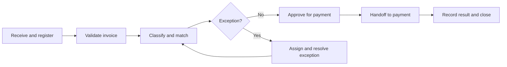

# Example 01: Accounts-Payable Invoice Processing

## Example Record

**Provenance:** Generalized — synthesized from common invoice-processing
patterns without representing a specific organization. 
**Review status:** Illustrative; not domain-validated. 
**Draft contributor:** Framework drafting assistant, under Brad Groux's direction. 
**Responsible maintainer:** Framework maintainer. 
**Publication-safety note:** No real organization, supplier, employee,
transaction, account, or payment information is represented. 
**Review triggers:** Material framework change, review by an accounts-payable or
financial-control practitioner, control failure discovered in the example, or
change to the scenario assumptions.

## Scenario Overview

A mid-sized organization purchases goods and services from approved suppliers.
Most purchases require an approved purchase order. Accounts Payable (AP)
receives invoices, validates them against purchasing and receipt records,
resolves exceptions, obtains required approvals, and releases approved items to
the payment process.

The fictional organization uses these illustrative rules:

- purchases require an approved purchase order unless the expense appears on
  an approved exception list;
- purchase-order invoices require a three-way match among the purchase order,
  receiving record, and invoice;
- differences within the lesser of one percent or 25 currency units may be
  accepted by an AP reviewer when quantity, tax, supplier identity, and bank
  details are otherwise valid;
- higher differences require the budget owner's approval and, when needed, a
  purchasing correction;
- supplier-master changes are handled outside this procedure and independently
  verified; and
- invoice approval, supplier-master maintenance, and payment release are
  separated where staffing permits.

These thresholds and role assignments exist only to make the example concrete.

## Procedure at a Glance

---

# SOP: Process Supplier Invoices

**Accountable owner:** Controller 
**Process manager:** Accounts-Payable Manager 
**Approval status:** Approved for inclusion as illustrative; not approved for operational use 
**Review cycle:** Annually and upon a listed review trigger

## 1. Purpose, Scope, and Expected Outcome

This SOP ensures that valid supplier invoices are recorded accurately,
approved under the organization's authority rules, paid no more than once, and
supported by evidence sufficient for reconciliation and audit.

It covers invoices from receipt through approval for payment, including
purchase-order invoices, approved non-purchase-order invoices, credits,
duplicates, disputes, and other exceptions.

It does not cover:

- supplier selection or onboarding;
- supplier-master or bank-detail changes;
- purchase-order creation;
- cash forecasting;
- execution of the payment after an approved item enters the payment process;
  or
- tax, accounting, or records-retention requirements not adopted by the
  organization.

The expected outcome is an invoice record with a valid disposition: approved
for payment, returned for correction, placed in a documented hold, rejected, or
recognized as a credit or duplicate.

## 2. Roles, Responsibilities, and Authority

| Role | Responsibility and authority |
|---|---|
| Controller | Accountable for the process, financial-control design, material exceptions, and approval of changes to this SOP. |
| AP Manager | Oversees daily work, assigns exceptions, approves holds and reprocessing, monitors performance, and escalates control concerns. |
| AP Processor | Receives, registers, validates, matches, routes, and records invoices; cannot approve their own purchases or independently change supplier-master data. |
| Requestor or Receiver | Confirms that goods or services were received as ordered and explains receipt discrepancies. |
| Budget Owner | Confirms business purpose, coding, available authority, and acceptance of permitted non-purchase-order expenses or out-of-tolerance differences. |
| Purchasing | Resolves purchase-order price, quantity, supplier, and commercial-term discrepancies. |
| Supplier-Master Custodian | Maintains supplier identity and payment instructions under a separate controlled procedure. |
| Payment Releaser | Executes the separate payment process using only approved invoice records. |
| Internal Control or Audit | May inspect records and test control operation; does not perform routine invoice approval. |

AI may assist with transcription, duplicate suggestions, matching, coding
suggestions, or anomaly detection. The AP Processor remains responsible for
reviewing the invoice record, and only authorized people may approve exceptions
or payment.

No participant may split, recode, or otherwise alter an invoice to avoid an
approval threshold.

## 3. Trigger, Prerequisites, Inputs, and Authoritative Sources

The procedure begins when AP receives an invoice or credit memo through an
approved intake route.

Required inputs are:

- a readable invoice bearing the supplier's legal or approved trading identity;
- invoice number and date;
- purchase-order reference when required;
- description, quantity, price, tax, currency, and total;
- payment terms;
- evidence of receipt or service acceptance;
- business-purpose and coding information for permitted non-purchase-order
  invoices; and
- the supplier record needed to verify identity and approved payment details.

Authoritative sources are:

1. the approved supplier record for identity and payment instructions;
2. the approved purchase order for authorized items, prices, terms, and limits;
3. the receiving or service-acceptance record for fulfillment;
4. the invoice for the supplier's payment claim;
5. the delegation-of-authority and non-purchase-order exception policies for
   approval requirements; and
6. the accounting policy for coding, tax treatment, period, and retention.

An invoice image is never authoritative for a change to supplier bank details.
Conflicting or missing records cause an exception; they must not be silently
reconciled through assumption.

## 4. Procedure

### A. Register the Invoice

1. Record the invoice in the invoice register with a receipt date, supplier,
   invoice number, invoice date, amount, currency, and intake reference.
2. Preserve the original received document.
3. Check whether the same supplier, invoice number, amount, date, purchase
   order, or document image may already exist.
4. Mark suspected duplicates as held before further processing.
5. If the document requests new payment instructions, route that request to the
   supplier-master procedure and retain the invoice on hold.

The invoice register is the authoritative work-state record. A processor
resuming interrupted work uses its status, assigned owner, exception reason,
and latest action.

### B. Confirm Minimum Validity

The AP Processor confirms that:

- the supplier is approved and active;
- the invoice identifies the supplying entity;
- required invoice fields are readable;
- totals and line calculations are internally consistent;
- the currency and payment terms agree with the governing purchase record;
- the invoice is addressed to the organization;
- the claimed goods or services are within scope of an approved purchase or
  permitted exception; and
- the invoice does not contain an unexplained alteration.

Invalid or incomplete invoices are returned to the supplier or requestor with a
specific reason and recorded disposition.

### C. Classify and Match

For a purchase-order invoice:

1. Match supplier identity, line items, quantity, price, currency, tax, and
   terms to the purchase order.
2. Match invoiced quantity or milestone to the receiving or service-acceptance
   record.
3. Confirm that prior invoices have not exhausted the purchase-order value or
   quantity.
4. Determine whether each difference is within the stated tolerance.

For a permitted non-purchase-order invoice:

1. Confirm that the expense type appears on the approved exception list.
2. Obtain documented business purpose and accounting treatment.
3. Route the invoice to the budget owner and any additional authority required
   by the delegation matrix.

For a credit memo:

1. Link it to the original invoice, return, dispute, or supplier agreement.
2. Determine whether it offsets an unpaid invoice or creates a recoverable
   balance.
3. Record the approved accounting disposition.

### D. Resolve Exceptions

Assign each exception to a named owner and record the reason, required action,
date, and next review point.

- Receipt or service-acceptance differences go to the requestor or receiver.
- Purchase-order price, quantity, or term differences go to Purchasing.
- Coding, business-purpose, or authority gaps go to the budget owner.
- Supplier identity or payment-detail concerns go to the Supplier-Master
  Custodian and AP Manager.
- Tax or accounting-treatment questions go to the Controller or delegated
  accounting authority.
- Suspected fraud, altered documents, collusion, or deliberate threshold
  avoidance goes immediately to the Controller and the organization's fraud or
  ethics authority.

The AP Processor may accept only a difference within the illustrative
tolerance, and must record the calculation and reason. All other differences
require correction or documented approval from the responsible authority.

### E. Approve and Release to Payment

Before approval, the AP Processor confirms that:

- validation and matching are complete;
- all exceptions are resolved by authorized roles;
- required approvals are present and attributable;
- the final amount, currency, due date, coding, and supplier record agree;
- the item is not a duplicate or subject to a hold; and
- the evidence package is attached or referenced.

The AP Processor changes the record to **Ready for payment**. The Payment
Releaser accepts only records with that status and performs the separate payment
procedure.

The handoff includes invoice identity, approved amount and currency, approved
supplier record, due date, payment terms, accounting treatment, approvals,
hold status, and evidence references.

### F. Close the Invoice Record

After the payment process returns a result, AP links the payment or rejection
reference to the invoice. An invoice is closed only after its approved
disposition and downstream result are recorded.

## 5. Policies, Controls, Approvals, and Risks

Required controls are:

- duplicate screening before approval and again before payment;
- three-way match for purchase-order invoices;
- documented approval under the delegation-of-authority policy;
- independent handling and verification of supplier-master changes;
- separation among invoice preparation, exception approval, supplier-master
  maintenance, and payment release where practicable;
- restricted use of overrides, with reason and approver recorded;
- period and accounting review for material or unusual items; and
- retained linkage among invoice, purchase, receipt, approval, and payment.

Key risks include duplicate or fraudulent payment, payment to an altered
account, unauthorized purchase, incorrect quantity or price, tax or coding
error, missed discount, late payment, concealment through threshold splitting,
and loss of supporting evidence.

The Controller approves material control overrides. An override cannot be used
to bypass unresolved supplier identity, bank-detail, fraud, or legal concerns.

## 6. Exceptions, Escalation, Recovery, and Stop Conditions

- **Duplicate suspected:** Hold both records, compare originals and history,
  reject or merge the duplicate reference, and retain the decision.
- **Supplier cannot be verified:** Stop processing and escalate to the AP
  Manager and Supplier-Master Custodian.
- **Changed bank details:** Do not use invoice-provided details. Keep the
  invoice on hold until the separate change procedure completes.
- **Missing receipt:** Request confirmation from the responsible receiver. A
  budget owner may approve only when policy expressly permits an alternative
  acceptance record.
- **Disputed goods or services:** Place the invoice on hold and record the
  commercial owner, dispute basis, supplier communication, and next review.
- **Approval unavailable:** Follow the approved delegation path; do not accept
  informal substitution.
- **Payment date at risk:** Escalate the timing risk without weakening controls.
- **Partial or failed recording:** Preserve the invoice and intake reference,
  identify the last confirmed state, reverse any incomplete posting when
  authorized, and resume from the register.

Stop work and notify the AP Manager when there is a credible fraud indicator,
unresolved identity or payment-detail conflict, prohibited expense, missing
required authority, or record-integrity failure.

## 7. Completion, Verification, and Evidence

The invoice process is complete when:

- the invoice has an authorized disposition;
- the recorded supplier, amount, currency, terms, coding, and tax treatment are
  complete;
- matches, exceptions, and approvals are resolved and recorded;
- the payment-process result or nonpayment disposition is linked;
- any credit or remaining balance is accounted for; and
- required records are retained under policy.

The AP Processor performs the completion check. The AP Manager reviews
high-risk exceptions, overrides, aged holds, and sampled completed records.
Finance reconciliation verifies that invoice and payment records agree with the
financial ledger and bank activity.

Retained evidence includes the original invoice, purchase order, receipt or
acceptance, match result, exception correspondence, approvals, coding, hold
history, supplier-record reference, payment or rejection result, and correction
history.

## 8. Review, Approval, and Change History

The Controller owns this SOP. The AP Manager gathers practitioner feedback and
control evidence.

Review occurs annually and sooner after:

- a duplicate, fraudulent, unauthorized, or misdirected payment;
- repeated match exceptions or aged holds;
- a change in purchasing, accounting, tax, authority, or retention policy;
- a change in responsibilities or separation of duties;
- an audit finding; or
- evidence that the procedure no longer supports accurate, timely payment.

Material revisions require Controller approval and communication to AP,
Purchasing, budget owners, supplier-master custodians, and payment releasers.

| Version | Status | Change | Approved by |
|---|---|---|---|
| Example draft | Illustrative | Initial fictionalized procedure | Pending domain review |

---

## Framework Annotation

| Concern | How the example expresses it |
|---|---|
| Intent | The SOP ties invoice activity to the business outcomes of valid, accurate, authorized, non-duplicate payment and auditable records. |
| Responsibility | It names accountable ownership, operational roles, approval authority, separation of duties, and limits on AI assistance. |
| Work | It defines intake, validation, classification, matching, exception resolution, payment handoff, closure, authoritative state, and resumability. |
| Control | It makes authority, matching, duplicate prevention, supplier-detail verification, holds, overrides, fraud escalation, and stop conditions part of the work. |
| Assurance | It defines completion, reconciliation, management review, and the evidence needed to support the payment decision. |
| Learning | It assigns maintenance ownership and connects incidents, aging, audits, policy changes, and practitioner feedback to revision. |

The annotation explains the example; it does not add framework requirements.

## Domain-Specific Boundary

The three-way match, tolerance, illustrative authority model, financial roles,
supplier-master separation, and evidence listed here are choices for this
accounts-payable scenario. The framework requires clear intent,
responsibility, work, control, assurance, and learning—not these particular
thresholds, roles, controls, or accounting practices.

This example is not accounting, tax, fraud, audit, or legal advice. An
organization must replace the fictional assumptions with its own policies,
authority matrix, regulatory requirements, systems of record, risk assessment,
and qualified financial-control review before operational use.

## Related Framework Documents

- [Framework examples](README.md)
- [Operating framework](../framework/operating-framework.md)
- [SOP content standard](../framework/sop-content-standard.md)
- [Shared operating memory standard](../framework/shared-operating-memory-standard.md)
- [Standards maintenance method](../framework/standards-maintenance-method.md)
