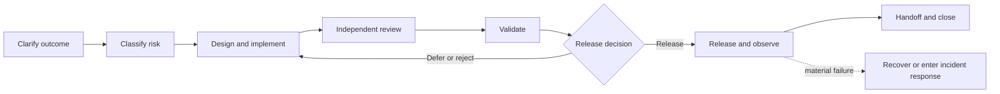

# Example 02: Software-Change Delivery

## Example Record

**Provenance:** Generalized — synthesized from common software-delivery
practices without representing a particular organization, product, or method. 
**Review status:** Illustrative; not domain-validated. 
**Draft contributor:** Framework drafting assistant, under Brad Groux's direction. 
**Responsible maintainer:** Framework maintainer. 
**Publication-safety note:** The example contains no source code, credentials,
vulnerability details, customer data, or proprietary architecture. 
**Review triggers:** Material framework change, practitioner review, delivery
failure traced to the example, or change to the scenario assumptions.

## Scenario Overview

A software organization delivers changes to a service used by customers and
internal operations. Work ranges from small corrections to changes that affect
security, privacy, availability, financial processing, or contractual
commitments.

The organization classifies changes as:

- **Routine:** limited, reversible work covered by established review and
  release practices;
- **Heightened:** work with material security, privacy, data, availability,
  financial, contractual, or cross-team impact; or
- **Emergency:** urgent work needed to contain or restore a material incident.

The SOP deliberately names no development platform, repository, programming
language, testing product, deployment service, or communication tool. Teams use
their approved working systems while preserving the business meaning and
evidence described here.

## Procedure at a Glance

---

# SOP: Deliver a Software Change

**Accountable owner:** Software Delivery Executive 
**Process manager:** Delivery Practice Owner 
**Approval status:** Approved for inclusion as illustrative; not approved for operational use 
**Review cycle:** Semiannually and upon a listed review trigger

## 1. Purpose, Scope, and Expected Outcome

This SOP governs the path from an accepted change need to a verified operational
outcome. Its purpose is to deliver software changes that meet agreed intent,
respect authority and controls, produce credible evidence, and can be safely
operated, reversed, or improved.

It covers:

- change intake and clarification;
- risk classification and planning;
- design and implementation;
- independent review and validation;
- release approval and execution;
- post-release observation; and
- closure and learning.

It does not prescribe product strategy, a software-development methodology,
team structure, technical architecture, or specific tools.

The expected outcome is a released, verified, supportable change—or a documented
decision not to release—with requirements, decisions, evidence, operational
state, and follow-up work preserved.

## 2. Roles, Responsibilities, and Authority

| Role | Responsibility and authority |
|---|---|
| Software Delivery Executive | Accountable for delivery policy, material risk acceptance, and this SOP. |
| Change Owner | Owns the change outcome, scope, coordination, work record, and closure. |
| Business or Product Owner | Defines business intent, priorities, acceptance outcomes, and customer or operational constraints. |
| Technical Lead | Owns technical approach, dependencies, implementation quality, and technical readiness. |
| Implementer | Produces the change and supporting records; may be a person, AI, or combined team operating within assigned authority. |
| Independent Reviewer | Reviews work they did not solely create and records findings and disposition. |
| Quality Reviewer | Determines whether validation is sufficient for the risk and whether acceptance outcomes are met. |
| Security, Privacy, Data, Legal, or Control Reviewer | Reviews heightened impacts within their authority. |
| Release Authority | Makes the release or no-release decision for the classified risk. |
| Operations Owner | Confirms operability, observation, support, recovery, and handoff readiness. |
| Incident Authority | Directs emergency containment and restoration under the incident procedure. |

One person may hold several roles for low-risk work, but no one may both create
and provide the only independent review of a heightened change. AI may propose,
implement, review, or analyze work only within assigned access and authority.
Accountable people remain responsible for approvals and risk acceptance.

## 3. Trigger, Prerequisites, Inputs, and Authoritative Sources

The procedure begins when an authorized owner accepts a defect, business need,
control requirement, maintenance need, or incident remediation for delivery.

Before implementation:

- a Change Owner and Business or Product Owner are named;
- the intended outcome and affected users or operations are stated;
- known constraints and dependencies are recorded;
- the current operational state is identifiable;
- access and working environments are authorized; and
- the work is classified as routine, heightened, or emergency.

Authoritative sources include:

- the accepted change record for scope, owner, priority, and status;
- approved requirements and acceptance outcomes;
- current code, configuration, data definitions, and operating documentation;
- applicable architecture, security, privacy, quality, legal, and release
  policies;
- production or service records for current behavior; and
- incident authority instructions during an emergency.

Conflicting requirements are resolved by the responsible business and control
authorities before release. An informal conversation may inform the work but
does not silently replace the accepted record.

## 4. Procedure

### A. Clarify the Change

The Change Owner records:

- the problem or opportunity;
- expected business and user outcome;
- work inside and outside scope;
- affected capabilities, data, customers, operations, and commitments;
- acceptance outcomes;
- known assumptions and unanswered questions;
- dependencies and required reviewers; and
- the responsible operational owner after release.

The Business or Product Owner approves the intent. If the outcome cannot be
stated well enough to assess, implement, and verify, the change returns for
clarification.

### B. Classify Risk and Plan the Work

The Change Owner and Technical Lead assess:

- consequence and reach of error;
- reversibility;
- security, privacy, safety, data, financial, legal, and contractual impact;
- migration or compatibility implications;
- operational dependencies and support readiness;
- uncertainty and novelty; and
- urgency.

They assign the change class and record the rationale. Heightened changes name
the relevant control reviewers, validation depth, release authority,
observation period, and recovery decision.

The plan identifies work items, decision points, dependencies, handoffs,
environments, evidence, release sequence, recovery approach, and a safe point
from which interrupted work can resume.

### C. Design and Implement

The Technical Lead establishes an approach proportionate to the risk. The
Implementer:

1. works only within the accepted scope and authorized environments;
2. preserves traceability between the intended outcome and material changes;
3. adds or updates validation appropriate to the changed behavior;
4. updates affected operating, support, user, or control documentation;
5. records material assumptions, deviations, and new dependencies;
6. protects secrets, personal data, customer data, and production access; and
7. stops when findings materially change the risk, scope, or authority needed.

AI-generated output is treated as unverified work until a responsible
participant reviews it. AI confidence, fluency, or successful generation is not
acceptance evidence.

### D. Review

An Independent Reviewer assesses:

- correctness and clarity;
- alignment with the accepted intent and scope;
- maintainability and consistency with existing patterns;
- likely failure modes and edge cases;
- adequate handling of data, security, privacy, and operational concerns;
- evidence quality; and
- completeness of supporting documentation.

Findings are recorded as blocking, required before closure, or advisory. The
Change Owner ensures each finding has a disposition. A reviewer cannot approve
an unresolved issue outside their authority.

Heightened changes receive the named domain or control reviews. Each reviewer
states the scope of review, decision, conditions, and unresolved risk.

### E. Validate

The Quality Reviewer confirms that validation:

- covers the accepted outcomes and material requirements;
- includes normal behavior, important exceptions, and credible failure or
  recovery paths;
- uses an environment and information appropriate to the claim;
- checks material integrations and dependencies;
- protects sensitive information;
- identifies residual defects and limitations; and
- produces repeatable evidence.

Failed validation returns the work to implementation or triggers a scope,
risk, or release decision. Results may not be discarded merely because they
delay release.

### F. Decide Whether to Release

The Change Owner assembles a readiness record containing:

- approved intent and final scope;
- risk classification;
- implementation and review status;
- validation results;
- required control approvals;
- unresolved limitations and accepted residual risks;
- release, observation, communication, and recovery plans; and
- operations-owner readiness.

The Release Authority decides **release**, **release with explicit conditions**,
**defer**, or **reject**. A conditional release names the condition, owner,
deadline, monitoring, and consequence of failure.

No participant may infer approval from silence, schedule pressure, or completion
of implementation.

### G. Release, Observe, and Recover

Authorized participants execute the approved release sequence. The Change Owner
records the actual start, decision points, deviations, and final state.

During the observation period, the Operations Owner compares actual behavior
with the expected outcome and agreed operational indicators. Unexpected impact
is contained and escalated.

The Release Authority or Incident Authority decides whether to continue,
pause, reverse, disable, or enter incident response. Recovery follows the
approved plan unless current evidence shows that it would increase harm, in
which case the responsible authority selects and records a safer response.

### H. Close and Handoff

The Change Owner closes the change only after:

- the released state is identified;
- acceptance outcomes and operational behavior are verified;
- support and operations have the necessary information;
- customer or internal communications are complete when required;
- remaining defects, limitations, and follow-up work have owners;
- evidence is retained; and
- relevant learning is captured.

The handoff includes what changed, current status, expected behavior, known
limitations, support and observation needs, recovery information, evidence
references, and named follow-up owners.

## 5. Policies, Controls, Approvals, and Risks

Controls are proportionate to change risk and include:

- traceable business intent and acceptance outcomes;
- authorized access and protected information;
- independent review;
- validation suited to consequence and reversibility;
- required security, privacy, data, legal, financial, or operational review;
- explicit release authority;
- recoverability and operational readiness;
- retained decisions and evidence; and
- heightened scrutiny for emergency changes after immediate danger is
  contained.

No participant may introduce undeclared scope, expose secrets or private data,
bypass required review, fabricate evidence, conceal failed validation, or
release without authority.

Key risks include solving the wrong problem, service disruption, data loss or
corruption, security or privacy harm, inaccessible recovery, unsupported
operations, broken commitments, and false confidence from incomplete
validation.

## 6. Exceptions, Escalation, Recovery, and Stop Conditions

- **Requirement conflict:** Escalate to the Business or Product Owner and
  affected control authority; do not choose silently.
- **Material scope discovery:** Pause affected work, revise the record and risk
  classification, and obtain changed authority.
- **Failed review or validation:** Return to implementation or change the
  release decision; preserve the evidence.
- **Dependency unavailable:** Record the blocked state, owner, impact, and safe
  resume point.
- **Release authority unavailable:** Defer unless the documented delegation or
  emergency procedure applies.
- **Emergency change:** Incident Authority may authorize the minimum change
  needed to contain or restore service. Record decisions contemporaneously
  where possible, then complete missing review, validation, documentation, and
  learning after stabilization.
- **Release failure:** Stop additional rollout, contain impact, assess actual
  state, and execute authorized recovery or incident response.
- **Recovery fails or increases harm:** Stop the planned recovery and escalate
  to Incident Authority with current evidence.

Stop the work when it exceeds accepted scope or authority, relies on unsafe or
unlawful action, exposes protected information, lacks necessary recovery for
the risk, or cannot produce credible readiness evidence.

## 7. Completion, Verification, and Evidence

A software change is complete when:

- its final operational state is known;
- accepted business and user outcomes have been checked;
- required reviews, validation, approvals, and communications are complete;
- material residual risk is explicitly accepted by the right authority;
- operations and support can sustain the result;
- follow-up obligations have owners and dates; and
- the retained record can explain what was intended, changed, decided,
  observed, and learned.

Evidence includes the accepted change record, requirements, risk decision,
material work record, review findings and dispositions, validation results,
control approvals, release decision, execution record, observation results,
recovery actions, communications, and closure decision.

The Quality Reviewer verifies evidence for the claimed outcome. The Operations
Owner verifies operational handoff. The Change Owner verifies closure, while
the Release Authority owns any accepted residual release risk.

## 8. Review, Approval, and Change History

The Software Delivery Executive owns this SOP. The Delivery Practice Owner
collects delivery evidence and practitioner feedback.

Review occurs semiannually and sooner after:

- a material incident, failed recovery, or escaped defect;
- a security, privacy, data, legal, or audit finding;
- repeated emergency changes or bypass attempts;
- material changes in responsibilities or operating risk;
- evidence that required reviews do not improve outcomes; or
- changed framework requirements.

Material revisions require approval by the Software Delivery Executive and
consultation with delivery, product, operations, quality, and affected control
owners.

| Version | Status | Change | Approved by |
|---|---|---|---|
| Example draft | Illustrative | Initial generalized procedure | Pending practitioner review |

---

## Framework Annotation

| Concern | How the example expresses it |
|---|---|
| Intent | Work begins with an accepted problem, outcome, scope, and acceptance basis rather than implementation activity alone. |
| Responsibility | The SOP distinguishes outcome ownership, implementation, independent review, control review, release authority, operations, and incident authority. |
| Work | It covers clarification, planning, implementation, review, validation, release, observation, recovery, handoff, and resumable state. |
| Control | Risk classification determines proportionate review, approval, access, release, and recovery controls; stop conditions prevent silent bypass. |
| Assurance | Acceptance outcomes, independent review, validation evidence, operational observation, and closure checks support the result claimed. |
| Learning | Incidents, defects, findings, emergency changes, practitioner feedback, and outcome evidence trigger improvement. |

The annotation explains the example; it does not add framework requirements.

## Domain-Specific Boundary

The change classes, software roles, independent-review practice, validation
activities, release decision, observation period, and recovery approach are
choices for this software-delivery scenario. The framework does not require
these titles, stages, classifications, engineering practices, or any particular
development or release technology.

An organization must adapt the procedure to its architecture, delivery method,
regulatory and contractual duties, risk tolerance, support model, and qualified
technical judgment.

## Related Framework Documents

- [Framework examples](README.md)
- [Operating framework](../framework/operating-framework.md)
- [SOP content standard](../framework/sop-content-standard.md)
- [Shared operating memory standard](../framework/shared-operating-memory-standard.md)
- [Standards maintenance method](../framework/standards-maintenance-method.md)
