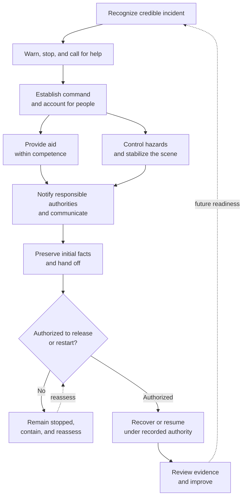

# Example 03: Construction Field-Incident Response

## Example Record

**Provenance:** Fictional — created solely to illustrate framework application
to physical, time-sensitive, safety-relevant work. 
**Review status:** Illustrative; not domain-validated. 
**Draft contributor:** Framework drafting assistant, under Brad Groux's direction. 
**Responsible maintainer:** Framework maintainer. 
**Publication-safety note:** No real project, employer, worker, incident,
location, hazard detail, or protected investigation record is represented. 
**Review triggers:** Relevant construction-safety review, material framework
change, unsafe ambiguity discovered in the example, or change to the scenario
assumptions.

## Scenario Overview

A general contractor operates a commercial construction site with employees,
subcontractors, visitors, equipment, and changing physical conditions. This
example addresses the immediate response to an injury, near miss, property
damage, environmental release, structural concern, utility strike, or other
unplanned field event that may threaten people, the public, property, or the
environment.

The procedure assumes the project already has an approved emergency plan,
qualified safety leadership, trained first-aid responders, emergency contacts,
site access controls, and jurisdiction-specific reporting requirements. It does
not define medical treatment, rescue tactics, hazardous-material handling,
structural evaluation, or legally required notifications.

When this example conflicts with an approved emergency plan or instruction from
emergency services, the approved plan and authorized responder direction
control.

## Procedure at a Glance

---

# SOP: Respond to a Construction Field Incident

**Accountable owner:** Project Executive 
**Immediate field authority:** Site Superintendent 
**Safety authority:** Project Safety Lead 
**Approval status:** Approved for inclusion as illustrative; not approved for operational use 
**Review cycle:** Before project mobilization, after a material incident, and
when project conditions materially change

This SOP follows the domain's incident-response flow rather than repeating the
eight content-standard headings. The framework annotation traces the required
business meaning without turning that traceability into the operating
procedure's layout.

## Operating Outcome and Emergency Boundaries

This SOP provides a controlled response to a construction field incident so
that immediate danger is addressed, affected people receive appropriate help,
the scene and continuing work are controlled, required authorities receive
accurate information, and learning supports safe recovery.

It covers discovery through emergency action, escalation, scene control,
initial fact preservation, notification, work-status decisions, recovery,
restart, and handoff to formal investigation.

It does not replace:

- emergency-service direction;
- the project's emergency response, fire, rescue, severe-weather, evacuation,
  environmental, or security plans;
- medical judgment or treatment;
- a legally required investigation;
- structural, electrical, environmental, industrial-hygiene, or other
  professional assessment; or
- the authority of regulators or public officials.

The expected outcome is that immediate harm is contained under qualified
authority, people and the scene are accounted for, affected work remains
stopped until release, notifications and evidence are preserved, and recovery
or restart is explicitly authorized.

## Incident Command, Responsibilities, and Authority

| Role | Responsibility and authority |
|---|---|
| Project Executive | Accountable for project response governance, external executive escalation, major business decisions, and this SOP. |
| Site Superintendent | Directs the initial site response until relieved by emergency services or a designated incident leader; may stop any affected work. |
| Project Safety Lead | Advises on hazard control, reporting, evidence, investigation handoff, and restart requirements; may stop unsafe work independently. |
| Person Discovering the Incident | Warns others, calls for help, avoids additional exposure, and reports observable facts. |
| Trained First-Aid or Emergency Team | Acts only within training, authorization, and the emergency plan. |
| Trade Supervisor | Accounts for their workers, stops affected work, communicates instructions, and preserves relevant work information. |
| Site Access Coordinator | Directs emergency access, controls nonessential entry, and supports accountability. |
| Communications Lead | Provides approved workforce, family, client, public, or media communications; other participants do not speculate publicly. |
| Qualified Specialist | Assesses structural, electrical, environmental, equipment, or other hazards within professional competence. |
| Investigation Lead | Controls the later fact-finding process once immediate danger is stabilized. |
| Emergency Services or Public Authority | Exercises the authority granted by law and the incident; site participants follow their lawful direction. |

Everyone has authority to report a concern and stop their own work when they
reasonably believe continuing creates imminent danger. Only designated
authorities may order broader evacuation, reentry, scene release, or restart.

AI may help organize non-sensitive records or identify missing information
after immediate safety is established. It may not direct rescue, diagnose
injuries, assess technical safety, conduct witness interviews autonomously, or
authorize reentry or restart.

## Activation Conditions and Authoritative Direction

This procedure begins when any person observes or receives a credible report of:

- an injury or medical emergency;
- a near miss with credible serious-harm potential;
- fire, smoke, explosion, collapse, structural movement, or utility strike;
- uncontrolled release, spill, or environmental harm;
- equipment failure or property damage that may create danger;
- violence, threat, unauthorized entry, or public exposure; or
- any unplanned condition the observer reasonably believes may require work to
  stop.

Initial action does not wait for a complete report.

Required prerequisites include visible emergency contact information, a known
site location and access route, current personnel accountability practices,
available emergency equipment appropriate to the work, and named field and
safety authorities.

Authoritative sources are:

1. emergency-service and public-authority instructions;
2. the approved project emergency and evacuation plans;
3. current site conditions observed by qualified people;
4. approved safety plans and hazard controls;
5. workforce accountability and access records;
6. jurisdiction-specific reporting requirements confirmed by qualified
   safety or legal authority; and
7. the controlled incident record.

Rumor, social media, or unverified recollection may prompt caution but does not
replace verified incident facts.

## Recognize, Warn, Stop, and Call for Help

The person discovering the incident:

1. warns people in immediate danger without entering an unsafe area;
2. stops affected work and equipment when this can be done without added risk;
3. contacts emergency services or the site emergency channel as the approved
   plan requires;
4. states the site location, observable event, known hazards, number of people
   believed affected, and safe access point;
5. follows evacuation or shelter instructions; and
6. reports to the Site Superintendent or nearest supervisor.

No one enters, reenters, or remains in a hazardous area to obtain information,
retrieve property, or preserve evidence.

## Establish Incident Command and Account for People

The Site Superintendent:

- assumes initial field coordination and identifies themselves;
- activates the applicable emergency plan;
- establishes an exclusion area;
- directs trade supervisors to stop related work and account for people;
- sends a trained person to guide responders from the access point;
- requests the Safety Lead and needed qualified specialists;
- records the time, current conditions, actions, and instructions; and
- transfers authority clearly when emergency services or another authorized
  incident leader assumes command.

Trade supervisors report people as accounted for, missing, injured, off-site,
or unknown. A missing person is reported immediately to the incident leader;
untrained participants do not initiate independent searches.

## Provide Aid Within Competence

Trained responders provide first aid or emergency support only within their
training and the approved plan. Emergency services direct medical and rescue
activity upon arrival.

Participants protect dignity and privacy. Medical details are shared only with
people who need them for care, emergency response, required reporting, or
authorized follow-up.

## Control Hazards and Stabilize the Scene

The Site Superintendent and Safety Lead:

- stop adjacent or dependent work that may increase risk;
- isolate energy, equipment, materials, traffic, or access only through
  qualified and authorized participants;
- monitor for changing conditions;
- prevent nonessential entry, photography, removal, cleanup, alteration, or
  restart;
- protect the public and neighboring operations; and
- record any change made to save life, prevent further harm, or stabilize the
  scene.

Preservation never takes precedence over rescue or prevention of additional
harm.

## Notify Responsible Authorities and Communicate

The incident leader uses the approved notification matrix to contact the
Project Executive, Safety Lead, employer representatives, client, insurers,
public authorities, environmental contacts, or other parties as required.

A qualified safety or legal authority determines whether, when, and how a
regulatory report is required. The record states the authority, deadline,
sender, information provided, and confirmation.

The Communications Lead coordinates workforce, family, client, public, and
media messages. Messages separate confirmed facts from unknowns, protect
privacy, and avoid blame or speculation.

## Preserve Initial Facts and Hand Off

After immediate danger is controlled, the Safety Lead:

1. opens the controlled incident record;
2. records who reported the event and when;
3. preserves the scene boundary and relevant work records;
4. identifies witnesses without coaching or group discussion;
5. records perishable conditions through authorized means;
6. inventories moved, isolated, or altered items and why they changed;
7. collects current permits, plans, equipment, training, inspection, and
   workforce records relevant to the event; and
8. hands the record and scene control to the designated Investigation Lead.

This initial record captures observations, not conclusions about fault or root
cause.

## Assess Recovery, Release, and Restart

The Site Superintendent, Safety Lead, affected Trade Supervisor, and required
Qualified Specialists determine what may remain stopped, resume with controls,
or requires redesign or repair.

Restart requires:

- emergency or public-authority release when applicable;
- completion of required professional assessment;
- removal or control of the immediate hazard;
- verification that affected people, equipment, structure, utilities, and work
  conditions are ready;
- communication of changed controls to affected workers;
- renewed permits or plans when required; and
- explicit authorization from the named restart authority.

Restart may be phased. Each released area or activity is recorded. Schedule
pressure is never restart authority.

## Shared Controls and Material Risks

Controls include:

- immediate stop-work and emergency activation;
- authority transfer to emergency services;
- personnel accountability;
- controlled entry and scene preservation;
- qualified hazard isolation and professional assessment;
- protected medical and personal information;
- authorized regulatory and external communication;
- documented restart criteria and authority; and
- retained incident, investigation, and corrective-action records.

Key risks are delayed aid, secondary exposure, unaccounted people, unauthorized
rescue or reentry, evidence loss, privacy harm, speculative communication,
missed reporting duties, unsafe restart, retaliation against reporters, and
premature conclusions.

No business, schedule, cost, client, or reputational concern authorizes
continued work in the presence of unresolved imminent danger.

## When the Response Diverges

- **Incident leader unavailable:** The ranking authorized field leader assumes
  initial coordination under the emergency plan and records the transfer.
- **Communications unavailable:** Use approved backup methods and send a runner
  only through a confirmed safe route.
- **Conditions worsen:** Expand the exclusion area, stop additional work,
  update emergency services, and reassess evacuation or shelter.
- **Person unaccounted for:** Report last known location and relevant hazards to
  the incident leader; do not begin an unauthorized search.
- **Public or environmental exposure:** Extend controls beyond the site and
  notify the responsible public or environmental authority.
- **Pressure to disturb the scene:** Refuse unless rescue, harm prevention, or
  an authorized public authority requires it; record the instruction.
- **Conflicting instructions:** Follow emergency-service or lawful public
  authority direction, then escalate other conflicts to the Project Executive
  and Safety Lead.
- **Restart control fails:** Stop affected work again, contain the condition,
  and repeat qualified assessment and authorization.

Stop all affected work when the hazard is unknown or uncontrolled, people are
unaccounted for, emergency services require control, critical evidence would be
destroyed without necessity, or restart requirements remain unmet.

## Verify Immediate Response and Preserve Evidence

The immediate response is complete only when:

- emergency authority has released the response or transferred continuing
  responsibility;
- people are accounted for to the extent reasonably possible;
- affected work and access have a clear status;
- continuing hazards are controlled by qualified authority;
- required notifications are confirmed or have an accountable pending owner;
- the incident record and scene have been handed to the Investigation Lead;
- affected people and teams received appropriate information; and
- restart, continued shutdown, or phased recovery is explicitly recorded.

The Site Superintendent verifies field status. The Safety Lead verifies safety,
notification, evidence, and restart conditions within their competence.
Qualified specialists verify domain-specific release conditions. The Project
Executive verifies accountable handoff and unresolved business actions.

Evidence includes emergency calls and instructions, accountability results,
scene boundaries, contemporaneous action log, photographs or measurements when
authorized, permits and plans, equipment and training records, notifications,
professional assessments, release decisions, worker briefings, restart
authorization, investigation handoff, and corrective-action ownership.

## Keep the Procedure Current

The Project Executive owns this SOP with professional input from the Safety
Lead and relevant qualified specialists.

Review occurs before project mobilization and after:

- an injury, near miss, release, utility strike, structural concern, or other
  material incident;
- emergency-plan activation;
- a failed accountability, communication, scene-control, notification, or
  restart control;
- material change in site layout, work phase, hazards, workforce, or public
  interface;
- regulator, client, insurer, or investigation findings; or
- a relevant framework change.

Revisions require approval by accountable project and safety authorities and
communication to affected employers and workers before they rely on the
changed procedure.

| Version | Status | Change | Approved by |
|---|---|---|---|
| Example draft | Illustrative | Initial fictional procedure | Pending construction-safety review |
| Framework baseline approval | Approved for inclusion as illustrative; not domain-validated | Reorganized around the incident-response flow, added separate content traceability, and expanded the learning-loop visual | Founding steward |

---

## Framework Annotation

| Concern | How the example expresses it |
|---|---|
| Intent | The procedure prioritizes prevention of additional harm, accountable response, controlled recovery, and learning over schedule or documentation activity. |
| Responsibility | It identifies immediate command, independent stop-work authority, emergency-service authority, professional limits, communications ownership, and restart authority. |
| Work | It describes warning, stopping, help, accountability, aid, hazard and scene control, notification, evidence handoff, recovery, and restart. |
| Control | Exclusion, competence limits, protected information, qualified assessment, scene preservation, external notification, stop conditions, and explicit restart govern high-risk work. |
| Assurance | Accountability, professional release, confirmed notifications, incident records, and restart verification provide evidence for the claimed state. |
| Learning | Investigation, corrective action, incidents, control failures, site changes, and professional findings trigger procedure review. |

### SOP Content Traceability

| Required business meaning | Where the example communicates it |
|---|---|
| Purpose, scope, and expected outcome | Operating Outcome and Emergency Boundaries |
| Ownership, participation, responsibility, and authority | Incident Command, Responsibilities, and Authority |
| Trigger, prerequisites, inputs, and authoritative sources | Activation Conditions and Authoritative Direction |
| Activities, decisions, dependencies, handoffs, and outputs | Recognize, Warn, Stop, and Call for Help through Assess Recovery, Release, and Restart |
| Policies, controls, approvals, and risks | Shared Controls and Material Risks |
| Exceptions, escalation, recovery, and stop conditions | When the Response Diverges |
| Completion, verification, quality, and evidence | Verify Immediate Response and Preserve Evidence |
| Review ownership, review triggers, and change history | Keep the Procedure Current |

The annotations explain the example; they do not add framework requirements or
prescribe headings for another SOP.

## Domain-Specific Boundary

The construction roles, emergency practices, scene controls, notification
matrix, evidence expectations, and restart conditions are fictional
domain-specific choices. The framework does not prescribe emergency tactics,
construction safety controls, reporting obligations, professional methods, or
these role titles.

This example is not a safety plan, emergency plan, rescue procedure, regulatory
interpretation, or professional construction-safety guidance. It has not been
reviewed by a construction-safety professional. No organization should use it
operationally without qualified review, applicable law and project requirements,
site-specific hazard planning, training, and authorized approval.

## Related Framework Documents

- [Framework examples](README.md)
- [Operating framework](../framework/operating-framework.md)
- [SOP content standard](../framework/sop-content-standard.md)
- [Shared operating memory standard](../framework/shared-operating-memory-standard.md)
- [Standards maintenance method](../framework/standards-maintenance-method.md)
