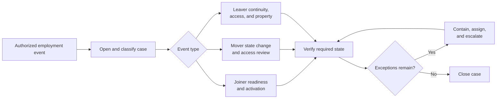

# Example 04: Employee Onboarding and Offboarding

## Example Record

**Provenance:** Generalized — synthesized from common joiner, mover, and leaver
operating patterns without representing a specific employer or worker. 
**Review status:** Illustrative; not domain-validated. 
**Draft contributor:** Framework drafting assistant, under Brad Groux's direction. 
**Responsible maintainer:** Framework maintainer. 
**Publication-safety note:** No real employment, compensation, identity,
medical, performance, access, or personal information is represented. 
**Review triggers:** Material framework change, human-resources, privacy,
security, payroll, or employment review, a control failure discovered in the
example, or a change to the scenario assumptions.

## Scenario Overview

A multi-location organization coordinates employee lifecycle changes across
People Operations, management, payroll, benefits, identity and access,
security, facilities, equipment, training, and records administration.

This example covers:

- **Joiners:** people beginning employment;
- **Movers:** employees changing role, manager, location, legal entity,
  employment status, or required access; and
- **Leavers:** employees ending employment, including planned, urgent, and
  involuntary departures.

The fictional organization treats the approved People record as authoritative
for employment status, manager, dates, and work arrangement. Access is granted
from an approved role baseline and adjusted for documented exceptions. The
organization uses a confidential handling path for involuntary or sensitive
changes.

## Procedure at a Glance

---

# SOP: Coordinate Employee Joiner, Mover, and Leaver Events

**Accountable owner:** People Operations Director 
**Process manager:** Employee Lifecycle Coordinator 
**Approval status:** Approved for inclusion as illustrative; not approved for operational use 
**Review cycle:** Annually and upon a listed review trigger

This SOP intentionally uses the domain's joiner, mover, and leaver structure
rather than repeating the eight content-standard headings. The framework
annotation traces the required business meaning without turning that
traceability into the operating procedure's layout.

## Operating Outcome and Boundaries

This SOP coordinates employee lifecycle changes so the person, manager, and
supporting functions are ready for the effective date; compensation, access,
equipment, workplace, training, and records reflect the authorized employment
state; and confidential or high-risk changes occur under controlled authority.

It covers accepted employee joiner, mover, and leaver events from initiation
through confirmed completion.

It does not determine:

- whether to hire, promote, transfer, discipline, or terminate someone;
- compensation philosophy or workforce planning;
- immigration, employment-law, tax, payroll, benefits, privacy, or labor
  requirements;
- technical access-control design; or
- the substantive content of role training.

The expected outcome is that every affected function can identify the approved
employment state, complete its obligations by the required time, provide
evidence, and resolve or own any remaining exception without exposing personal
information or leaving inappropriate access.

## Lifecycle Ownership and Decision Authority

| Role | Responsibility and authority |
|---|---|
| People Operations Director | Accountable for the lifecycle process, sensitive-case governance, and this SOP. |
| Employee Lifecycle Coordinator | Opens and coordinates the case, confirms owners and deadlines, protects case information, and verifies completion evidence. |
| Authorized People Partner | Confirms that the employment action is approved, lawful review is complete where required, and the authoritative People record is accurate. |
| Manager | Defines business readiness, role duties, role-based access needs, onboarding or transition plan, knowledge handoff, and return of business property. |
| Identity and Access Owner | Grants, changes, suspends, or removes access from approved requests; verifies effective access state. |
| Payroll and Benefits Owners | Apply authorized pay, tax, time, benefit, and final-pay changes within their respective authority. |
| Facilities and Equipment Owners | Prepare, issue, transfer, recover, inspect, and record workplace credentials and business property. |
| Security and Privacy Owners | Advise on high-risk access, data preservation, monitoring, personal-data handling, and security incidents. |
| Training or Compliance Owner | Assigns and verifies required learning or certifications. |
| Employee | Supplies authorized information, completes required activities, protects property and information, and confirms receipt or return where applicable. |
| Legal or Employee-Relations Authority | Directs sensitive or disputed employment actions within professional authority. |

The manager may request access but does not grant it. Supporting functions act
only on an employment event authorized in the People record or through the
documented confidential path.

AI may help summarize role requirements, draft checklists, answer approved
orientation questions, or identify missing evidence. It may not decide an
employment action, infer sensitive personal facts, expand access, communicate a
confidential decision without authorization, or mark completion without
evidence.

## Authorized Event and Case Sources

This procedure begins when an Authorized People Partner records an approved:

- hire and start date;
- role, manager, location, entity, status, or access change;
- leave-related status that requires coordinated operational change; or
- separation and effective time.

Prerequisites are:

- verified identity appropriate to the stage of the event;
- an authorized employment action;
- effective date and, for access-sensitive events, effective time;
- assigned manager and People Partner;
- work location and arrangement;
- confidentiality classification; and
- the functions required for the event.

Authoritative sources are:

1. the approved People record for employment status, dates, manager, role,
   location, and work arrangement;
2. the approved employment action and compensation record;
3. the role and access baseline plus approved exceptions;
4. payroll, benefits, facilities, equipment, training, retention, privacy, and
   security policies within their domains;
5. Legal or Employee-Relations instructions for sensitive cases; and
6. the lifecycle case for work status, evidence, exceptions, and handoffs.

Email, chat, a manager's verbal request, or a prior employee's access is not
authority to create or change employment status or access.

## Open and Plan the Lifecycle Case

### Open and Classify the Lifecycle Case

The Employee Lifecycle Coordinator:

1. verifies the authorized event and effective date;
2. classifies it as joiner, mover, leaver, or combined event;
3. assigns normal, confidential, or urgent handling;
4. identifies affected functions, owners, and dependencies;
5. records required completion times relative to the effective event;
6. limits case visibility to legitimate participants; and
7. records the next coordination point and safe resume state.

If the source record is incomplete or contradictory, the Coordinator pauses
downstream action and asks the Authorized People Partner to correct it.

### Plan the Required State

The Manager and functional owners define the difference between current and
required state for:

- job duties, objectives, and reporting relationship;
- compensation, time, payroll, and benefits;
- identity, account, role, group, application, data, physical, and remote
  access;
- equipment, credentials, workspace, and logistics;
- training, policy acknowledgments, and professional requirements;
- customer, supplier, project, financial, or approval authority;
- records ownership and knowledge handoff; and
- internal or external communications.

Each nonstandard request states the business need, duration, data or capability
affected, approving authority, and later review or removal trigger.

## Joiner Path

Before the start date, assigned owners:

- create only the approved identity and role baseline;
- prepare payroll, benefits, equipment, workspace, and required materials;
- schedule required orientation and role training;
- confirm the manager's first-day and first-period plan;
- protect personal information and avoid activating access earlier than policy
  permits; and
- record readiness or a named contingency for any incomplete item.

On or after the authorized start:

1. verify the person's identity through the approved process;
2. issue credentials and property with receipt evidence;
3. activate approved access at the authorized time;
4. provide policy, safety, security, privacy, and role orientation;
5. confirm how to obtain help and report concerns; and
6. have the manager verify that the person can begin meaningful work safely.

The Coordinator follows unresolved readiness items to completion rather than
closing the case after the first day.

## Mover Path

For a mover, the Manager and Identity and Access Owner compare old and new
states. They identify access and authority to retain, change, time-limit, or
remove.

By the effective time:

- employment, reporting, compensation, payroll, benefits, location, equipment,
  and facility changes are applied as authorized;
- new access is granted only after approval;
- obsolete or conflicting access and approval authority are removed;
- sensitive data, records, customers, and work are handed to named owners;
- required training or certification is assigned; and
- the employee and old and new managers receive appropriate confirmation.

A mover is not treated as a joiner-only event. Retained legacy access must be an
explicit decision, not an omission.

## Planned Leaver Path

For a planned departure, the Coordinator and Manager establish:

- final working date and access-removal time;
- knowledge, records, customer, supplier, approval, and work handoffs;
- property and credential return;
- payroll, benefits, expenses, and final obligations;
- internal and external communications;
- continuing confidentiality, intellectual-property, or other obligations; and
- a contact path for permitted post-employment questions.

At the authorized time, functional owners remove employment authority, logical
and physical access, approval rights, delegated authority, and possession of
business property as required. Records needed by the organization are
preserved by authorized owners; personal material is handled under policy.

## Urgent or Involuntary Leaver Path

The Authorized People Partner opens a restricted case and gives each participant
only the information and timing needed for their action.

People Operations, the Manager, Identity and Access Owner, Security, Payroll,
Facilities, and Legal or Employee Relations coordinate a single effective time.
They prepare access suspension or removal, meeting and safety arrangements,
property recovery, records preservation, payment and benefits actions,
communications, and continuity owners before the event occurs.

No participant alerts the employee or a wider audience before the authorized
communication. Immediate safety concerns follow the applicable emergency or
security procedure.

After the authorized event, the Coordinator confirms all actions, corrects any
timing failure, and limits retained sensitive detail to legitimate need.

## Verify and Close the Lifecycle Case

The Coordinator collects evidence from each required function and compares it
with the required state. The Manager confirms business readiness or continuity.
The Authorized People Partner confirms the People record and required employee
communication.

Incomplete items remain open with an owner, risk, containment, and due date.
The case closes only when completion criteria are met or an accountable
authority explicitly accepts and owns a bounded residual item.

## Shared Controls, Approvals, and Risks

Controls include:

- action only from an authorized employment source;
- minimum necessary use of personal and sensitive information;
- role-based, least-privilege access with approved exceptions;
- separation between access request and grant;
- time-coordinated access activation, change, suspension, and removal;
- confidential handling for sensitive events;
- property and credential accountability;
- verified completion by each functional owner; and
- retained decision, communication, and evidence history.

Key risks include premature or late access, excessive retained access after a
move, unremoved access after departure, payroll or benefit error, privacy
exposure, unsafe communication, missing property, abandoned approvals or work,
broken customer continuity, discrimination, retaliation, and unauthorized
employment decisions.

Only qualified People, Legal, Employee-Relations, payroll, benefits, privacy,
security, or other authorities interpret requirements in their domains.

## When the Lifecycle Case Diverges

- **Start date changes:** The Authorized People Partner changes the source
  record; the Coordinator re-baselines every dependent action.
- **Manager unavailable:** The business owner names an authorized interim
  manager before access or approval requests proceed.
- **Equipment or workspace unavailable:** Provide an approved safe contingency
  and limit work to what the person can perform securely and lawfully.
- **Required check or documentation incomplete:** Do not activate the affected
  employment condition or access unless the responsible authority approves a
  lawful alternative.
- **Mover has incompatible old and new duties:** Remove or suspend conflicting
  authority and escalate the access design to the business and control owners.
- **Leave of absence:** Treat access, pay, benefits, communications, and return
  as an authorized mover event tailored by qualified People and Legal review.
- **Leaver is absent or does not return property:** Remove access at the
  authorized time, protect records, document property status, and follow the
  approved recovery path; do not delay access control solely for property.
- **Leaver timing changes:** The Authorized People Partner confirms the new
  effective time; all functions acknowledge the re-coordinated plan.
- **Conflicting instructions:** Pause affected action and escalate to the People
  Operations Director and authority responsible for the conflict.
- **Access removed or granted incorrectly:** Contain immediately, notify the
  Identity and Access Owner and Security, restore only from approved state, and
  assess exposure.

Stop the event when the employment action lacks authority, identity is
unverified where required, a request exceeds role or legal authority,
confidentiality is breached, or continuing would create unresolved safety,
privacy, security, or employment risk.

## Evidence of Readiness, Transition, or Closure

A lifecycle event is complete when:

- the People record reflects the authorized state;
- compensation, payroll, benefits, manager, location, and status obligations
  are complete or have accountable bounded follow-up;
- access and authority match the required state;
- equipment, credentials, workspace, and property are accounted for;
- required communications, acknowledgments, training, and handoffs occurred;
- confidential information was appropriately handled;
- the manager confirms readiness or continuity; and
- unresolved items have explicit owners, containment, due dates, and authority.

The Employee Lifecycle Coordinator verifies the overall case. Each functional
owner verifies their own state. The Authorized People Partner verifies
employment status and communication; the Manager verifies business readiness
or continuity; Security reviews material access exceptions or failures.

Evidence includes the authorized event, source-record state, action checklist,
access request and result, property receipts, payroll and benefits
confirmations, training status, communications, knowledge and records handoff,
exception decisions, exposure assessment, and closure approval. Personal data
is retained only as policy and law permit.

## Keeping the Procedure Current

The People Operations Director owns this SOP. The Employee Lifecycle
Coordinator gathers exceptions, cycle outcomes, access discrepancies,
participant feedback, and audit findings.

Review occurs annually and sooner after:

- an unauthorized, late, or incorrect access event;
- a payroll, benefits, privacy, security, safety, or employment incident;
- repeated first-day readiness or handoff failure;
- changes in employment models, locations, roles, laws, or policies;
- audit or employee-relations findings; or
- a relevant framework change.

Material revisions require People Operations Director approval and
proportionate review by affected People, Legal, payroll, benefits, security,
privacy, facilities, equipment, training, and business owners.

| Version | Status | Change | Approved by |
|---|---|---|---|
| Example draft | Illustrative | Initial generalized procedure | Pending cross-functional domain review |
| Independent-review response | Approved for inclusion as illustrative; not domain-validated | Reorganized around joiner, mover, and leaver work with separate content traceability; no domain-validation claim added | Founding steward |

---

## Framework Annotation

| Concern | How the example expresses it |
|---|---|
| Intent | The procedure aims for an authorized, ready, secure employment state and business continuity, not merely a completed checklist. |
| Responsibility | People Operations owns the process while managers and specialist functions own decisions and evidence within defined authority. |
| Work | The SOP distinguishes joiner, mover, planned leaver, and urgent leaver paths and coordinates dependencies, timing, handoffs, and closure. |
| Control | Source authority, confidentiality, least privilege, request/grant separation, coordinated timing, stop conditions, and specialist review control the work. |
| Assurance | Functional confirmations, state comparison, manager verification, exception ownership, and retained evidence demonstrate the actual employment and access state. |
| Learning | Incidents, access discrepancies, readiness failures, audits, workforce changes, and participant feedback trigger improvement. |

### SOP Content Traceability

| Required business meaning | Where the example communicates it |
|---|---|
| Purpose, scope, and expected outcome | Operating Outcome and Boundaries |
| Ownership, participation, responsibility, and authority | Lifecycle Ownership and Decision Authority |
| Trigger, prerequisites, inputs, and authoritative sources | Authorized Event and Case Sources |
| Activities, decisions, dependencies, handoffs, and outputs | Open and Plan the Lifecycle Case; Joiner, Mover, Planned Leaver, Urgent or Involuntary Leaver, and Verify and Close paths |
| Policies, controls, approvals, and risks | Shared Controls, Approvals, and Risks |
| Exceptions, escalation, recovery, and stop conditions | When the Lifecycle Case Diverges |
| Completion, verification, quality, and evidence | Verify and Close the Lifecycle Case; Evidence of Readiness, Transition, or Closure |
| Review ownership, review triggers, and change history | Keeping the Procedure Current |

The annotations explain the example; they do not add framework requirements or
prescribe headings for another SOP.

## Domain-Specific Boundary

The joiner-mover-leaver model, People record, lifecycle roles, access practices,
timing, evidence, and employment controls are choices for this fictional
scenario. The framework does not prescribe these roles, systems, employment
practices, or access methods.

This example is not employment, labor, payroll, tax, benefits, immigration,
privacy, security, or legal advice. Organizations must replace its assumptions
with their own approved policies, contracts, workforce arrangements, authority,
law, professional review, and local operating needs.

## Related Framework Documents

- [Framework examples](README.md)
- [Operating framework](../framework/operating-framework.md)
- [SOP content standard](../framework/sop-content-standard.md)
- [Shared operating memory standard](../framework/shared-operating-memory-standard.md)
- [Standards maintenance method](../framework/standards-maintenance-method.md)
