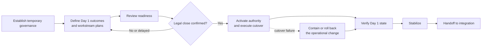

# Example 05: Merger-and-Acquisition (M&A) Day 1 Transition

## Example Record

**Provenance:** Fictional — created to illustrate temporary, cross-organization
transition governance without representing a real transaction or party. 
**Review status:** Illustrative; not domain-validated. 
**Draft contributor:** Framework drafting assistant, under Brad Groux's direction. 
**Responsible maintainer:** Framework maintainer. 
**Publication-safety note:** No real transaction, valuation, negotiation,
organization, employee, customer, regulator, system, or confidential plan is
represented. 
**Review triggers:** Material framework change, qualified M&A, legal,
finance, workforce, or integration review, unsafe ambiguity discovered in the
example, or change to the scenario assumptions.

## Scenario Overview

A buyer expects to complete the acquisition of another company. Legal close may
occur at an uncertain time after required conditions are met. The parties must
prepare to operate on Day 1 without acting as one company before they are
authorized, exposing restricted information, disrupting critical operations,
or creating conflicting instructions.

The fictional parties establish a temporary transition organization. It
coordinates legal-close confirmation, authority activation, essential
workforce and customer communication, financial control, access, service
continuity, and stabilization.

“Rollback” in this example means reversal or containment of a failed operational
Day 1 change. It does not mean reversing the legal transaction. Only qualified
transaction and legal authorities determine whether the transaction closes,
what may occur before close, and which obligations survive it.

## Procedure at a Glance

---

# SOP: Prepare and Execute an M&A Day 1 Transition

**Accountable owner:** Executive Transaction Sponsor 
**Transition authority:** Day 1 Transition Director 
**Approval status:** Approved for inclusion as illustrative; not approved for operational use 
**Review cycle:** At each transaction gate and after Day 1 stabilization

## 1. Purpose, Scope, and Expected Outcome

This SOP coordinates the minimum work required to move from separately
controlled pre-close preparation to an authorized and stable Day 1 operating
state.

It covers:

- temporary transition governance;
- pre-close planning within approved boundaries;
- workstream readiness and dependency management;
- close confirmation and Day 1 activation;
- cutover of approved operational changes;
- communication and continuity;
- exception, escalation, and operational rollback; and
- stabilization and handoff to longer-term integration.

It does not determine deal terms, legal close, regulatory clearance, valuation,
financing, tax structure, accounting treatment, employee consultation duties,
or the long-term integration strategy.

The expected outcome is that only authorized Day 1 changes occur, essential
people and operations receive clear direction, critical obligations continue,
actual state is verified, and incomplete or failed changes are contained and
owned.

## 2. Roles, Responsibilities, and Authority

| Role | Responsibility and authority |
|---|---|
| Executive Transaction Sponsor | Accountable for transition outcomes, executive tradeoffs, material residual risk, and this SOP. |
| Transaction and Legal Authority | Determines close status, permitted pre-close conduct, legal-entity authority, information restrictions, and legally required action. |
| Day 1 Transition Director | Directs the temporary transition organization, integrated plan, readiness reviews, command cadence, escalation, and handoff. |
| Workstream Owner | Owns readiness, authority, dependencies, evidence, cutover, recovery, and stabilization for a domain such as People, Finance, Technology, Operations, Customer, Supplier, Facilities, or Communications. |
| Day 1 Control Lead | Maintains the integrated decision, issue, dependency, and status record and checks that actions follow the temporary authority matrix. |
| Information-Governance Lead | Controls restricted information, clean-team or equivalent boundaries, access, use, retention, and release. |
| Communications Lead | Coordinates authorized employee, customer, supplier, public, and leadership communication. |
| Business Continuity Lead | Coordinates critical-service dependencies, contingency, incident response, and operational recovery. |
| Acquired-Company Authority | Retains decision authority for the acquired business until legal and transition authority changes are effective. |
| Integration Owner | Receives stabilized Day 1 work and owns the longer-term integration portfolio. |

The temporary authority matrix states, by decision and time:

- who decides before close;
- which preparation may occur before close;
- who receives authority upon confirmed close;
- which decisions remain with legal entities or specialist functions;
- which decisions require joint approval; and
- where conflicts escalate.

No transition participant acquires authority merely by being on the integration
team. AI may help consolidate approved plans, identify dependency conflicts, or
summarize status. It may not infer legal close, release restricted information,
change authority, make employment or customer commitments, or approve a
cutover.

## 3. Trigger, Prerequisites, Inputs, and Authoritative Sources

The procedure begins when the Executive Transaction Sponsor authorizes formal
Day 1 planning under instructions from Transaction and Legal Authority.

Prerequisites are:

- identified parties and transaction scope;
- named legal, executive, transition, and workstream authorities;
- approved information-sharing boundaries;
- known closing conditions and earliest plausible close window;
- defined critical operations and commitments;
- an approved temporary authority matrix; and
- a controlled transition record.

Authoritative sources are:

1. signed transaction documents and formal legal instructions;
2. written close confirmation from Transaction and Legal Authority;
3. approved regulatory, financing, employee, and other closing-condition status;
4. the temporary authority and information-governance matrices;
5. approved Day 1 operating principles and workstream plans;
6. each legal entity's current operating records until authority changes;
7. the integrated dependency, decision, issue, and readiness record; and
8. approved communication materials and audience lists.

Rumors, calendar dates, public reports, or assumptions that conditions will be
met are not close confirmation.

## 4. Procedure

### A. Establish Temporary Governance

The Executive Transaction Sponsor and Transaction and Legal Authority:

1. appoint the Transition Director and Workstream Owners;
2. approve the temporary authority matrix;
3. define restricted information and permitted collaboration;
4. define consequence and escalation thresholds;
5. identify critical operations and Day 1 outcomes;
6. approve the readiness and close-activation process; and
7. set the stabilization and handoff criteria.

The Day 1 Control Lead opens the integrated record for decisions, dependencies,
risks, issues, status, evidence, and changes. Every workstream identifies a
safe state from which delayed work can resume.

### B. Define Minimum Day 1 Outcomes

Each Workstream Owner states what must be true on Day 1 to:

- protect people, confidential information, assets, and legal entities;
- preserve payroll, cash, financial control, customer, supplier, safety,
  security, privacy, and critical service continuity;
- communicate who owns which decisions;
- prevent unauthorized commitments or access;
- meet explicit transaction obligations; and
- enable later integration without forcing nonessential Day 1 change.

The Transition Director challenges work that is desirable but unnecessary for
Day 1. Nonessential transformation moves to the integration portfolio unless a
responsible authority approves its Day 1 necessity and risk.

### C. Build and Reconcile Workstream Plans

Each plan includes:

- pre-close preparation permitted under legal instruction;
- close-dependent action that must remain dormant;
- owners, decision authorities, prerequisites, and deadlines;
- incoming and outgoing dependencies;
- data and information restrictions;
- cutover steps and expected state;
- verification evidence;
- communication needs;
- contingency and operational rollback;
- unresolved assumptions; and
- stabilization and handoff criteria.

The Day 1 Control Lead reconciles cross-workstream dependencies. The Transition
Director assigns an owner to every conflict and escalates issues that cannot be
resolved within temporary authority.

### D. Review Readiness

At each readiness review, Workstream Owners report:

- ready, ready with condition, not ready, or not applicable;
- evidence supporting the status;
- unresolved decisions, dependencies, risks, and information gaps;
- effect of a delayed or failed close;
- cutover and rollback readiness; and
- the next decision needed.

“Ready with condition” must identify the condition, owner, deadline,
containment, and consequence if unmet. The Transition Director does not convert
an unsupported status to ready to protect the schedule.

The parties rehearse critical command, communication, dependency, failure, and
recovery scenarios without prematurely executing close-dependent actions.

### E. Make the Day 1 Readiness Recommendation

Before the anticipated close window, the Transition Director assembles the
readiness position. Transaction and Legal Authority decides whether the
transaction may close; the Executive Transaction Sponsor decides whether
operational readiness supports proceeding where that decision remains within
their authority.

Possible operational decisions are:

- **Ready:** critical outcomes and controls are supported;
- **Ready with executive conditions:** named residual risks are accepted by the
  proper authority;
- **Delay operational changes:** legal close may proceed, but specified
  operational cutovers remain dormant or use contingency; or
- **Escalate transaction readiness:** a material condition requires
  transaction-level decision.

The legal close decision and operational readiness decision remain distinct.

### F. Confirm Close and Activate Authority

No close-dependent action begins until the Day 1 Control Lead receives and
records formal close confirmation from Transaction and Legal Authority.

After confirmation:

1. the Transition Director announces activation to authorized Workstream
   Owners;
2. the temporary authority matrix changes state as approved;
3. Workstream Owners acknowledge authority and begin only their approved
   cutovers;
4. the Communications Lead releases messages in the approved order; and
5. the Control Lead records actual timing, decisions, deviations, and status.

If close is delayed, all close-dependent actions remain dormant and restricted
information stays controlled.

### G. Execute Cutover and Manage Exceptions

Workstream Owners perform approved changes, verify intermediate states, and
report status at the agreed cadence. They stop when:

- a prerequisite is unconfirmed;
- actual authority differs from the plan;
- a critical dependency fails;
- a change exposes restricted information;
- the actual state cannot be determined; or
- continuing would materially increase harm.

The Transition Director coordinates conflicts. Domain authorities retain
decisions that require legal, financial, employment, safety, security, privacy,
technical, or other specialist judgment.

### H. Verify Day 1 and Stabilize

Each Workstream Owner verifies actual outcomes and provides evidence for:

- authority activation;
- critical people and operational continuity;
- access and information boundaries;
- financial and control state;
- customer and supplier commitments;
- required communication;
- failed, deferred, rolled-back, or incomplete action; and
- named stabilization work.

The Day 1 Control Lead assembles an integrated status showing confirmed facts,
unknowns, decisions, and risks. The Transition Director maintains the command
cadence until the Executive Transaction Sponsor accepts stabilization.

### I. Handoff to Integration

The Transition Director transfers to the Integration Owner:

- final Day 1 operating state;
- temporary decisions and expiration dates;
- unresolved risks, issues, dependencies, and commitments;
- rolled-back, deferred, or incomplete work;
- owners and due dates;
- retained evidence and decision history; and
- responsibilities that must return from temporary to durable governance.

Temporary authority ends only through an explicit decision and communication.

## 5. Policies, Controls, Approvals, and Risks

Controls include:

- legal authority over close and pre-close conduct;
- temporary authority and escalation matrices;
- restricted-information handling;
- minimum-necessary Day 1 scope;
- evidence-based workstream readiness;
- independent separation of legal close and operational readiness decisions;
- formal close confirmation before activation;
- named cutover, verification, contingency, and rollback ownership;
- controlled communications; and
- explicit transfer from temporary to durable governance.

Key risks include premature coordination, unauthorized information sharing,
legal exposure from acting as one company before authorization, conflicting
authority, employee or customer harm, payroll or cash failure, disrupted
critical service, incorrect communication, irreversible change, unsupported
readiness, temporary controls that never expire, and loss of transaction
evidence.

No schedule, announcement, executive expectation, or assumed close time
overrides legal or specialist authority.

## 6. Exceptions, Escalation, Recovery, and Stop Conditions

- **Close delayed:** Freeze close-dependent action, refresh timing and
  dependencies, preserve restricted-information controls, and reissue
  authorized instructions.
- **Close condition changes:** Transaction and Legal Authority decides the
  consequence; workstreams do not reinterpret it.
- **Partial or jurisdiction-limited authority:** Apply only the authority
  expressly confirmed and keep other actions dormant.
- **Conflicting source records:** Preserve each legal entity's authoritative
  record, identify the conflict owner, and do not merge or overwrite by
  assumption.
- **Unauthorized instruction:** Refuse, record, and escalate through the
  temporary authority matrix.
- **Critical cutover failure:** Stop dependent changes, contain impact, use the
  approved operational rollback or contingency, and escalate actual state.
- **Rollback cannot restore service:** Enter the responsible continuity or
  incident procedure and assign executive risk authority.
- **Incorrect communication:** Stop further release, correct the record through
  Communications and Legal authority, identify affected audiences, and assess
  consequences.
- **Temporary authority dispute:** Hold affected action while the Executive
  Transaction Sponsor and Transaction and Legal Authority clarify control.

Operational rollback restores or contains an affected service, access,
communication, or process where feasible. It does not undo legal close. Stop
any action that lacks confirmed authority, breaches information restrictions,
could materially harm people or critical operations, or has no credible
recovery for its risk.

## 7. Completion, Verification, and Evidence

Day 1 transition is complete when:

- legal close status and effective authority are recorded;
- required Day 1 outcomes are verified by each accountable Workstream Owner;
- critical people, customer, supplier, financial, access, control, and service
  states are known;
- required communications reached intended audiences;
- failed, deferred, contingent, or rolled-back actions have owners;
- material residual risks are accepted by the proper authority;
- temporary decisions and authority have expiration or handoff; and
- the Integration Owner accepts the stabilized record.

The Day 1 Control Lead verifies evidence completeness and integrated status.
Workstream Owners verify their domains. Transaction and Legal Authority verifies
close and legal authority. The Executive Transaction Sponsor accepts the
stabilization and handoff decision.

Evidence includes governance appointments, authority and information matrices,
readiness records, legal close confirmation, readiness decisions, dependency
and issue history, cutover logs, verification results, approved communications,
exception and rollback decisions, stabilization status, temporary-control
expirations, and integration acceptance.

## 8. Review, Approval, and Change History

The Executive Transaction Sponsor owns this SOP for the transaction. The
Transition Director gathers workstream evidence and feedback.

Review occurs at each transaction gate and after:

- a changed close condition or material delay;
- an authority, information, payroll, financial, customer, supplier, service,
  access, or communication failure;
- an operational rollback or continuity event;
- a regulator, auditor, employee, customer, or legal finding;
- transition-to-integration handoff; or
- a relevant framework change.

Material revisions require the Executive Transaction Sponsor's approval and
proportionate review from Transaction and Legal Authority and affected
Workstream Owners. Changes are communicated under the same confidentiality
controls as the transaction.

| Version | Status | Change | Approved by |
|---|---|---|---|
| Example draft | Illustrative | Initial fictional procedure | Pending M&A and legal review |

---

## Framework Annotation

| Concern | How the example expresses it |
|---|---|
| Intent | The procedure narrows Day 1 to authorized continuity, control, clear direction, and stable handoff rather than treating integration activity as the outcome. |
| Responsibility | It distinguishes legal close, executive risk, temporary transition, workstream, information, communication, continuity, and later integration authority. |
| Work | It coordinates governance, minimum outcomes, plans, dependencies, readiness, activation, cutover, verification, stabilization, and handoff. |
| Control | Information boundaries, temporary authority, formal close confirmation, minimum scope, readiness decisions, stop conditions, and rollback govern the transition. |
| Assurance | Workstream evidence, integrated status, actual-state verification, close confirmation, stabilization acceptance, and handoff support completion claims. |
| Learning | Gate reviews, failures, rollback, stakeholder findings, and handoff outcomes trigger corrections and future transition improvement. |

The annotation explains the example; it does not add framework requirements.

## Domain-Specific Boundary

The transaction roles, clean or restricted information practices, temporary
authority matrix, readiness gates, Day 1 command, cutover, stabilization, and
integration handoff are fictional choices for this M&A scenario. The framework
does not prescribe transaction structures, legal doctrines, integration
methods, or these roles and gates.

This example is not transaction, antitrust, securities, employment, tax,
accounting, regulatory, privacy, cybersecurity, or legal advice. It has not
received M&A or legal validation. Actual parties require transaction-specific
documents, qualified professional advice, jurisdictional review, confidentiality
controls, and authorized governance.

## Related Framework Documents

- [Framework examples](README.md)
- [Operating framework](../framework/operating-framework.md)
- [SOP content standard](../framework/sop-content-standard.md)
- [Shared operating memory standard](../framework/shared-operating-memory-standard.md)
- [Standards maintenance method](../framework/standards-maintenance-method.md)
