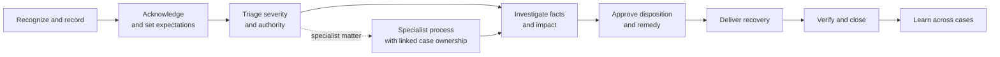

# Example 06: Customer Complaint and Service Recovery

## Example Record

**Provenance:** Generalized — synthesized from common customer complaint and
service-recovery patterns without representing a specific organization,
customer, or event. 
**Review status:** Illustrative; not domain-validated. 
**Draft contributor:** Framework drafting assistant, under Brad Groux's direction. 
**Responsible maintainer:** Framework maintainer. 
**Publication-safety note:** No real customer, contact information, account,
conversation, product, transaction, health information, or allegation is
represented. 
**Review triggers:** Material framework change, customer-service or consumer
protection review, a harmful ambiguity discovered in the example, repeated
complaint failure, or change to the scenario assumptions.

## Scenario Overview

A service organization receives complaints through conversations, written
messages, surveys, reviews, account teams, and referrals from other functions.
Complaints range from routine service dissatisfaction to allegations involving
safety, discrimination, privacy, fraud, legal rights, or serious harm.

The organization uses a remedy authority guide:

- a Case Owner may correct the service, reperform work, replace a deliverable,
  or reverse a verified erroneous charge within the original customer
  commitment;
- a Service Manager may approve additional goodwill or exceptions within a
  published management band;
- the Customer Experience Director approves remedies above that band; and
- only Legal or another specifically authorized function may approve a legal
  settlement, admission of liability, or waiver of contractual rights.

These authority bands are illustrative. The procedure treats understanding,
appropriate recovery, and prevention of recurrence as the outcome—not rapid
case closure alone.

## Procedure at a Glance

---

# SOP: Resolve a Customer Complaint and Recover Service

**Accountable owner:** Customer Experience Director 
**Process manager:** Complaint Operations Manager 
**Approval status:** Approved for inclusion as illustrative; not approved for operational use 
**Review cycle:** Quarterly and upon a listed review trigger

## 1. Purpose, Scope, and Expected Outcome

This SOP ensures that customer dissatisfaction is heard, assessed, resolved
within authority, communicated honestly, and used to improve service.

It covers:

- complaint intake from any recognized channel;
- acknowledgment and expectation setting;
- severity and specialist triage;
- fact-finding and customer impact assessment;
- remedy and commitment approval;
- recovery delivery and confirmation;
- closure, evidence, and learning.

It does not replace emergency, product-safety, privacy-incident, security,
fraud, legal-dispute, insurance, regulatory-reporting, employee-conduct, or
public-communications procedures. It routes qualifying matters to those
authorities while maintaining customer ownership.

The expected outcome is a customer complaint with a clear disposition,
delivered authorized remedy or explanation, preserved commitments and evidence,
and accountable corrective action where the organization caused or exposed a
systemic problem.

## 2. Roles, Responsibilities, and Authority

| Role | Responsibility and authority |
|---|---|
| Customer Experience Director | Accountable for complaint outcomes, remedy policy, systemic escalation, and this SOP. |
| Complaint Operations Manager | Oversees triage, assignment, aging, escalations, quality, and management remedy authority. |
| Intake Participant | Recognizes dissatisfaction, protects the customer from repeated explanation, captures minimum facts, and creates or routes a case. |
| Case Owner | Maintains end-to-end customer ownership, investigation, communication, remedy proposal, recovery coordination, evidence, and closure. |
| Service or Product Owner | Explains expected service, investigates operational facts, corrects service, and owns systemic action. |
| Remedy Approver | Approves financial, service, contractual, or goodwill remedies only within delegated authority. |
| Specialist Authority | Owns safety, privacy, security, fraud, legal, regulatory, accessibility, discrimination, insurance, or other specialist decisions. |
| Communications Authority | Approves public or media response when required. |
| Customer | States their experience and desired resolution, supplies available information, and receives status and outcome; they are not responsible for proving facts the organization already controls. |
| Quality and Learning Owner | Reviews case quality, themes, recurrence, corrective action, and SOP improvement. |

The Case Owner owns coordination even when a specialist procedure becomes
primary. They do not overrule specialist authority or promise an outcome outside
their authority.

AI may help classify unstructured intake, summarize a case, identify missing
facts, translate approved messages, or suggest relevant policy. A responsible
participant must review its output. AI may not dismiss a complaint, determine
credibility, infer protected characteristics, approve a remedy, admit
liability, or send a commitment without authority.

## 3. Trigger, Prerequisites, Inputs, and Authoritative Sources

This procedure begins when a customer or representative expresses
dissatisfaction, alleges harm, disputes the organization's action, or requests
remediation—whether or not they use the word “complaint.”

An Intake Participant needs enough information to:

- identify or create the customer and case reference when appropriate;
- record the customer's own description and desired resolution;
- identify the affected service, transaction, event, or commitment;
- provide a safe contact and accessibility preference;
- assess immediate danger or time sensitivity; and
- protect personal or confidential information.

Anonymous complaints may proceed when facts can be investigated or risk
requires action.

Authoritative sources are:

1. the customer's statement for their reported experience and requested
   outcome;
2. approved customer terms, promises, policies, and remedy authority;
3. service, transaction, delivery, communication, and consent records for
   organizational facts;
4. specialist incident or investigation records within their controlled scope;
5. applicable legal or regulatory interpretation from qualified authority; and
6. the complaint case for work state, commitments, decisions, and evidence.

An internal record does not automatically invalidate the customer's account.
Conflicts are investigated and represented honestly.

## 4. Procedure

### A. Recognize and Record the Complaint

The Intake Participant:

1. listens without requiring the customer to use a particular channel or form;
2. captures the customer's account in their meaning, distinguishing direct
   statements from the participant's interpretation;
3. records known dates, service, impact, requested outcome, contact preference,
   accessibility need, and prior attempts;
4. avoids requesting sensitive information not needed for the case;
5. checks for an existing complaint to prevent duplicate handling; and
6. gives the customer a case reference or explains the next contact.

If immediate danger, ongoing harm, credible threat, or urgent vulnerability is
apparent, the participant activates the responsible emergency or specialist
path before completing routine intake.

### B. Acknowledge and Set Expectations

The Case Owner acknowledges the complaint using the customer's preferred
permitted channel. The acknowledgment:

- confirms what the organization understood;
- states who owns the next step;
- gives a realistic time for the next update, not an unsupported resolution
  promise;
- explains any information needed from the customer and why;
- provides an accessibility or representation path; and
- identifies urgent help when relevant.

An apology for the customer's experience may be appropriate. A statement of
legal responsibility or final remedy requires the corresponding authority.

### C. Triage Severity and Authority

The Case Owner classifies the case by:

- actual or potential harm;
- ongoing exposure;
- customer vulnerability or accessibility need;
- number of customers or likelihood of recurrence;
- financial or contractual consequence;
- safety, privacy, security, fraud, discrimination, legal, or regulatory
  concern;
- time-critical commitment; and
- public or reputational impact.

Routine service failures remain with the Case Owner. Material or specialist
indicators are escalated immediately to the Complaint Operations Manager and
relevant Specialist Authority. The case records who has primary authority,
which information is restricted, and how customer communication will continue.

### D. Investigate Fairly

The Case Owner creates an investigation plan proportionate to severity:

1. confirm the question to be resolved;
2. preserve relevant records;
3. obtain service, transaction, communication, and policy facts from their
   authoritative owners;
4. invite clarification from the customer without forcing repeated full
   retelling;
5. distinguish confirmed fact, customer statement, organizational statement,
   assumption, and unknown;
6. identify similar cases or wider exposure where authorized; and
7. record contradictions and the authority needed to resolve them.

The organization does not alter records, coach accounts, retaliate, or treat a
complaint as unfounded solely because evidence is incomplete.

### E. Decide the Disposition and Remedy

The Case Owner and Service or Product Owner determine:

- what happened to the extent supportable;
- whether the service met the approved commitment;
- the customer's actual and continuing impact;
- correction needed to stop further harm;
- remedies permitted by policy and authority;
- any legal, contractual, regulatory, insurance, or specialist constraint; and
- corrective action needed beyond the individual case.

Possible dispositions include:

- complaint upheld in whole or part;
- service recovery provided without a final fault determination;
- additional information required;
- no organizational error supported, with explanation;
- transferred to a specialist dispute or incident process; or
- unable to determine, with known limits and available next step.

The Remedy Approver records the authorized remedy, basis, conditions, owner,
deadline, and effect on other commitments. No one promises money, waiver,
priority, confidentiality, deletion, legal outcome, or future service beyond
their authority.

### F. Communicate and Deliver Recovery

The Case Owner explains the outcome in direct language:

- what the organization understood and investigated;
- what it can and cannot conclude;
- the remedy or action approved;
- when and by whom it will occur;
- any action reasonably required from the customer;
- how to raise an unresolved concern; and
- when the next update will occur if work remains open.

The responsible operational owner performs the correction or recovery. The Case
Owner verifies delivery rather than treating the promise as completion.

### G. Confirm Closure

Before closure, the Case Owner:

- confirms the approved remedy or explanation was delivered;
- gives the customer a reasonable opportunity to respond;
- records acceptance, remaining disagreement, or inability to obtain a
  response;
- provides any required escalation or review route;
- ensures systemic corrective actions have owners outside the closing case;
  and
- records the final disposition and evidence.

A customer need not agree with the outcome for the case to close, but the
record must represent disagreement honestly and preserve any continuing right
or escalation path.

### H. Learn Across Cases

The Quality and Learning Owner reviews themes by service, cause, impact,
customer group, remedy, recurrence, and control failure while protecting
privacy.

Material patterns go to the responsible Service or Product Owner with an
action, accountable owner, target outcome, due date, and verification method.
Closing the individual complaint does not close the corrective action.

## 5. Policies, Controls, Approvals, and Risks

Controls include:

- acceptance from any recognized customer-contact path;
- accurate capture of the customer's meaning;
- protected and minimum-necessary personal information;
- immediate specialist escalation for high-impact indicators;
- remedy and commitment authority;
- separation of facts, allegations, assumptions, and conclusions;
- preserved customer communication and case history;
- verification that recovery was delivered;
- non-retaliation and accessibility; and
- trend and corrective-action ownership.

Key risks include ignoring indirect complaints, repeated customer retelling,
ongoing harm, biased credibility decisions, privacy exposure, unsupported
promises, inconsistent remedies, admission or waiver without authority,
premature closure, hidden recurrence, and treating customer satisfaction as the
only measure of a correct outcome.

## 6. Exceptions, Escalation, Recovery, and Stop Conditions

- **Customer cannot be identified:** Record an anonymous case, assess systemic
  risk, and investigate available facts without inventing identity.
- **Customer uses an unmonitored or public channel:** Preserve the complaint,
  move sensitive discussion to an approved private path, and keep the original
  reference.
- **Immediate safety or serious harm:** Activate emergency or specialist
  authority, protect the customer, and keep complaint ownership linked.
- **Privacy, security, fraud, discrimination, legal, or regulatory allegation:**
  Restrict the record as needed and follow the specialist procedure without
  promising its outcome.
- **Customer requests an unauthorized remedy:** Explain the Case Owner's
  authority, seek higher approval when proportionate, and do not imply approval.
- **Evidence conflicts:** Preserve both accounts, seek authoritative review, and
  state uncertainty.
- **Customer is abusive or threatening:** Protect participants and follow the
  safety or conduct procedure while preserving legitimate complaint content.
- **Promised recovery fails:** Acknowledge the failure, contain continuing
  impact, re-open or retain the case, and escalate remedy authority.
- **No customer response:** Make the approved number of reasonable attempts,
  preserve a reopen path when required, and close only after internal recovery
  obligations are addressed.

Stop routine handling when continuing could endanger someone, destroy evidence,
breach protected information, prejudice a controlled investigation, or make an
unauthorized commitment.

## 7. Completion, Verification, and Evidence

A complaint is complete when:

- the customer's concern and impact are represented accurately;
- severity and required specialist authority were assessed;
- relevant facts, contradictions, and limitations are recorded;
- an authorized disposition and remedy or explanation were delivered;
- recovery action was verified;
- the customer's response or reasonable contact attempts are recorded;
- continuing rights or escalation routes were communicated where required; and
- systemic action has an accountable owner and remains visible when applicable.

The Case Owner verifies the individual case. The Complaint Operations Manager
reviews material, aged, reopened, disputed, and sampled cases. Specialist
Authorities verify decisions in their domains. The Quality and Learning Owner
verifies trend and corrective-action follow-through.

Evidence includes original complaint content, acknowledgment, source records,
investigation notes, fact and uncertainty distinctions, specialist referrals,
remedy approvals, communications, recovery proof, customer response, closure
decision, and linked corrective action.

## 8. Review, Approval, and Change History

The Customer Experience Director owns this SOP. The Quality and Learning Owner
collects case evidence, customer feedback, practitioner feedback, remedy
patterns, recurrence, and control findings.

Review occurs quarterly and sooner after:

- serious customer harm or unresolved ongoing exposure;
- privacy, security, fraud, discrimination, safety, legal, or regulatory
  findings;
- repeated or inconsistent remedies;
- a failed promise or recovery;
- material complaint trend or systemic defect;
- changed customer commitments or remedy authority; or
- a relevant framework change.

Material revisions require Customer Experience Director approval and
proportionate review from customer operations, service or product owners, and
affected specialist authorities.

| Version | Status | Change | Approved by |
|---|---|---|---|
| Example draft | Illustrative | Initial generalized procedure | Pending customer-service and specialist review |

---

## Framework Annotation

| Concern | How the example expresses it |
|---|---|
| Intent | Resolution means understood impact, authorized recovery, honest communication, and corrective action—not merely fast case closure. |
| Responsibility | End-to-end case ownership remains clear while remedy, specialist, communication, service, and learning authority stay bounded. |
| Work | The procedure covers unstructured intake, acknowledgment, triage, investigation, disposition, remedy, communication, recovery, closure, and trend learning. |
| Control | Protected data, specialist escalation, remedy bands, fact distinctions, commitment limits, stop conditions, and non-retaliation govern judgment. |
| Assurance | Delivery verification, customer response, management sampling, specialist review, and retained case evidence support the final disposition. |
| Learning | Case themes, recurrence, failed recovery, feedback, and control findings create owned improvement beyond the individual case. |

The annotation explains the example; it does not add framework requirements.

## Domain-Specific Boundary

The complaint roles, severity assessment, remedy authority guide, investigation
practice, customer communication, and case evidence are choices for this
fictional service-recovery setting. The framework does not prescribe these
roles, remedy types, service commitments, or consumer processes.

This example is not legal, consumer-protection, accessibility, safety, privacy,
security, fraud, insurance, or public-relations advice. Organizations must use
their own customer promises, authority, law, professional review, product or
service risks, and escalation duties.

## Related Framework Documents

- [Framework examples](README.md)
- [Operating framework](../framework/operating-framework.md)
- [SOP content standard](../framework/sop-content-standard.md)
- [Shared operating memory standard](../framework/shared-operating-memory-standard.md)
- [Standards maintenance method](../framework/standards-maintenance-method.md)
