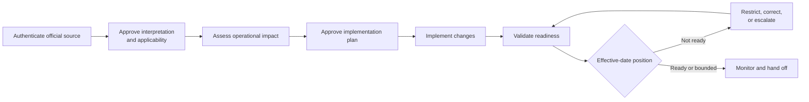

# Example 07: Regulatory-Change Implementation

## Example Record

**Provenance:** Fictional — created to illustrate the controlled interpretation
and implementation of an external requirement without representing a real law,
regulator, jurisdiction, organization, or compliance position. 
**Review status:** Illustrative; not domain-validated. 
**Draft contributor:** Framework drafting assistant, under Brad Groux's direction. 
**Responsible maintainer:** Framework maintainer. 
**Publication-safety note:** No privileged advice, confidential assessment,
regulatory filing, investigation, customer information, or real compliance
claim is represented. 
**Review triggers:** Material framework change, qualified legal or regulatory
review, a harmful ambiguity discovered in the example, or change to the
scenario assumptions.

## Scenario Overview

An organization operating in several jurisdictions receives notice of a new or
changed external requirement. The change may affect policy, customer terms,
records, controls, workforce practice, products, suppliers, reporting, or
evidence. The effective date and applicability may differ by jurisdiction and
business activity.

The fictional organization requires qualified Legal or Regulatory Authority to
approve the interpretation and applicability statement. Process and Control
Owners remain responsible for implementing approved changes in their
operations. An Executive Compliance Sponsor accepts material residual exposure
or determines that work must stop.

The example uses no real regulation or deadline and makes no compliance claim.

## Procedure at a Glance

---

# SOP: Implement a Regulatory Change

**Accountable owner:** Executive Compliance Sponsor 
**Interpretation authority:** Legal or Regulatory Authority 
**Process manager:** Regulatory Change Lead 
**Approval status:** Approved for inclusion as illustrative; not approved for operational use 
**Review cycle:** At each implementation gate and after the effective date

## 1. Purpose, Scope, and Expected Outcome

This SOP governs how an organization identifies, interprets, plans, implements,
verifies, and maintains changes required by an external legal or regulatory
development.

It covers:

- source authentication and intake;
- applicability and interpretation;
- impact assessment;
- implementation planning and authority;
- changes to operations, policy, controls, obligations, and evidence;
- readiness and compliance-position decisions;
- post-effective-date monitoring; and
- continuing ownership.

It does not provide legal advice, decide business entry or exit, conduct
regulatory advocacy, manage litigation or enforcement, or define the substance
of any particular legal requirement.

The expected outcome is an approved and evidenced organizational response in
which affected obligations, operations, controls, communications, and residual
exposure are known and owned by the effective date or escalated to an authority
capable of deciding the consequence.

## 2. Roles, Responsibilities, and Authority

| Role | Responsibility and authority |
|---|---|
| Executive Compliance Sponsor | Accountable for organizational response, resources, material exposure decisions, and this SOP. |
| Legal or Regulatory Authority | Authenticates and interprets the requirement, determines applicability within professional authority, and approves legal or regulatory claims. |
| Regulatory Change Lead | Coordinates the change record, impact assessment, plan, dependencies, readiness, evidence, escalation, and closure. |
| Business and Process Owner | Determines operational impact, implements approved changes, verifies adoption, and owns continuing compliance in their process. |
| Control Owner | Designs or changes controls and evidence needed to address the interpreted requirement. |
| Policy Owner | Revises governing organizational policy and resolves conflicts among internal standards. |
| Data and Records Owner | Addresses data use, quality, reporting, retention, deletion, provenance, and record obligations. |
| Workforce and Communications Owner | Coordinates training, notices, consultation, customer, supplier, or workforce communication under approved content. |
| Independent Assurance Owner | Reviews whether the response and evidence support the approved compliance position; does not replace Legal interpretation or Process ownership. |
| Risk Owner | Records, treats, and monitors residual exposure within delegated authority. |

AI may help monitor approved public sources, compare documents, organize impact
questions, draft controlled material, or identify missing evidence. A qualified
authority validates its output. AI may not determine legal applicability,
create the organization's compliance position, approve risk, or submit a
regulatory statement without authority.

## 3. Trigger, Prerequisites, Inputs, and Authoritative Sources

This procedure begins when:

- a competent public authority issues or changes a law, regulation, rule,
  order, binding standard, license condition, or official interpretation;
- qualified Legal or Regulatory Authority identifies a changed applicability
  or interpretation; or
- an authorized internal owner discovers that a previously assessed change may
  not be fully implemented.

Prerequisites are:

- an identifiable source and version;
- a Legal or Regulatory Authority;
- an Executive Compliance Sponsor;
- an initial jurisdiction, entity, activity, and effective-date hypothesis;
- protected handling for privileged or confidential analysis; and
- a controlled change record.

Authoritative sources are:

1. the official text and issuance record from the competent authority;
2. effective dates, transitional provisions, formal guidance, and later
   amendments from authoritative sources;
3. approved interpretation and applicability statements from qualified Legal
   or Regulatory Authority;
4. current business, entity, product, customer, workforce, supplier, data,
   control, and policy inventories;
5. approved risk and authority policies;
6. existing obligations, filings, licenses, commitments, and regulator
   correspondence; and
7. the regulatory change record for decisions, work state, evidence, and
   unresolved exposure.

Commentary, summaries, news, vendor materials, or AI output may identify a
possible issue but do not replace the official source or approved
interpretation.

## 4. Procedure

### A. Authenticate and Register the Change

The Regulatory Change Lead and Legal or Regulatory Authority:

1. obtain the official source and record its issuer, title, version, issue
   date, effective date, jurisdiction, and status;
2. distinguish enacted or binding text from proposals, commentary, and
   guidance;
3. record related amendments, transition periods, dependencies, or uncertain
   dates;
4. identify confidentiality or privilege handling; and
5. assign the initial sponsor, interpretation authority, and next decision.

If authenticity or status is uncertain, the record remains **under assessment**
and no participant represents the change as binding fact.

### B. Approve Applicability and Interpretation

Legal or Regulatory Authority prepares an approved interpretation statement
covering:

- affected jurisdictions and legal entities;
- affected activities, products, customers, workers, suppliers, data, records,
  or reports;
- required, prohibited, and permitted conduct;
- effective and transition dates;
- notification, filing, consent, consultation, or evidence obligations;
- unresolved ambiguity and assumptions;
- consequences that require executive decision; and
- conditions that would change the interpretation.

Business and Process Owners test the statement against actual operations and
raise facts that may alter applicability. They do not rewrite the legal
interpretation independently.

### C. Assess Impact and Current State

The Regulatory Change Lead creates an impact inventory. Each owner compares the
approved interpretation with current:

- policy and governance;
- customer, employee, supplier, and partner commitments;
- products, services, decisions, and operating procedures;
- roles, authority, segregation, and training;
- data collection, use, access, transfer, retention, and deletion;
- controls, monitoring, testing, reporting, and records;
- contracts, notices, forms, and communications; and
- third-party dependencies.

Each item is classified as compliant as-is, change required, uncertain, not
applicable, or accepted for escalation. Evidence and rationale are required;
unsupported confidence is not an impact assessment.

### D. Approve the Implementation Plan

The Regulatory Change Lead integrates:

- required outcomes and affected populations;
- work items, owners, authorities, dependencies, and milestones;
- policy, process, control, data, contract, communication, training, supplier,
  and record changes;
- validation and assurance;
- effective-date readiness and contingency;
- residual risk and escalation;
- post-effective monitoring; and
- a safe state from which interrupted work can resume.

Legal or Regulatory Authority confirms alignment with the interpretation.
Affected Business, Process, Policy, Control, Data, and Communications Owners
approve work within their authority. The Executive Compliance Sponsor approves
the integrated plan, resources, material tradeoffs, and escalation path.

### E. Implement Approved Changes

Owners implement only approved changes and record:

- the source obligation or interpretation addressed;
- the previous and new operating state;
- affected people, customers, records, agreements, or processes;
- testing and verification performed;
- communications, training, and effective timing;
- exceptions and deviations;
- evidence location; and
- continuing owner.

Material discoveries that change applicability, scope, deadline, cost,
feasibility, customer impact, or risk return to the corresponding authority.
Schedule pressure does not authorize a narrower interpretation.

### F. Validate Readiness

Before the effective date, the Regulatory Change Lead obtains owner assertions
and evidence. Independent Assurance proportionately tests:

- traceability from interpretation to implemented outcome;
- coverage of affected entities, processes, populations, data, and third
  parties;
- operation of new or changed controls;
- accuracy and delivery of required notices, training, filings, or records;
- treatment of exceptions and unavailable dependencies;
- actual rather than documented-only adoption; and
- support for the proposed compliance position.

Findings are classified, owned, and due. The owner of the compliance position
cannot erase a failed test; they must correct, bound, or escalate it.

### G. Decide the Effective-Date Position

The Executive Compliance Sponsor, advised by Legal or Regulatory Authority and
affected owners, records one position:

- **Ready:** evidence supports the approved interpretation and required state;
- **Ready with bounded residual action:** the responsible authority accepts
  explicit limitations, owners, deadlines, containment, and reporting;
- **Not ready—controlled restriction:** affected activity is limited, paused,
  or otherwise controlled under authority; or
- **Not ready—executive escalation:** a material exposure requires a decision
  beyond current authority.

Only Legal or Regulatory Authority approves legal or regulatory assertions and
communications. The record distinguishes factual implementation status,
assurance findings, legal interpretation, and risk acceptance.

### H. Monitor and Handoff

After the effective date, Process and Control Owners monitor actual adoption,
exceptions, outcomes, complaints, filings, control operation, and regulator or
industry developments.

The Regulatory Change Lead closes the temporary change only when continuing
obligations have durable owners, monitoring, evidence, and review triggers.
Open corrective actions remain visible after project closure.

## 5. Policies, Controls, Approvals, and Risks

Controls include:

- authentic official sources and version history;
- qualified interpretation and applicability authority;
- traceability from obligation to impact, change, control, and evidence;
- protected privilege and confidential information;
- integrated ownership and dependency management;
- explicit effective-date position;
- independent assurance proportionate to risk;
- controlled external statements and filings;
- residual-risk authority; and
- durable ownership after implementation.

Key risks include acting on a proposal as if final, missing an affected entity
or activity, unauthorized legal interpretation, inconsistent jurisdictional
treatment, incomplete third-party change, paper-only implementation, missed
deadline, unsupported compliance claims, loss of privilege, inaccurate filing,
weak evidence, and project closure before obligations become durable.

## 6. Exceptions, Escalation, Recovery, and Stop Conditions

- **Official sources conflict or change:** Legal or Regulatory Authority
  determines current status; affected work is re-baselined.
- **Interpretation remains ambiguous:** Record alternatives and consequences,
  seek qualified authority or regulator clarification when authorized, and use
  an approved conservative operating position where appropriate.
- **Jurisdictions conflict:** Do not average requirements. Assign qualified
  jurisdictional interpretation and executive resolution of operational
  consequences.
- **Effective date is at risk:** Escalate immediately with actual remaining
  work, exposure, containment options, and decision deadlines.
- **Third party cannot comply:** Apply contractual, operational, replacement,
  restriction, or exit decisions through the responsible owner and Legal
  authority.
- **Implementation test fails:** Contain affected operation, correct and retest,
  or escalate an explicit residual position.
- **Requirement is delayed, withdrawn, or invalidated:** Legal or Regulatory
  Authority confirms effect; owners decide which beneficial or contractual
  changes remain.
- **Regulator inquiry or challenge:** Preserve records and route all response
  through authorized Legal or Regulatory Authority.
- **Unauthorized compliance claim:** Correct or withdraw the statement,
  identify recipients, assess consequences, and review control failure.

Stop an affected activity when required by qualified authority, when continuing
would create an unaccepted material violation or harm, when a mandatory control
cannot operate, or when a public statement or filing lacks appropriate
authority.

## 7. Completion, Verification, and Evidence

The regulatory change is complete when:

- the official source, interpretation, applicability, and effective dates are
  identifiable;
- affected operations and obligations are accounted for;
- approved changes and controls are implemented and adopted;
- validation findings are resolved or explicitly bounded by the proper
  authority;
- the effective-date position is recorded;
- required communications, training, filings, and records are complete;
- residual actions and monitoring have durable owners; and
- the retained evidence supports only the claims actually made.

The Regulatory Change Lead verifies integrated completeness. Legal or
Regulatory Authority verifies interpretation and regulated assertions. Process
and Control Owners verify operational adoption. Independent Assurance reports
the scope and results of its work. The Executive Compliance Sponsor owns the
final organizational decision within delegated authority.

Evidence includes official sources and versions, interpretation and
applicability statements, impact inventory, approved plan, policy and process
changes, control design and operation, training and communication records,
contract or supplier changes, filings, test results, findings and remediation,
risk decisions, effective-date position, and monitoring handoff.

## 8. Review, Approval, and Change History

The Executive Compliance Sponsor owns this SOP with professional input from
Legal or Regulatory Authority. The Regulatory Change Lead maintains the
operating method and evidence.

Review occurs at each implementation gate and after:

- an amendment, guidance change, court or regulator development, or
  jurisdictional change;
- a missed or changed effective date;
- a compliance, control, filing, communication, or evidence failure;
- a regulator inquiry, audit, complaint, or enforcement event;
- material business, product, supplier, data, or organizational change;
- repeated implementation exceptions; or
- a relevant framework change.

Material revisions require approval by the Executive Compliance Sponsor and
qualified Legal or Regulatory Authority, with affected Process, Control, Risk,
Data, and Communications Owners consulted proportionately.

| Version | Status | Change | Approved by |
|---|---|---|---|
| Example draft | Illustrative | Initial fictional procedure | Pending legal and regulatory review |

---

## Framework Annotation

| Concern | How the example expresses it |
|---|---|
| Intent | The procedure seeks an evidenced organizational response to an approved interpretation, not completion of a compliance project or document alone. |
| Responsibility | Executive, legal, coordination, process, control, policy, data, communication, assurance, and risk authorities remain distinct and accountable. |
| Work | It moves from authentic source through interpretation, impact, planning, implementation, readiness, decision, monitoring, and durable handoff. |
| Control | Qualified interpretation, source history, traceability, privilege, approval gates, independent assurance, claim authority, restriction, and stop conditions govern the response. |
| Assurance | Owner evidence, traceability, control testing, independent review, effective-date position, and retained records bound the compliance claim. |
| Learning | Legal developments, findings, incidents, complaints, business changes, and implementation exceptions trigger renewed assessment and change. |

The annotation explains the example; it does not add framework requirements.

## Domain-Specific Boundary

The legal and compliance roles, interpretation statement, impact inventory,
readiness gates, assurance practice, effective-date positions, and compliance
evidence are fictional choices for this regulatory-change scenario. The
framework does not interpret law, prescribe compliance structures, or require
these roles, gates, or records.

This example is not legal, regulatory, compliance, risk, audit, privacy, tax, or
professional advice. It has not been reviewed by counsel or a regulatory
professional and must not be used to claim compliance. Actual implementation
requires authoritative sources, qualified jurisdiction-specific interpretation,
organizational authority, and evidence suited to the obligation.

## Related Framework Documents

- [Framework examples](README.md)
- [Operating framework](../framework/operating-framework.md)
- [SOP content standard](../framework/sop-content-standard.md)
- [Shared operating memory standard](../framework/shared-operating-memory-standard.md)
- [Standards maintenance method](../framework/standards-maintenance-method.md)
