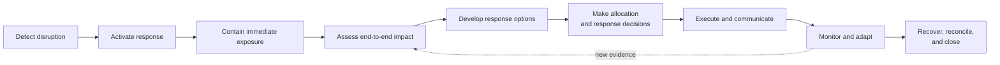

# Example 08: Supply-Chain Disruption Response

## Example Record

**Provenance:** Generalized — synthesized from common supply, planning,
continuity, and customer-coordination patterns without representing a real
organization, supplier, product, route, or disruption. 
**Review status:** Illustrative; not domain-validated. 
**Draft contributor:** Framework drafting assistant, under Brad Groux's direction. 
**Responsible maintainer:** Framework maintainer. 
**Publication-safety note:** No real supplier terms, inventory, capacity,
pricing, customer commitments, locations, vulnerabilities, or continuity plans
are represented. 
**Review triggers:** Material framework change, supply-chain or continuity
practitioner review, a harmful ambiguity discovered in the example, disruption
response failure, or change to the scenario assumptions.

## Scenario Overview

A manufacturer learns that a constrained material may not arrive in time to
support planned production and customer commitments. Information from
suppliers, carriers, sites, forecasts, and customers is incomplete and changes
quickly. Available responses may increase cost, quality risk, legal exposure, or
harm to other customers.

The fictional organization uses a temporary disruption team. Procurement may
use preapproved expediting authority. Planning may rebalance available supply
under an approved allocation policy. No material or design substitution occurs
without Quality and Product approval, plus customer or regulatory approval when
required. Only authorized commercial roles change customer commitments.
Executive Operations Authority decides material allocation, premium-cost, and
service tradeoffs outside standing authority.

## Procedure at a Glance

---

# SOP: Respond to a Supply-Chain Disruption

**Accountable owner:** Chief Operations Officer 
**Response authority:** Supply Disruption Director 
**Approval status:** Approved for inclusion as illustrative; not approved for operational use 
**Review cycle:** After each material disruption and semiannually

## 1. Purpose, Scope, and Expected Outcome

This SOP coordinates the response to a material supply-chain disruption so the
organization can protect people and quality, establish reliable facts, make
authorized tradeoffs, communicate honestly, preserve critical commitments, and
recover deliberately.

It covers:

- disruption recognition and activation;
- fact, exposure, and dependency assessment;
- immediate containment;
- response-option development;
- allocation and authority decisions;
- supplier, operational, and customer coordination;
- execution, monitoring, recovery, and learning.

It does not define sourcing strategy, product design, transportation safety,
trade compliance, contract interpretation, product-quality standards,
regulatory reporting, or crisis communications in detail.

The expected outcome is a controlled operating position in which affected
supply, production, customers, commitments, decisions, risks, and recovery work
are known and owned—even when full service cannot be preserved.

## 2. Roles, Responsibilities, and Authority

| Role | Responsibility and authority |
|---|---|
| Chief Operations Officer | Accountable for response policy, enterprise tradeoffs, material residual risk, and this SOP. |
| Supply Disruption Director | Directs the temporary response, integrated priorities, cadence, decisions, escalation, and recovery handoff. |
| Procurement Owner | Verifies supplier facts, contractual positions, alternate sources, expediting options, and supplier actions within purchasing authority. |
| Planning Owner | Maintains demand, inventory, capacity, allocation, and scenario views; applies only approved allocation rules. |
| Operations Owner | Assesses production or service impact, protects people and assets, and executes approved operating changes. |
| Quality and Product Authorities | Decide whether a material, process, source, design, or acceptance deviation is technically and professionally acceptable. |
| Logistics Owner | Assesses location, route, carrier, customs, handling, and delivery alternatives within approved authority. |
| Finance Owner | Validates cost, cash, margin, reserves, and financial authority. |
| Customer and Commercial Owner | Owns customer impact, prioritization inputs, approved commitments, and customer communication. |
| Legal, Trade, Risk, or Regulatory Authority | Interprets contracts, sanctions, import or export, insurance, regulatory, and other controlled obligations. |
| Continuity Owner | Connects the response to wider business-continuity and incident processes. |

The disruption team recommends and executes within delegated authority. It does
not create authority by urgency. Conflicting priorities escalate to the Chief
Operations Officer or the specialist authority responsible for the affected
risk.

AI may help reconcile approved records, detect inconsistencies, model stated
scenarios, summarize supplier updates, or draft internal options. People
responsible for sources and decisions validate its output. AI may not invent
supply facts, approve a substitution, choose customer allocation, change a
commitment, or accept risk.

## 3. Trigger, Prerequisites, Inputs, and Authoritative Sources

This procedure begins when credible information indicates that a supply,
capacity, logistics, quality, geopolitical, labor, facility, technology, or
other dependency may materially affect safety, legality, quality, production,
service, cost, or customer commitments.

Activation requires:

- a named Disruption Director;
- an initial affected item, service, location, supplier, or route;
- an initial consequence and time horizon;
- responsible domain owners;
- an escalation and decision cadence; and
- a controlled disruption record.

Authoritative sources are:

1. confirmed supplier and carrier commitments and notices;
2. approved purchase, contract, inventory, quality, shipment, and receiving
   records;
3. current production, service, capacity, maintenance, and workforce status;
4. approved demand forecasts, customer orders, service commitments, and
   allocation policy;
5. approved product specifications and change authority;
6. qualified legal, trade, regulatory, quality, safety, and financial
   interpretation; and
7. the disruption record for facts, assumptions, decisions, actions, evidence,
   and current state.

Estimates and supplier statements are labeled with source, time, confidence,
and confirmation status. No forecast is presented as confirmed supply.

## 4. Procedure

### A. Activate and Establish the Common Operating Picture

The Supply Disruption Director:

1. records who reported the issue, source, time, and observable facts;
2. appoints domain owners and sets the response cadence;
3. distinguishes confirmed fact, working assumption, scenario, and unknown;
4. identifies the earliest point of harm and time-sensitive decisions;
5. protects restricted commercial and security information;
6. links any safety, quality, security, or continuity incident; and
7. records current state and a safe resume point.

The team does not wait for perfect information before containing credible
danger, but it labels uncertainty in every material decision.

### B. Contain Immediate Exposure

Responsible owners:

- stop unsafe, unlawful, unapproved, or quality-compromised activity;
- quarantine suspect or nonconforming material;
- protect scarce inventory from unapproved consumption;
- prevent duplicate or conflicting supplier orders;
- pause unsupported customer or production promises;
- preserve relevant contracts, specifications, orders, communications, and
  traceability; and
- activate wider incident or continuity procedures when thresholds are met.

Containment states what is stopped, protected, restricted, or continuing and
who may release it.

### C. Assess End-to-End Impact

Procurement, Planning, Operations, Logistics, Quality, Finance, and Commercial
Owners determine:

- affected materials, sources, tiers, routes, facilities, products, and
  services;
- on-hand, in-transit, committed, usable, suspect, and recoverable supply;
- production or service capacity and constraints;
- customer orders, critical needs, penalties, and contractual commitments;
- downstream customer impacts, including who may receive less, later, changed,
  or no service under each scenario;
- safety, quality, regulatory, trade, financial, workforce, and reputational
  consequences;
- second-order dependencies and competing demands;
- earliest decision dates; and
- best, expected, and severe scenarios with stated assumptions.

The Planning Owner maintains the integrated view. Domain owners remain
responsible for the facts they provide.

### D. Develop Response Options

The team develops options such as:

- expedite or reroute confirmed supply;
- repair, recover, or safely rework available material;
- use an already approved alternate supplier or location;
- seek a qualified substitution or temporary specification change;
- change production sequence or service mode;
- allocate constrained inventory;
- defer noncritical internal consumption;
- negotiate supplier recovery;
- revise customer sequencing or commitments through authorized roles; or
- suspend affected offerings or operations.

Each option states expected benefit, time, cost, capacity, affected customers,
dependencies, reversibility, safety and quality effect, contractual or
regulatory implications, evidence, and approving authority.

### E. Make Allocation and Response Decisions

The Supply Disruption Director assembles a decision package. The responsible
authority selects actions using approved criteria such as:

- protection of life, safety, legality, and product quality;
- critical public, customer, or operational need;
- contractual and regulatory duties;
- ability to prevent cascading harm;
- fairness and consistency under the allocation policy;
- feasibility, reversibility, cost, and time; and
- long-term relationship and recovery consequences.

The decision record names the authority, facts and assumptions used, customers
or operations affected, rejected alternatives, residual risk, next review, and
conditions that would change the decision.

No participant favors a customer, site, or executive request outside the
approved decision criteria and authority.

### F. Execute and Coordinate

Each action has an owner, authorized scope, deadline, dependency, communication,
verification, and stop condition.

Procurement confirms supplier commitments. Logistics confirms route and
delivery facts. Operations changes schedules only after relevant safety,
quality, workforce, and material conditions are approved. Quality and Product
Authorities approve deviations before use. Commercial Owners communicate only
approved customer effects and alternatives.

Handoffs carry the current source facts, decision, affected quantities and
dates, conditions, restrictions, evidence needs, and next escalation. The
disruption record is updated at each decision cadence.

### G. Communicate with Affected Parties

Communications are timely, audience-appropriate, and explicit about:

- confirmed impact;
- what remains uncertain;
- current action and owner;
- changed commitment only when authorized;
- customer, supplier, or internal action needed;
- next update; and
- available escalation.

The organization does not promise recovery dates unsupported by confirmed
supply and capacity. Legally, commercially, or security-sensitive information
is shared only with authorized audiences.

### H. Monitor, Adapt, and Recover

The team compares actual supply, production, cost, quality, delivery, and
customer outcomes with the selected plan. New evidence triggers reassessment,
not silent plan drift.

Recovery includes:

- confirming stable supply and capacity;
- replenishing safety or working inventory under policy;
- removing temporary allocations and restrictions deliberately;
- ending premium freight or duplicate supply;
- reconciling orders, inventory, invoices, quality status, and customer
  commitments;
- monitoring temporary suppliers or deviations until closed;
- communicating restored or changed service; and
- transferring remaining actions to durable owners.

The Chief Operations Officer accepts closure of the temporary response.

## 5. Policies, Controls, Approvals, and Risks

Controls include:

- fact, assumption, scenario, and unknown distinctions;
- authority for sourcing, expediting, allocation, substitution, customer
  commitment, financial, and risk decisions;
- safety and quality hold authority;
- traceability for material and decision history;
- protected commercial and security information;
- approved allocation criteria;
- verification before use or promise;
- recurring reassessment as conditions change; and
- deliberate removal of temporary measures.

Key risks include unsafe substitution, counterfeit or unqualified supply,
quality escape, sanctions or trade violation, unapproved commitment, unfair
allocation, supplier fraud, inventory inaccuracy, cascading shortages, cost
without authority, customer harm, hidden second-order impacts, and temporary
workarounds becoming permanent.

## 6. Exceptions, Escalation, Recovery, and Stop Conditions

- **Supplier information conflicts:** Label the conflict, seek direct
  confirmation from authorized supplier contacts, and plan from bounded
  scenarios until resolved.
- **Inventory cannot be reconciled:** Quarantine uncertain quantities from
  allocation and perform controlled verification.
- **Unapproved alternate is proposed:** Do not purchase or use it until
  Procurement, Quality, Product, Legal, or regulatory authorities complete
  required approval.
- **Critical customer needs exceed supply:** Apply approved allocation criteria
  and escalate the tradeoff to Executive Operations Authority.
- **Commercial commitment already missed:** Correct the forecast, notify the
  Commercial Owner, and communicate under approved authority.
- **Expedite or recovery fails:** Reassess all dependent plans and promises,
  contain new exposure, and select another authorized option.
- **Disruption expands to safety, security, or continuity incident:** Transfer
  command as required while preserving linked supply ownership and evidence.
- **Decision authority unavailable:** Use documented delegation or contain the
  situation; urgency alone is not approval.
- **Temporary measure creates new harm:** Stop it, restore the safest known
  state when feasible, and escalate actual consequences.

Stop affected use, movement, production, or promise when safety, quality,
legality, origin, authority, or actual state is materially uncertain and
continuing could increase harm.

## 7. Completion, Verification, and Evidence

The disruption response is complete when:

- affected supply, operations, customers, and commitments have known status;
- immediate safety, quality, legal, and continuity exposure is controlled;
- approved response and allocation decisions were executed and checked;
- customer and supplier communications reflect authorized current facts;
- orders, inventory, quality, cost, delivery, and commitments are reconciled;
- temporary measures have been removed, approved for continued use, or handed
  to durable owners;
- residual risks and corrective actions have accountable owners; and
- the Chief Operations Officer accepts stabilization.

The Supply Disruption Director verifies integrated status. Each domain owner
verifies their facts and actions. Quality and specialist authorities verify
decisions in their domain. Finance verifies material cost treatment.
Commercial Owners verify customer commitments and communications.

Evidence includes source notices, common operating picture, inventory and
capacity assessments, scenario assumptions, option analysis, decision and
authority records, supplier commitments, quality approvals, allocation,
customer communications, execution results, exception and recovery history,
reconciliations, stabilization decision, and corrective-action ownership.

## 8. Review, Approval, and Change History

The Chief Operations Officer owns this SOP. The Supply Disruption Director and
Continuity Owner gather event evidence and participant feedback.

Review occurs after each material disruption and sooner when:

- a safety, quality, legal, trade, customer, or financial control fails;
- an alternate source, substitution, allocation, or recovery causes unexpected
  harm;
- a critical dependency or supplier concentration changes;
- repeated forecast, inventory, or communication failure appears;
- a continuity or audit finding is issued; or
- a relevant framework change occurs.

Material revisions require Chief Operations Officer approval and proportionate
review by Procurement, Planning, Operations, Quality, Logistics, Finance,
Commercial, Continuity, and relevant specialist authorities.

| Version | Status | Change | Approved by |
|---|---|---|---|
| Example draft | Illustrative | Initial generalized procedure | Pending supply-chain and continuity review |

---

## Framework Annotation

| Concern | How the example expresses it |
|---|---|
| Intent | The response protects safety, quality, critical commitments, authorized tradeoffs, and recovery rather than optimizing one shipment or schedule. |
| Responsibility | Temporary coordination is distinct from sourcing, planning, quality, commercial, financial, specialist, and executive decision authority. |
| Work | It covers activation, containment, fact-building, impact, options, decisions, execution, communication, adaptation, reconciliation, and recovery. |
| Control | Source confidence, holds, authority limits, allocation criteria, qualified substitution, commitment control, protected information, and stop conditions govern fast-moving choices. |
| Assurance | Reconciled facts, owner verification, quality approval, decision evidence, customer commitment review, and stabilization acceptance support closure. |
| Learning | Disruptions, control failures, concentration changes, outcomes, audit findings, and participant feedback drive continuity and procedure improvement. |

The annotation explains the example; it does not add framework requirements.

## Domain-Specific Boundary

The disruption team, allocation policy, supply facts, sourcing practices,
quality approvals, customer coordination, and recovery controls are choices for
this fictional manufacturing scenario. The framework does not prescribe
suppliers, allocation criteria, inventory methods, quality systems, logistics
methods, or these role titles.

This example is not supply-chain, product-quality, safety, trade, sanctions,
contract, insurance, finance, or legal advice. Organizations must use qualified
domain review, approved product and supplier controls, actual contracts,
applicable law, and their own decision authority.

## Related Framework Documents

- [Framework examples](README.md)
- [Operating framework](../framework/operating-framework.md)
- [SOP content standard](../framework/sop-content-standard.md)
- [Shared operating memory standard](../framework/shared-operating-memory-standard.md)
- [Standards maintenance method](../framework/standards-maintenance-method.md)
