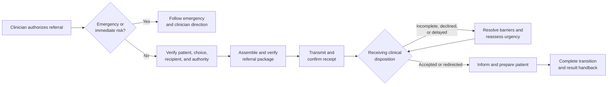

# Example 10: Patient Referral and Care Transition

## Example Record

**Provenance:** Fictional — created solely to illustrate framework application
to a high-stakes referral and care-transition handoff. 
**Review status:** Illustrative; not domain-validated. No clinical review has
occurred. 
**Draft contributor:** Framework drafting assistant, under Brad Groux's direction. 
**Responsible maintainer:** Framework maintainer. 
**Publication-safety note:** No real patient, clinician, organization,
condition, diagnosis, medication, treatment, appointment, identifier, or health
record is represented. 
**Review triggers:** Material framework change, qualified clinical, privacy, or
healthcare-operations review, any unsafe ambiguity discovered in the example,
or change to the scenario assumptions.

## Scenario Overview

A referring healthcare organization needs to transition a patient to a
receiving healthcare organization for further evaluation or care. The handoff
must preserve patient choice, privacy, clinical urgency, relevant information,
clear responsibility, confirmation of receipt and acceptance, and continuity
when the referral is delayed, declined, incomplete, or unsuccessful.

This fictional procedure assumes:

- a licensed clinician makes clinical decisions and determines the referral
  need and urgency;
- the patient or authorized representative participates as required by
  applicable rights, consent, and care needs;
- the referring and receiving organizations use approved identity, privacy,
  communication, scheduling, documentation, and emergency procedures;
- qualified privacy and legal authorities define permissible information use
  and disclosure; and
- emergency or immediately life-threatening needs bypass routine referral and
  follow the approved emergency response.

The example defines no symptom criteria, diagnosis, treatment, medication,
clinical timeline, or jurisdiction-specific legal rule.

## Procedure at a Glance

---

# SOP: Coordinate a Patient Referral and Care Transition

**Accountable owner:** Clinical Operations Executive 
**Clinical authority:** Referring and Receiving Licensed Clinicians within
their respective care responsibilities 
**Process manager:** Referral Operations Manager 
**Approval status:** Approved for inclusion as illustrative; not approved for operational use 
**Review cycle:** At least annually and after a listed review trigger

## 1. Purpose, Scope, and Expected Outcome

This SOP coordinates a referral and transition so the correct patient reaches
an appropriate receiving service with clinically relevant, accurate, and
permitted information; urgency and responsibility are clear; the patient
understands the next step; and failures do not create silent loss of continuity.

It covers:

- authorized referral initiation;
- identity, choice, consent or other permissible-basis, and destination checks;
- licensed-clinician urgency assignment;
- referral package preparation and protected transmission;
- receipt, clinical review, acceptance, scheduling, and patient communication;
- incomplete, declined, delayed, redirected, and failed-transition handling;
- result and responsibility handback; and
- closure, evidence, and improvement.

It does not define clinical indications, diagnosis, treatment, triage criteria,
emergency care, consent law, privacy law, insurance coverage, utilization
review, professional licensing, or the receiving service's standard of care.

The expected outcome is a closed-loop transition with an explicit current
clinical and coordination owner, verified disposition, informed patient or
authorized representative, and retained evidence. Sending a referral is not
completion.

## 2. Roles, Responsibilities, and Authority

| Role | Responsibility and authority |
|---|---|
| Clinical Operations Executive | Accountable for organizational referral governance, resources, material continuity risk, and this SOP. |
| Referring Licensed Clinician | Determines the clinical need and urgency, explains the referral, identifies clinically relevant information, and remains responsible within applicable professional and organizational duties until responsibility is accepted or otherwise transferred. |
| Referral Coordinator | Verifies administrative prerequisites, assembles authorized information, transmits, tracks, communicates, escalates, and preserves the referral record; does not make clinical decisions. |
| Patient or Authorized Representative | Provides preferences and permitted information, participates in decisions and preparation, and receives instructions and status consistent with rights and care needs. |
| Receiving Referral Team | Confirms receipt, verifies routing, identifies missing information, and coordinates clinical review and scheduling. |
| Receiving Licensed Clinician | Determines clinical acceptance, priority, destination, and needed clinical action within professional authority. |
| Care Coordination Owner | Manages complex barriers, cross-setting continuity, and unresolved handoffs when assigned. |
| Privacy, Legal, or Health-Information Authority | Determines permissible use, disclosure, consent, representation, access, correction, and record handling within qualified authority. |
| Coverage or Financial-Clearance Owner | Addresses authorization, network, benefit, or payment prerequisites without making clinical decisions. |
| Quality and Safety Owner | Reviews delayed, lost, incorrect, harmful, or repeated referral failures and corrective action. |

Administrative participants must not override a licensed clinical urgency or
acceptance decision. Coverage or administrative difficulty does not, by itself,
authorize clinical delay; it is escalated to the responsible clinician and
continuity authority.

AI may help detect missing administrative fields, summarize approved records
for clinician review, translate approved patient information, or track
unconfirmed handoffs. A responsible person validates its output. AI may not
diagnose, assign urgency, select treatment, decide consent or permissible
disclosure, accept the referral, or tell a patient that clinical responsibility
has transferred.

## 3. Trigger, Prerequisites, Inputs, and Authoritative Sources

This procedure begins when a Referring Licensed Clinician decides that referral
or transfer to another clinician, service, or organization is appropriate and
authorizes the referral order.

Prerequisites are:

- verified patient identity using the organization's approved method;
- an authorized referral order or equivalent clinical instruction;
- intended receiving specialty, service, or clinician;
- clinician-assigned urgency and relevant clinical reason;
- patient or authorized-representative involvement as required;
- confirmed lawful and organizational basis for using and disclosing
  information;
- known language, accessibility, communication, transport, and other continuity
  needs; and
- a controlled referral record.

Authoritative sources are:

1. the current health record for verified patient and clinical information;
2. the Referring Licensed Clinician's referral order, reason, urgency, and
   instructions;
3. the patient's documented preferences, choices, permissions, and
   representative status as applicable;
4. approved directory and receiving-service requirements;
5. qualified privacy, legal, clinical, coverage, and records guidance;
6. confirmed receipt, review, acceptance, scheduling, and result messages from
   authorized receiving participants; and
7. the referral record for work state, contacts, exceptions, commitments, and
   evidence.

An unverified contact, outdated directory entry, copied prior referral, or
automated suggestion is not sufficient authority for routing or disclosure.

## 4. Procedure

### A. Confirm Immediate Safety and Referral Suitability

The Referring Licensed Clinician determines whether the patient can proceed
through routine referral or needs emergency, urgent, same-day, monitored,
transport-supported, or other clinically directed action.

If emergency or immediate risk is suspected, participants follow the approved
emergency procedure and clinician instructions. They do not continue routine
administrative processing in place of urgent care.

The clinician records the referral reason, urgency, relevant precautions,
expected receiving service, and responsibility for care while the referral is
pending.

### B. Confirm Patient, Choice, and Permissible Information Use

The Referral Coordinator:

1. verifies patient identity;
2. confirms the selected or permitted receiving destination with the patient
   and clinician;
3. identifies the patient or authorized representative's communication,
   language, accessibility, transportation, and scheduling needs;
4. verifies consent or other permissible basis as required by qualified policy;
5. confirms recipient identity and approved transmission route;
6. records restrictions on information use or communication; and
7. escalates uncertainty to Privacy, Legal, or Health-Information Authority.

The coordinator does not pressure the patient to waive a choice or privacy
right to simplify processing.

### C. Assemble and Clinically Verify the Referral Package

The Referral Coordinator assembles only the information required and permitted
for the intended transition. Depending on clinician direction and receiving
requirements, the package may include:

- patient identity and approved contact information;
- referring clinician and organization contact;
- referral reason and licensed-clinician urgency;
- relevant history, findings, results, images, reports, current medications,
  allergies, precautions, and prior interventions;
- current care plan and pending tests or actions;
- language, accessibility, communication, and continuity needs;
- coverage or authorization information when required;
- requested receiving action; and
- the person to contact for clinical or administrative clarification.

The Referring Licensed Clinician verifies the clinical content, urgency, and
relevance. The Coordinator verifies administrative completeness, correct
patient and recipient, permissible disclosure, and readable attachments.

### D. Transmit and Confirm Receipt

The Coordinator sends the package through an approved protected route to the
verified receiving destination and records what was sent, to whom, when, by
whom, and under what authority.

Receipt must be confirmed by an authorized receiving participant or reliable
approved acknowledgment. A successful transmission status alone does not prove
that the right receiving service can review the referral.

If receipt is not confirmed within the clinician-directed time, the Coordinator
rechecks destination and route, contacts the receiving service, informs the
Referring Licensed Clinician, and escalates according to urgency.

### E. Obtain Clinical Review and Disposition

The Receiving Licensed Clinician or authorized clinical service records one
disposition:

- accepted with priority and next step;
- accepted pending specified information or prerequisite;
- redirected to a more appropriate service;
- declined with clinical or service reason and recommended next action where
  within authority; or
- unable to determine without additional clinical review.

The Receiving Referral Team communicates the disposition, responsible
receiving contact, timing, and missing requirements to the Referring
Organization.

Administrative staff do not represent a scheduling slot as clinical acceptance
unless the receiving organization has defined it that way.

### F. Resolve Barriers and Keep Responsibility Explicit

The Referral Coordinator assigns and tracks missing records, authorization,
coverage, scheduling, transport, language, accessibility, patient-contact, or
other barriers.

The Referring Licensed Clinician reassesses clinical urgency when:

- the referral is declined or redirected;
- required timing cannot be met;
- the patient's condition or circumstances change;
- required information is unavailable;
- coverage or administrative barriers delay care; or
- contact with the patient or receiving service is lost.

At every point, the referral record states who currently owns clinical
decisions, patient communication, barrier resolution, and the next check.
Responsibility does not disappear between organizations.

### G. Inform and Prepare the Patient

An authorized participant tells the patient or representative:

- the receiving service and reason for referral;
- confirmed status—not an assumed acceptance;
- scheduled or expected next step;
- preparation and information they need;
- whom to contact with questions or changed condition;
- what to do if symptoms or circumstances worsen, using clinician-approved
  instructions; and
- any unresolved coverage, transport, language, accessibility, or timing issue.

Communication uses understandable language and an approved accessible form.
Clinical instructions come from licensed clinicians.

### H. Complete the Transition and Close the Loop

The receiving organization confirms the accepted next step and assumes
responsibility only as defined by its clinical and organizational practice. The
referring organization records that transition and any continuing duties.

After the receiving encounter or transition:

- the receiving service provides the permitted report, result, or care
  transition information to the responsible referring participant;
- the Referring Licensed Clinician reviews and acts on returned information
  within professional duty;
- required follow-up responsibilities are assigned;
- discrepancies or missing results are pursued; and
- the patient receives appropriate follow-up communication.

The referral closes only after disposition, responsibility, patient
communication, and required result handback are known.

## 5. Policies, Controls, Approvals, and Risks

Controls include:

- licensed-clinician authority for referral need, urgency, clinical content,
  acceptance, and clinical instruction;
- verified patient and recipient identity;
- patient choice and permissible information use;
- minimum-necessary, relevant, accurate information;
- protected transmission and access;
- explicit receipt and clinical disposition;
- tracked barriers and time-sensitive escalation;
- no silent responsibility gap;
- result handback and clinician review; and
- privacy, safety, quality, and continuity incident handling.

Key risks include wrong-patient or wrong-recipient disclosure, incomplete or
incorrect clinical information, lost referral, false receipt or acceptance,
administrative override of clinical urgency, delayed care, inaccessible
communication, coverage barriers hidden from clinicians, unclear responsibility,
missing results, privacy harm, and closing the record after sending rather than
after transition.

## 6. Exceptions, Escalation, Recovery, and Stop Conditions

- **Emergency or worsening condition:** Follow clinician and emergency
  instructions immediately; routine referral tracking becomes secondary.
- **Identity or recipient uncertainty:** Stop disclosure, verify through
  approved sources, and report any suspected misdirection under the privacy or
  safety procedure.
- **Consent or permissible-basis uncertainty:** Hold nonurgent disclosure and
  escalate to qualified Privacy, Legal, or Health-Information Authority while
  the clinician manages care risk.
- **Referral package incomplete:** The Referring Licensed Clinician decides
  whether available information supports urgent transmission, later supplement,
  alternate destination, or other clinical action.
- **Referral declined or redirected:** Record the reason, notify the referring
  clinician and patient appropriately, and obtain a new clinical plan.
- **No timely receiving capacity:** Escalate to the Referring Licensed Clinician
  and Care Coordination Owner for urgency reassessment and authorized
  alternatives.
- **Coverage or financial barrier:** Inform the clinician and patient, pursue
  approved alternatives, and do not silently cancel clinically needed work.
- **Patient cannot be reached:** Use approved contact and safety procedures,
  involve the clinician based on urgency, and document attempts without exposing
  information.
- **Misdirected information:** Stop further disclosure, request containment,
  activate privacy and safety response, verify the correct destination, and
  resend only under renewed authority.
- **Result not returned:** Contact the receiving service, alert the responsible
  clinician, and keep the follow-up obligation open.

Stop routine processing when patient or recipient identity is materially
uncertain, disclosure authority is absent, clinical content has not received
required clinician verification, the destination cannot provide the intended
service, or continuing would substitute administration for urgent clinical
action.

## 7. Completion, Verification, and Evidence

The referral and care transition are complete when:

- the correct patient, referral order, destination, urgency, and permissible
  information basis are verified;
- clinically and administratively complete information reached the correct
  authorized recipient;
- receipt and clinical disposition are confirmed;
- the patient or authorized representative understands the confirmed next step
  through an appropriate communication method;
- current clinical, communication, and barrier-resolution responsibility is
  explicit;
- accepted transition, decline, redirection, or alternative action is recorded;
- required results or transition information returned to and were reviewed by
  the responsible clinician; and
- unresolved follow-up has an accountable owner and timing.

The Referral Coordinator verifies the administrative closed loop. Referring and
Receiving Licensed Clinicians verify clinical decisions within their respective
responsibilities. Privacy or specialist authorities verify exceptions in their
domains. The Referral Operations Manager reviews delayed, declined, redirected,
misdirected, lost, and sampled referrals.

Evidence includes the referral order, clinician urgency and instructions,
identity and destination verification, applicable choice and permissible-basis
record, transmitted package inventory, receipt confirmation, clinical
disposition, barrier and escalation history, patient communication, scheduling
or alternate plan, transition acceptance, returned report or result, clinician
review, privacy or safety response, and closure decision.

## 8. Review, Approval, and Change History

The Clinical Operations Executive owns this SOP with qualified clinical,
privacy, legal, health-information, patient-experience, and referral-operations
input.

Review occurs at least annually and after:

- patient harm, delay, lost referral, wrong-patient or wrong-recipient event;
- missed urgency, acceptance, result, or responsibility handoff;
- repeated decline, redirection, access, coverage, transport, language, or
  accessibility barrier;
- privacy, safety, quality, complaint, audit, or regulatory finding;
- changed clinical services, directories, responsibilities, or requirements;
- patient or practitioner feedback showing confusion; or
- a relevant framework change.

Material revisions require approval by the Clinical Operations Executive and
qualified clinical and privacy authorities, with affected referral,
health-information, patient-experience, coverage, and care-coordination
participants consulted.

| Version | Status | Change | Approved by |
|---|---|---|---|
| Example draft | Illustrative; not domain-validated | Initial fictional procedure | Pending clinical, privacy, and healthcare-operations review |

---

## Framework Annotation

| Concern | How the example expresses it |
|---|---|
| Intent | The outcome is safe continuity with verified disposition, informed patient, and explicit responsibility—not transmission of a referral document. |
| Responsibility | Licensed clinical authority, administrative coordination, patient participation, receiving review, privacy, barriers, and quality remain distinct and explicit. |
| Work | The procedure covers safety assessment, identity and permission, package preparation, transmission, receipt, clinical disposition, barriers, patient preparation, transition, and result handback. |
| Control | Clinical competence, verified identities, minimum-necessary information, protected transmission, urgency escalation, no administrative override, and stop conditions govern the handoff. |
| Assurance | Receipt, clinical disposition, patient communication, accepted responsibility, result return, clinician review, and exception evidence demonstrate a closed loop. |
| Learning | Harm, delay, misdirection, lost results, repeated barriers, findings, patient feedback, and practitioner feedback trigger review and correction. |

The annotation explains the example; it does not add framework requirements.

## Domain-Specific Boundary

The clinical and administrative roles, referral package, identity and privacy
checks, receipt and acceptance distinctions, urgency escalation, result
handback, and continuity controls are fictional domain-specific choices. The
framework does not define clinical practice, privacy law, referral criteria,
triage, consent, treatment, professional duties, or healthcare records.

This example has not been clinically validated. It is not medical, nursing,
clinical, emergency, privacy, coverage, regulatory, risk, or legal advice and
must not be used as a care protocol. Any operational use requires qualified
clinicians, privacy and legal authorities, patient-safety review, actual
organizational policies, applicable law, local services, training, and formal
approval.

## Related Framework Documents

- [Framework examples](README.md)
- [Operating framework](../framework/operating-framework.md)
- [SOP content standard](../framework/sop-content-standard.md)
- [Shared operating memory standard](../framework/shared-operating-memory-standard.md)
- [Standards maintenance method](../framework/standards-maintenance-method.md)
