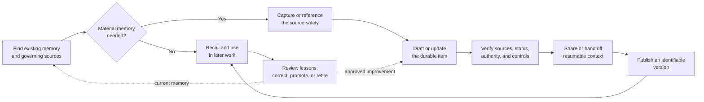
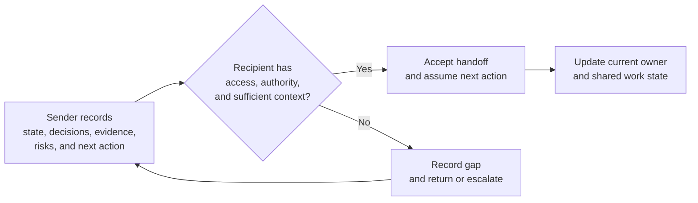

# Example 11: Shared Operating Memory Capture and Handoff

## Example Record

**Provenance:** Sanitized from real work — adapted with owner permission from
an internal operating-memory procedure. Private paths, identities,
organization-specific names, client and product names, helper commands, and
internal source references were removed. The business controls and scenario
were expanded for public illustration.<br>
**Review status:** Illustrative; not domain-validated. No independent records,
privacy, security, legal, knowledge-management, or business-continuity review
has occurred.<br>
**Draft contributor:** Framework drafting assistant, under Brad Groux's
direction.<br>
**Responsible maintainer:** Framework maintainer.<br>
**Publication-safety note:** The example contains no real repository, person,
organization, client, product, project, source record, credential, or private
operating detail.<br>
**Review triggers:** Material change to the shared operating memory standard,
independent domain review, privacy or records concern, unsafe ambiguity,
continuity failure, or change to the scenario assumptions.

## Scenario Overview

A multidisciplinary organization wants people and AI to continue work without
depending on individual recollection or access to prior conversations. It uses
a controlled, versioned repository containing readable documents, indexes, and
approved source files. Some authoritative business records remain in other
systems and are referenced rather than copied.

The organization wants a simple operating discipline:

- find relevant memory before acting;
- preserve material sources;
- distinguish source, synthesis, decision, work state, evidence, and guidance;
- capture context future participants should not have to rediscover;
- hand off resumable work;
- review and version meaningful changes;
- and promote approved lessons into standards and SOPs.

This example chooses a version-controlled document repository to make the
procedure concrete. That choice is not a framework requirement.

## Illustrative Assumptions

- The repository has one approved current location and controlled access.
- Text documents are the primary readable format, but permitted source files
  may use other formats.
- Repository history identifies meaningful changes and supports restoration.
- Existing systems of record remain authoritative for the business state
  assigned to them.
- Highly sensitive, privileged, regulated, secret, or large source material
  remains in an approved controlled system unless explicit authority permits
  repository storage.
- The organization has responsible privacy, security, legal, records, and
  domain authorities, even when one person holds several roles.
- People and AI use the same approved business documents, subject to the
  access and authority assigned to their roles.

## Memory Flow at a Glance



The diagram is the example's practical flow. It does not require every
organization to use these steps or a repository.

---

# SOP: Capture and Hand Off Shared Operating Memory

**Accountable owner:** Operating Memory Owner<br>
**Process manager:** Memory Maintainer<br>
**Approval status:** Approved for inclusion as illustrative; not approved for
operational use<br>
**Illustrative review cycle:** Quarterly and upon a listed review trigger

## 1. Purpose, Scope, and Expected Outcome

This SOP ensures that material operating knowledge is captured, grounded,
controlled, shared, and maintained so authorized people and AI can continue,
verify, and improve work without reconstructing essential context from
individual recollection or private conversation history.

It covers:

- finding relevant memory before work;
- deciding what requires durable capture;
- preserving or referencing source material;
- creating and updating syntheses, operating context, decisions, work state,
  handoffs, evidence references, and lessons;
- reviewing authority, provenance, sensitivity, freshness, and quality;
- versioning and sharing approved changes;
- correcting, superseding, archiving, and recovering memory;
- and routing lessons to standard and SOP maintainers.

It does not:

- replace an authoritative system of record;
- define enterprise data governance or records management;
- authorize collection of information;
- grant access or source rights;
- approve a business decision merely because it is recorded;
- require all work or communication to be retained;
- store credentials or secret values;
- or prescribe this repository structure to another organization.

The expected outcome is an identifiable current memory state in which:

- material claims are traceable to sources;
- status, authority, scope, sensitivity, and freshness can be judged;
- current work can be resumed;
- handoffs carry sufficient context;
- required controls and evidence are preserved;
- and lessons have an accountable path into future operation.

## 2. Roles, Responsibilities, and Authority

| Role | Responsibility and authority |
|---|---|
| Operating Memory Owner | Accountable for the shared operating-memory outcome, approves this SOP, assigns maintainers, accepts material operating risk, and resolves escalated cross-functional authority conflicts. |
| Memory Maintainer | Manages repository structure, indexes, review triggers, current and superseded status, quality findings, version history, correction coordination, and routine access questions. May contain an unsafe or incorrect item but cannot waive another authority's requirement. |
| Process or Project Owner | Owns the business context, decisions, work state, handoffs, and lessons for assigned work. Confirms what must be captured and who may rely on it. |
| Contributor | Finds existing memory, preserves sources, drafts or updates items, states provenance and uncertainty, applies handling rules, and submits meaningful changes for review. |
| Source or Decision Authority | Confirms the meaning, authority, scope, or current state of material sources and decisions within assigned responsibility. |
| Reviewer | Checks source grounding, clarity, completeness, controls, affected memory, and suitability for the claimed status. Review does not grant authority the reviewer does not hold. |
| Recipient | Confirms access to a handoff, assesses whether its state and sources are sufficient, accepts or rejects the handoff, and records material gaps. |
| Privacy, Security, Legal, Records, or Rights Authority | Defines controls within assigned competence, including permitted capture, access, retention, disclosure, legal hold, correction, and disposal. |
| Repository Administrator | Operates repository access, synchronization, backup, restoration, and technical integrity under approved direction. Does not decide business authority or record meaning. |

One person may hold several roles when consequence and separation-of-duty
requirements permit it. Role combination does not erase the decisions or
controls assigned to each role.

### AI Participation

AI may, within approved access:

- search and retrieve repository material;
- compare sources and versions;
- summarize, index, or organize content;
- draft memory, decision, handoff, or review items;
- flag missing sources, broken references, uncertainty, conflicts, or stale
  claims;
- suggest related memory and potential lessons;
- and check whether affected documents remain consistent.

AI may not:

- approve its own output as authoritative;
- invent a missing source, fact, decision, authority, permission, or handoff
  acceptance;
- treat its earlier output as independent evidence;
- expose or retain controlled information outside granted authority;
- decide legal, records, privacy, security, or professional requirements;
- dispose of memory or override retention;
- promote working memory into an approved SOP or standard;
- or represent successful retrieval as verification.

The Operating Memory Owner and responsible business owners remain accountable.

## 3. Trigger, Prerequisites, Inputs, and Authoritative Sources

### Triggers

The procedure begins when:

- a participant starts work that may depend on existing operating context;
- a new material source is received;
- a material fact, decision, approval, commitment, or business state changes;
- work is interrupted or transferred;
- completion or verification evidence is produced;
- an exception, incident, correction, or recovery occurs;
- a recurring question or workaround reveals a knowledge gap;
- a standard, SOP, policy, role, requirement, or repository location changes;
- or a review trigger indicates that memory may be stale, unsafe, duplicated,
  inaccessible, or no longer useful.

### Prerequisites

Before adding or changing memory, the contributor must be able to determine or
escalate:

- the business purpose and affected scope;
- whether relevant memory already exists;
- the responsible process, project, or memory owner;
- the intended memory class;
- the authoritative source or the absence of one;
- the contributor's right and authority to capture and share the material;
- the sensitivity and access boundary;
- applicable retention or legal-hold requirements;
- and the required reviewer or recipient.

The contributor does not capture sensitive material merely to avoid requesting
proper access later.

### Authoritative Sources

The repository index and this SOP govern how the memory process operates.
Business meaning comes from the sources and authorities assigned to each
matter, including:

- approved laws, policies, contracts, professional requirements, standards,
  and SOPs;
- designated systems of record;
- approved decisions and delegations;
- original source files or controlled references;
- verified observations and completion evidence;
- and current process or project records maintained by their accountable
  owners.

A summary, index, search result, AI response, conversation, personal note, or
repository copy is not authoritative merely because it is easier to access.

## 4. Activities, Decisions, Dependencies, Handoffs, and Outputs

### Activity 1 — Find Existing Memory

Before material work:

1. Start at the current repository index or known process or project entry
   point.
2. Search for the subject, process, project, source, decision, and known
   alternate terms.
3. Identify the current standard, active context, material decisions, work
   state, handoffs, and source references.
4. Check status, owner, scope, effective or as-of date, sensitivity, review
   trigger, and superseded links.
5. For high-impact or disputed matters, inspect the source or system of record
   rather than relying only on a synthesis.
6. Record a missing-memory or access exception when required material cannot be
   found or used.

Finding nothing is not proof that no memory, authority, or prior decision
exists.

### Activity 2 — Decide Whether Durable Capture Is Required

Capture or update memory when loss would foreseeably cause another participant
to:

- repeat material investigation;
- act without a governing source;
- misunderstand current state, scope, authority, or commitment;
- lose required evidence;
- repeat a known failure;
- receive an incomplete handoff;
- rely on superseded guidance;
- or miss a material lesson.

Do not create a durable item for trivial activity, unsupported speculation,
duplicated content, or temporary working material with no continuing value.
When uncertain, ask the Process or Project Owner or Memory Maintainer.

### Activity 3 — Classify and Route the Material

Choose the material's primary business role:

| Class | Illustrative treatment |
|---|---|
| Source material | Preserve an authorized original or record a stable controlled reference. Do not rewrite the source as though it were the original. |
| Synthesis | Explain what matters, cite the sources, state scope and as-of date, and mark uncertainty. |
| Operating context | Record durable facts, assumptions, constraints, relationships, and unresolved questions needed for the work. |
| Decision or commitment | Record the choice, authority, date, scope, rationale, conditions, dissent when material, and resulting action. |
| Work state or handoff | Record completed and remaining work, next owner and action, sources, decisions, dependencies, risks, exceptions, evidence, and acceptance. |
| Evidence reference | Identify the evidence, claimed outcome, verifier, date, authoritative location, and handling requirements. |
| Standard or SOP | Use the approved standards maintenance and contribution process. |
| Learning or correction | Record the observation, effect, affected material, owner, disposition, and whether guidance must change. |

One document may carry several classes when each is distinguishable. Separate
items when combining them would hide authority, access, status, or retention.

### Activity 4 — Capture or Reference the Source

1. Confirm the organization has the right and authority to retain or reference
   the source.
2. Apply sensitivity, access, privacy, security, and retention requirements.
3. Preserve an authorized original when required for evidence.
4. Otherwise, record the authoritative location, owner, date, scope, and access
   dependency without copying controlled content.
5. Give the source a stable, understandable identity.
6. Keep raw or original material distinguishable from later synthesis.
7. Do not place credentials, secret values, or unnecessarily identifying
   information in a note.

### Activity 5 — Create or Update the Durable Item

Use a structure appropriate to the work. The item communicates,
proportionately:

- subject, purpose, and scope;
- memory class and intended use;
- owner, maintainer, and contributor;
- status, authority, and as-of date;
- sources and provenance;
- relevant facts and context;
- decisions and their authority;
- assumptions, confidence, uncertainty, and unresolved questions;
- sensitivity, access, rights, and retention;
- related work and affected memory;
- next action or handoff;
- review trigger;
- and material change history.

The following is an example, not a required template:

```markdown
# Subject

Status: Current synthesis
Owner: Business role
As of: YYYY-MM-DD
Handling: Internal; authorized project participants

## Purpose and Scope

## Source and Authority

- Source: controlled reference
- Governs: stated scope
- Verification: reviewed by responsible role on YYYY-MM-DD

## Current Context

Separate facts, assumptions, and unresolved questions.

## Decisions and Work State

## Handoff or Next Actions

## Review Triggers and Change History
```

### Activity 6 — Record Decisions and Work State

For a material decision:

1. state what was decided;
2. identify the deciding role and evidence of authority;
3. record the date, scope, rationale, alternatives, conditions, and accepted
   risk;
4. preserve material dissent or uncertainty;
5. identify affected work and memory;
6. and update current context and next actions.

For active work state:

1. state the intended outcome;
2. record what is complete and how it was verified;
3. record what remains;
4. identify current owner, next owner, and next action;
5. link sources, decisions, outputs, and evidence;
6. state dependencies, risks, exceptions, and stop conditions;
7. and provide enough state to resume after interruption.

### Activity 7 — Verify the Item

The contributor or assigned reviewer:

- compares material claims with their sources;
- confirms that source, synthesis, decision, assumption, and uncertainty are
  distinguishable;
- checks owner, status, authority, scope, date, and freshness;
- confirms that sensitive content and source rights are handled correctly;
- checks affected links, indexes, decisions, handoffs, standards, and
  superseded material;
- confirms the item is in the appropriate controlled location;
- and records unresolved findings.

High-impact claims require review proportionate to their consequence. Fluent or
well-formatted content does not reduce the review needed.

### Activity 8 — Prepare and Accept the Handoff

The sender records:

- the outcome and scope;
- current state and as-of time;
- completed work and verification;
- remaining work and next action;
- sender, recipient, and accountable owner;
- decisions, approvals, and commitments;
- sources, current materials, outputs, and evidence;
- dependencies, risks, exceptions, and stop conditions;
- sensitivity and access requirements;
- unresolved questions and their owners;
- and the acceptance condition.

The recipient:

1. confirms access and authority;
2. checks that the state and sources are sufficient;
3. accepts the handoff or records the missing information;
4. becomes the next owner only when the transfer is valid;
5. and escalates a material gap instead of silently reconstructing the work.

### Handoff Detail



### Activity 9 — Publish an Identifiable Version

For a meaningful repository change:

1. inspect the complete change and affected indexes;
2. confirm that unrelated or sensitive material is not included;
3. obtain required review and approval;
4. create an identifiable version with a clear description of the knowledge
   changed;
5. synchronize it through the approved repository process;
6. confirm the accepted version is available to intended participants;
7. and report the location and version needed for recall.

Repository presence or version history does not prove that business review,
approval, or source authority occurred.

### Activity 10 — Review, Promote, Supersede, or Retire

The Memory Maintainer and responsible Process or Project Owner:

1. review retrieval failures, stale items, conflicts, duplicates, broken
   references, repeated questions, corrections, incidents, and feedback;
2. correct the current item and affected derivatives;
3. route material lessons to responsible decision, standard, or SOP owners;
4. use the standards maintenance method for approved guidance changes;
5. mark superseded items and redirect current entry points;
6. archive or dispose only under assigned authority;
7. and preserve material decision and change history.

## Illustrative Repository Structure

This example uses the following structure:

```text
operating-memory/
  README.md
  governance/
    memory-sop.md
    access-and-retention.md
  sources/
    source-register.md
    approved-source-files/
  operations/
    processes/
    projects/
    decisions/
    handoffs/
  standards/
    policies/
    sops/
  reference/
    research/
    terminology/
  reviews/
    corrections/
    memory-health/
  archive/
```

`README.md` is the current entry point. The structure separates governing
material, sources, active context, approved standards, review, and history.
Authoritative records that belong elsewhere are linked from the appropriate
item rather than copied automatically.

Other organizations may use the companion
[illustrative operational file structures](shared-operating-memory-file-structures.md)
or entirely different systems.

## 5. Policies, Controls, Approvals, and Risks

### Policies and Controls

- One current entry point identifies the approved repository and navigation.
- Every material item has an owner, status, scope, as-of date, sources, and
  handling boundary proportionate to its use.
- Source, synthesis, decision, work state, evidence, and approved guidance are
  distinguishable.
- Existing systems of record remain authoritative for their assigned state.
- Material repository changes receive proportionate review.
- Access follows least privilege and separation-of-duty requirements.
- Sensitive information is minimized and stored only in an approved location.
- Credentials and secret values are never stored in operating notes.
- Source rights, licenses, permissions, and contractual limits are preserved.
- Retention, legal hold, deletion, and disposal follow responsible authority.
- Current and superseded material are clearly distinguished.
- Repository history supports accountability and restoration but does not
  replace approval, records, access, or backup controls.
- AI output remains unverified until the required responsible participant
  reviews it.

### Approval

The Operating Memory Owner approves this SOP and material cross-functional
changes. Process and Project Owners approve memory within assigned authority.
Privacy, security, legal, records, rights, and professional authorities approve
or direct matters within their competence.

The Memory Maintainer may accept routine, low-risk corrections and organization
changes that do not alter business authority or controlled meaning.

### Primary Risks

- important work depends on uncaptured conversation history;
- unsupported synthesis is mistaken for fact;
- repository location is mistaken for authority;
- private, confidential, proprietary, or secret information is exposed;
- duplicated current versions drift;
- stale context drives incorrect work;
- a handoff transfers tasks without authority or sufficient state;
- AI-generated text is promoted without review;
- version history retains material that should not have been stored;
- a repository failure interrupts work;
- or lessons are collected but never change standards.

## 6. Exceptions, Escalation, Recovery, and Stop Conditions

### Missing or Inaccessible Memory

Search alternate terms, indexes, affected project or process areas, and
authorized systems. Ask the responsible owner. Record the gap and assign it.

Stop dependent high-impact work when the missing memory prevents a participant
from confirming authority, safety, legality, scope, current state, or required
evidence.

### Conflicting Memory

Record both sources, their dates, scope, owners, and authority. Do not silently
choose one. Route the conflict to the responsible Source, Decision, Process, or
Project Authority. Contain affected guidance until resolved.

### Stale or Unsupported Synthesis

Mark it as stale or unverified, prevent it from appearing as current, inspect
the source, correct affected derivatives, and notify participants who may have
relied on it.

### Sensitive or Unauthorized Material

Stop sharing and further copying. Preserve only the information needed to
coordinate containment. Notify the responsible privacy, security, legal,
records, rights, and repository authorities. Do not assume deleting the visible
file removes history, backups, exports, or derivative summaries.

### Invalid Decision or Authority

Mark the recorded decision as disputed or invalid within the authorized
containment process. Notify affected owners and recipients. Stop dependent work
when required. Route the business decision to the correct authority; editing
the note cannot supply missing authority.

### Rejected Handoff

The recipient records the missing state, source, access, authority, or
acceptance condition. Ownership remains with the sender or prior accountable
role until the handoff is corrected or escalated.

### Concurrent or Conflicting Repository Change

Pause publication, preserve both proposed changes, compare their business
meaning, resolve the conflict with affected owners, repeat review, and publish
one coherent current version.

### Repository or Source-System Unavailable

Use only an approved continuity copy or alternate source. Record work performed
during the interruption. When service returns, reconcile changes, verify
integrity and access, publish the authoritative state, and retain the incident
record.

### Incorrect Published Memory

Contain the item by marking, withdrawing, or correcting it. Identify affected
derivatives and participants, restore the last trustworthy state when
appropriate, record the correction and reason, and reassess related memory.

### Stop Conditions

Stop capture, publication, handoff, or reliance when:

- source rights or permission are unresolved;
- the contributor cannot determine the required sensitivity or access;
- credentials, secret values, or unnecessarily sensitive information may be
  exposed;
- material claims lack required sources or review;
- authority is missing, disputed, or outside the recorder's role;
- a conflict could materially change the work;
- retention, legal hold, deletion, or records treatment is unresolved;
- the handoff cannot support safe and authorized continuation;
- or the repository change would publish unrelated or private material.

## 7. Completion, Verification, Quality, and Evidence

### Completion Criteria

The procedure is complete for a memory change when:

- existing relevant memory was checked;
- durable capture was justified;
- the source was preserved or referenced under appropriate controls;
- the memory class, purpose, scope, owner, status, authority, as-of date, and
  handling boundary are clear;
- fact, synthesis, decision, assumption, and uncertainty are distinguishable;
- current context, work state, and next actions are accurate;
- affected links, indexes, decisions, standards, handoffs, and superseded items
  are consistent;
- required review and approval occurred;
- the accepted version is identifiable and available to intended participants;
- and unresolved exceptions have owners and do not violate a stop condition.

For a handoff, completion also requires recipient acceptance or a recorded
rejection and escalation.

### Quality Expectations

Memory is:

- necessary and proportionate;
- source-grounded;
- clear without an oral briefing;
- explicit about authority and uncertainty;
- findable from the current entry point;
- current enough for its stated use;
- controlled according to sensitivity, rights, and retention;
- sufficient to resume or verify the work;
- and maintainable without dependence on its original author.

### Verification

The assigned reviewer checks the completed item against the source, current
business state, handling requirements, affected memory, and intended use. The
Process or Project Owner confirms material operating meaning. Control
authorities confirm matters within their competence.

### Retained Evidence

Retain proportionate evidence of:

- the source or controlled source reference;
- contributor and review;
- material authority and approval;
- handoff acceptance or rejection;
- the accepted repository version;
- correction, conflict, containment, or recovery actions;
- standard or SOP promotion decisions;
- and supersession, archive, or disposal authority.

Repository history may preserve some evidence but does not prove external
approval or replace authoritative records.

## 8. Review, Approval, and Change History

The Operating Memory Owner owns this SOP. The Memory Maintainer conducts routine
review with Process and Project Owners and the necessary privacy, security,
legal, records, rights, domain, and repository authorities.

Review when:

- participants repeatedly cannot find current context;
- work cannot resume from a handoff;
- sources, owners, decisions, or authority are unclear;
- memory is stale, duplicated, contradictory, or unused;
- private, confidential, proprietary, secret, or improperly retained material
  is found;
- an incorrect item affected work;
- a repository, source system, identity, access, retention, or backup control
  changes;
- AI participation materially changes;
- an incident or recovery exposes a gap;
- or the shared operating memory standard changes.

Review:

- retrieval and access failures;
- rejected handoffs;
- missing-source and conflict records;
- stale and duplicate items;
- corrections and affected derivatives;
- privacy, security, rights, retention, and disposal events;
- repository integrity, backup, and recovery results;
- lessons promoted or not promoted into standards;
- and participant feedback from people and AI.

Material changes repeat proportionate documentation, validation, approval, and
communication. Superseded versions remain clearly historical under authorized
retention.

| Version | Date | Status | Change | Approved by |
|---|---|---|---|---|
| Example draft | 2026-07-30 | Illustrative | Sanitized and expanded operating-memory procedure for framework illustration | Founding steward |
| Version 1.0.0 baseline | 2026-07-30 | Approved for inclusion as illustrative; not domain-validated | Added full controls, handoff acceptance, correction, retention, recovery, and framework traceability | Founding steward |

---

## Framework Annotation

| Concern | How the example expresses it |
|---|---|
| Intent | It defines a durable, trustworthy, controlled shared-memory outcome and excludes indiscriminate capture or technology prescription. |
| Responsibility | It assigns accountable ownership, maintenance, contribution, source and decision authority, review, receipt, control, and administration without granting AI independent authority. |
| Work | It covers finding, classifying, sourcing, capturing, deciding, recording state, verifying, handing off, versioning, recalling, promoting, and retiring memory. |
| Control | It governs access, privacy, security, rights, retention, secrets, authority, stop conditions, containment, correction, conflicts, and recovery. |
| Assurance | It defines completion, quality, source grounding, review, authoritative results, handoff acceptance, identifiable versions, and retained evidence. |
| Learning | It reviews retrieval failures, stale context, conflicts, corrections, incidents, and recurring lessons and routes approved improvements into standards and SOPs. |

## Domain-Specific Boundary

The version-controlled document repository, illustrative roles, folder tree,
review cycle, item classes, publication step, and example note structure are
choices for this scenario. The framework does not prescribe Git, Markdown,
folders, repository history, these role titles, or one centralized memory
location.

This example is not legal, privacy, security, records-management,
knowledge-management, information-governance, or business-continuity advice.
An organization must replace its assumptions with its own authority, systems
of record, access model, information classification, retention schedules,
legal holds, source rights, backup and recovery controls, professional review,
and approved operating practices.

## Related Framework Documents

- [Framework examples](README.md)
- [Operating framework](../framework/operating-framework.md)
- [SOP content standard](../framework/sop-content-standard.md)
- [Shared operating memory standard](../framework/shared-operating-memory-standard.md)
- [Standards maintenance method](../framework/standards-maintenance-method.md)
- [Illustrative operational file structures](shared-operating-memory-file-structures.md)
