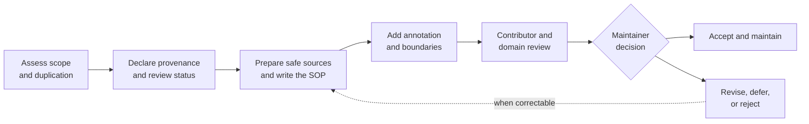

# SOP: Contributing Framework Examples

**Status:** Approved 
**Accountable owner:** Framework maintainer 
**Effective date:** 2026-07-30 
**Review triggers:** Framework change, contribution problem, publication-safety
incident, material domain change, or collection review

## Purpose, Scope, and Outcome

This SOP governs how examples are proposed, created, reviewed, accepted,
published, and maintained for the AI-Native Operating Framework.

It applies to new examples and material revisions to accepted examples. It does
not govern an organization's internal SOP approval process or make the
framework maintainer an authority over the business domain represented.

The repository-wide [framework contribution SOP](../CONTRIBUTING.md) also
applies. This specialized SOP establishes the additional requirements for
example content; the framework-wide SOP governs repository triage, accountable
decision, integration, response, and release.

The expected outcome is a useful, complete, clearly bounded, publication-safe
example that:

- illustrates the framework in a distinct domain or operating pattern;
- contains a complete SOP satisfying the eight content requirements;
- explains all six framework concerns without redefining them;
- states its provenance and review status truthfully;
- separates domain-specific choices from framework requirements; and
- has an accountable maintainer and known reasons for future review.

## Contribution Flow at a Glance

The flow summarizes the contribution path. The detailed procedure and named
authorities below govern each decision.

## Roles, Responsibilities, and Authority

### Framework Maintainer

The framework maintainer is accountable for the collection. The maintainer:

- decides whether a proposal is in scope and sufficiently distinct;
- reviews framework alignment, completeness, collection consistency, and
  publication safety;
- determines whether review evidence supports the claimed review status;
- accepts, returns, defers, or rejects a contribution;
- assigns or confirms ongoing maintenance ownership; and
- may withdraw or relabel an example when its provenance, safety, accuracy, or
  currency is no longer supportable.

Acceptance means the example is suitable for the framework collection. It does
not approve the example for operational use by another organization.

### Contributor

The contributor prepares the example and is responsible for:

- truthful provenance, attribution, permissions, and source handling;
- the completeness and clarity of the proposed SOP and annotation;
- identifying assumptions, limitations, and domain-specific choices;
- addressing review findings; and
- disclosing known facts that could affect publication or maintenance.

### Domain Reviewer

A domain reviewer assesses only the real-world or professional accuracy within
the review scope they accept. The reviewer records their relevant perspective,
review scope, date, material limitations, and findings. Domain review does not
transfer accountability for collection acceptance from the framework
maintainer.

### Other Participants

People with privacy, legal, safety, security, licensing, editorial, or other
relevant responsibilities may review a contribution when its subject or source
material requires them.

AI may assist with research, drafting, comparison, or review under the same
business controls that govern other participants. AI must not be represented as
having granted permission, supplied real-world experience, verified provenance,
or performed professional review when it did not.

## Trigger, Prerequisites, Inputs, and Authoritative Sources

### Trigger

This SOP begins when someone proposes:

- a new framework example;
- a material revision to an accepted example; or
- remediation of an example whose safety, accuracy, provenance, or currency is
  in question.

### Prerequisites

Before drafting begins, the contributor must be able to:

- explain the domain or operating pattern the example adds;
- identify existing examples that overlap with the proposal;
- state the intended provenance label;
- confirm a legitimate right to use any source material;
- identify known publication-safety concerns; and
- name a proposed maintainer for the example.

If the right to use source material is uncertain, work may continue only with
fictional or independently developed content that does not reproduce or expose
the uncertain material.

### Required Inputs and Authoritative Sources

Use the current versions of:

- the [operating framework](../framework/operating-framework.md);
- the [SOP content standard](../framework/sop-content-standard.md);
- the [shared operating memory standard](../framework/shared-operating-memory-standard.md);
- the [standards maintenance method](../framework/standards-maintenance-method.md);
- the [framework example index](README.md);
- the [approved glossary](../framework/glossary.md); and
- any law, policy, professional standard, source material, or organizational
  requirement that the example explicitly claims to represent.

The contributor must distinguish authoritative domain sources from commentary,
assumptions, and invented scenario details.

## Procedure

### 1. Assess Scope and Duplication

Describe the proposed scenario, intended audience, business pattern, and reason
for inclusion. Compare it with accepted and planned examples.

Proceed when the example adds a meaningfully different domain, scale, risk,
authority pattern, handoff, exception, or learning mechanism. Combine, narrow,
or stop proposals that merely rename an existing pattern without adding useful
understanding.

Record the scope decision and any overlap that the completed example should
acknowledge.

### 2. Declare Provenance and Intended Review Status

Choose and explain one provenance label:

- Fictional;
- Generalized;
- Sanitized from real work; or
- Directly sourced.

Choose an intended review status:

- Illustrative; not domain-validated; or
- Domain-validated example.

Do not select the second status until suitable domain review has actually been
completed and recorded. Note any sources, permissions, contributors, or
reviewers that the label will require.

### 3. Prepare Source Material for Safe Use

Identify and remove or replace:

- confidential or proprietary information;
- personal or identifying information;
- credentials and security-sensitive details;
- unsafe operational detail whose publication could create material harm;
- content without adequate permission or licensing; and
- facts, claims, or attribution that cannot be supported.

Sanitization must preserve the operating lesson while breaking unintended
connections to real people, organizations, transactions, incidents, or protected
material. If safe use cannot be established, stop the contribution.

### 4. Write the Complete SOP

Use a structure and language appropriate to the domain. Do not force the example
into a universal template, but make all eight required content areas clear:

1. purpose, scope, expected outcome, and governing requirements;
2. accountable owner, participants, responsibilities, and authority;
3. trigger, prerequisites, inputs, and authoritative sources;
4. activities, decisions, dependencies, handoffs, and outputs;
5. policies, controls, approvals, and risks;
6. exceptions, escalation, recovery, and stop conditions;
7. completion, verification, and retained evidence; and
8. review ownership, review triggers, approval, and change history.

Write enough operational detail to show normal work, meaningful exceptions, and
credible failure or recovery. Avoid invented precision: a fictional threshold,
deadline, law, or role must be clearly a scenario choice, not presented as a
universal fact.

When the example creates or uses durable sources, context, decisions, work
state, evidence, handoffs, or lessons, make their authority, location, access,
retention, correction, and maintenance meaning clear in proportion to the
scenario. Tool, repository, and file-structure choices remain example-specific.

### 5. Add the Example Annotation

Add:

- a concise scenario overview;
- a six-concern annotation explaining where the SOP addresses Intent,
  Responsibility, Work, Control, Assurance, and Learning;
- the provenance label and supporting explanation;
- the review status and its scope;
- a domain-specific boundary note;
- contributor attribution;
- the responsible maintainer; and
- known review or update triggers.

The six-concern annotation explains the SOP; it does not add requirements,
replace the complete SOP, or turn the example into a test of the framework.
State explicitly which roles, controls, time limits, thresholds, forms,
professional judgments, memory locations, file structures, and other choices
belong to the example's domain.

### 6. Perform Contributor Review

Review the draft for:

- business clarity and internal consistency;
- all eight SOP content requirements;
- all six framework concerns;
- normal, exceptional, failure, stop, and recovery paths;
- clear authority, approval, handoff, completion, and evidence expectations;
- accurate links, terms, sources, attribution, and provenance;
- alignment with the shared operating memory standard where durable context,
  decisions, state, evidence, handoffs, or lessons are material;
- separation of framework requirements from domain-specific choices; and
- publication safety.

Resolve findings or record them as explicit limitations. Do not hide a gap by
using vague language or an unsupported claim.

### 7. Obtain Proportionate Domain Review

Obtain relevant domain review when the example claims professional,
regulatory, legal, clinical, safety, or real-world accuracy. Give the reviewer
the complete example, intended claims, relevant sources, and known limitations.

Record:

- the reviewer's relevant role or perspective;
- what was and was not reviewed;
- the review date;
- findings and resulting changes; and
- any limitation or review-expiration condition.

If suitable review is not obtained, label the example **Illustrative; not
domain-validated** and remove or qualify claims that require professional or
real-world validation. No amount of framework review substitutes for domain
review.

### 8. Submit the Contribution

Provide the complete example and a contribution record containing:

- the scope and distinct-value rationale;
- provenance label and explanation;
- source, permission, license, and attribution information where applicable;
- publication-safety review results;
- intended review status and supporting review record;
- contributor attribution;
- responsible maintainer;
- known review and update triggers;
- material assumptions and unresolved limitations; and
- a summary of contributor-review findings and resolutions.

Use the submission and change-control process designated by the framework
maintainer. The business information above is required regardless of the
particular method used to exchange or review the document.

### 9. Complete Maintainer Review

The framework maintainer reviews the submission for:

- useful scope and limited duplication;
- alignment with the framework's purpose and boundaries;
- SOP completeness and readability;
- accurate six-concern annotation;
- appropriate operating-memory meaning without prescribing an implementation;
- truthful provenance, attribution, and review status;
- explicit domain-specific boundaries;
- publication safety;
- adequate response to contributor and domain-review findings; and
- credible maintenance ownership and triggers.

The maintainer may request changes, narrower claims, further review,
sanitization, consolidation with another example, or clearer boundaries.

### 10. Accept, Publish, and Maintain

The framework maintainer records one decision:

- **Accept** — ready for inclusion with stated provenance and review status;
- **Return for revision** — correctable findings are identified;
- **Defer** — potentially useful, but awaiting a named input, permission,
  review, or framework decision; or
- **Reject** — unsuitable, unsafe, unsupported, redundant, or outside scope.

After acceptance, add the example to the collection index and record its
maintainer, review status, review date, and update triggers. Publication occurs
only through the separately authorized publication process.

The example maintainer periodically checks review triggers, investigates
reported problems, and routes material changes through this SOP again.

## Policies, Controls, and Risks

- A provenance or review-status label must describe what actually happened.
- A domain-validated claim must identify a relevant reviewer, bounded scope, and
  date.
- An example must never be presented as legal, clinical, safety, regulatory, or
  other professional approval unless such authority and approval genuinely
  exist and may be published.
- Source rights, permission, licensing, and attribution must be resolved before
  acceptance.
- Publication safety applies to both the SOP and its contextual notes, review
  records, sources, and change history.
- Sanitized material must not be reversible through combinations of retained
  details.
- AI assistance does not cure missing permission, unreliable sources,
  unsupported facts, or absent professional review.
- The maintainer must prefer an explicit limitation or an illustrative label
  over an overstated claim.
- Collection consistency must not erase useful domain language or force a fixed
  document layout.

Material publication, privacy, safety, licensing, or professional-accuracy risk
requires review by the person or function accountable for that risk. The
framework maintainer cannot waive authority they do not hold.

## Exceptions, Escalation, Recovery, and Stop Conditions

### Exceptions and Escalation

- **Possible duplicate:** Compare the operating pattern and decide whether to
  combine, cross-reference, narrow, or reject.
- **Uncertain provenance or permission:** Pause direct use of the material and
  seek the accountable source, rights, privacy, or legal authority.
- **Conflicting reviewer findings:** Record the disagreement and escalate to
  the authority responsible for the disputed domain claim or risk.
- **Unavailable domain review:** Reduce or remove the relevant accuracy claim
  and retain the **Illustrative; not domain-validated** status.
- **Known defect in an accepted example:** Mark the limitation promptly,
  correct it through this SOP, or withdraw the example until it is safe and
  reliable enough to restore.
- **Missing maintainer:** The framework maintainer assumes temporary custody or
  withdraws the example until maintenance ownership is assigned.

### Stop Conditions

Stop acceptance or publication when:

- source rights or permission remain unresolved;
- confidential, personal, proprietary, security-sensitive, unsafe, or
  improperly licensed information may remain;
- provenance, attribution, or review status is false or unsupported;
- a material professional-accuracy claim lacks appropriate review;
- foreseeable harm cannot be reduced to an acceptable, authorized level; or
- no accountable maintainer will own the example.

### Recovery

Contain a problematic example by marking, withdrawing, or correcting it
proportionately. Preserve the decision record and relevant evidence, notify
affected maintainers or reviewers, assess whether similar examples are
affected, and use the learning to improve the collection or this SOP.

## Completion, Verification, and Evidence

A contribution is complete only when:

- the maintainer has recorded an acceptance decision;
- the example and annotation are complete;
- scope, provenance, attribution, review status, and boundaries are explicit;
- required publication-safety and domain reviews are resolved or accurately
  bounded;
- contributor and maintainer identities or accountable roles are recorded;
- review and update triggers are recorded;
- the collection index reflects the accepted example; and
- the published or retained version can be identified.

Retain proportionate evidence of:

- the submitted version;
- source rights, permissions, licenses, and attribution where applicable;
- contributor, publication-safety, domain, and maintainer reviews;
- findings, responses, limitations, and acceptance decision;
- the accepted version and review status; and
- later revisions, relabeling, withdrawal, or restoration.

The maintainer verifies that the example visible in the collection matches the
accepted version and carries the correct labels. File presence alone is not
evidence that the contribution process is complete.

## Review, Approval, and Change History

The framework maintainer owns this SOP and reviews it when:

- the framework, SOP content standard, shared operating memory standard, or
  maintenance method changes;
- contributors or reviewers repeatedly misunderstand an expectation;
- a publication-safety, provenance, rights, accuracy, or maintenance incident
  occurs;
- an accepted example exposes a missing control; or
- the collection undergoes a scheduled review.

Material changes require proportionate consultation with contributors, example
maintainers, and relevant domain or control authorities, followed by approval
from the framework maintainer.

| Version | Date | Status | Change | Approved by |
|---|---|---|---|---|
| Stage 2 draft | 2026-07-30 | Draft | Initial contribution SOP | Pending |
| Initial framework baseline | 2026-07-30 | Approved | Approved the example contribution and maintenance procedure | Founding steward |
| Version 1.0.0 memory extension | 2026-07-30 | Approved | Added operating-memory alignment and implementation-boundary review | Founding steward |

## Related Documents

- [Framework contribution SOP](../CONTRIBUTING.md)
- [Framework example collection](README.md)
- [Operating framework](../framework/operating-framework.md)
- [SOP content standard](../framework/sop-content-standard.md)
- [Shared operating memory standard](../framework/shared-operating-memory-standard.md)
- [Standards maintenance method](../framework/standards-maintenance-method.md)
- [Approved glossary](../framework/glossary.md)
