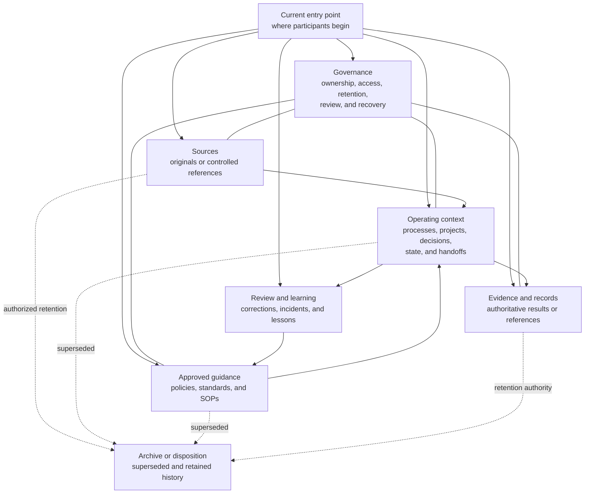
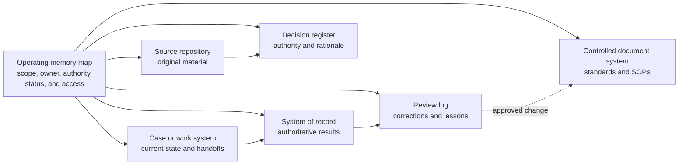

# Illustrative Shared Operating Memory File Structures

## Companion Record

**Status:** Illustrative structural patterns; not a complete SOP and not a
framework requirement.<br>
**Provenance:** Generalized — assembled from common document, project, records,
and knowledge-organization patterns without representing a specific
organization.<br>
**Review status:** Illustrative; not domain-validated.<br>
**Responsible maintainer:** Framework maintainer.<br>
**Publication-safety note:** All names, paths, structures, and examples are
generic and fictional.<br>
**Review triggers:** Material change to the shared operating memory standard,
evidence that a pattern implies one required architecture, or review by
records, privacy, security, knowledge-management, or operations practitioners.

## Purpose

These structures show several ways an organization could make shared operating
memory understandable in files or file-like repositories.

They are implementation examples. The framework requires the business meaning
defined in the
[shared operating memory standard](../framework/shared-operating-memory-standard.md),
not these folder names, hierarchy, formats, or storage choices.

An organization may:

- rename or combine every folder shown;
- distribute the same roles across several applications;
- keep authoritative records outside the memory repository;
- use metadata, links, search, databases, cases, or records systems instead of
  folders;
- and adopt an existing structure that already satisfies the standard.

## Logical Structure Before Physical Structure

Before choosing folders, identify the logical roles the organization must
provide:



The physical structure should make these relationships clear without creating
uncontrolled duplicate sources of truth.

## Structure Principles

Useful structures generally:

- provide one current starting point even when memory is federated;
- make ownership and scope understandable;
- distinguish sources from synthesis;
- distinguish active context from approved guidance;
- separate or label current, draft, superseded, and archived material;
- keep decisions and handoffs close to the work they affect;
- link to authoritative records rather than copying them automatically;
- provide a visible place for corrections and review;
- apply access and retention at boundaries the storage system can actually
  enforce;
- and remain usable after a person, AI, vendor, or tool changes.

A folder named `archive` does not establish a retention schedule. A folder
named `decisions` does not prove decision authority. A folder named `sources`
does not make every file authoritative.

## Pattern A — Minimal Team Memory

### When It Fits

A small team with a modest volume of low- to moderate-risk work, few access
boundaries, and one shared repository.

### Example Structure

```text
team-memory/
  README.md
  sources/
    source-register.md
    approved-files/
  current/
    operating-context.md
    decisions.md
    work-state.md
    handoffs/
  procedures/
    policies/
    sops/
  learning/
    feedback.md
    corrections.md
    review-log.md
  archive/
```

### Operating Notes

- `README.md` identifies the owner, scope, current entry points, handling rules,
  authoritative systems, and review process.
- `source-register.md` points to sources and states their scope and authority.
- `operating-context.md` summarizes current facts, assumptions, constraints,
  and unresolved questions.
- `decisions.md` is suitable only when decision volume and access remain small;
  material or differently controlled decisions should be separated.
- `work-state.md` covers one current stream; several simultaneous streams need
  separate state items.
- `archive/` contains only material retained under an assigned retention
  decision.

### Primary Risk

The structure stops scaling when many processes, access classes, or concurrent
projects cause the current files to become crowded or ambiguous.

## Pattern B — Multi-Team and Portfolio Memory

### When It Fits

An organization with several functions, products, services, clients, or
projects that share reference material and governance but need clear ownership
boundaries.

### Example Structure

```text
operating-memory/
  README.md
  governance/
    operating-memory-standard.md
    access-and-handling.md
    retention-and-disposition.md
    repository-map.md
  organization/
    strategy/
    cross-functional-decisions/
    terminology/
  functions/
    finance/
      README.md
      processes/
      decisions/
      handoffs/
    operations/
      README.md
      processes/
      decisions/
      handoffs/
  portfolios/
    portfolio-a/
      README.md
      context/
      projects/
      decisions/
      handoffs/
      evidence-index/
  engagements/
    engagement-template/
  standards/
    policies/
    sops/
  shared-reference/
    source-register/
    research/
  reviews/
    corrections/
    memory-health/
  archive/
```

### Operating Notes

- Each functional, portfolio, or engagement root has a local `README.md`
  identifying owner, scope, handling, authoritative records, current status,
  and navigation.
- Cross-functional decisions live at the lowest common scope that reaches all
  affected participants.
- Shared reference material is linked rather than copied into every project.
- A portfolio index may summarize projects, but each project's owner maintains
  its current state and handoffs.
- Access boundaries may require separate controlled repositories even when the
  logical navigation presents one operating-memory map.

### Primary Risk

Hierarchy can hide cross-functional memory or create repeated copies. The
repository map, stable links, ownership, and periodic duplicate review are
essential.

## Pattern C — Controlled or Regulated Operations

### When It Fits

Work with formal records, retention schedules, legal holds, privacy or security
classification, professional oversight, evidence integrity, or separation of
duty.

### Example Structure

```text
controlled-operating-memory/
  README.md
  governance/
    authorities/
    classifications/
    retention-schedules/
    legal-hold-process/
    access-register/
  controlled-guidance/
    policies/
    standards/
    sops/
  source-registers/
    governing-requirements/
    authoritative-systems/
    external-sources/
  operations/
    cases/
      case-id/
        context/
        decisions/
        handoffs/
        evidence-index/
        exceptions/
        closure/
  assurance/
    verification/
    approvals/
    audits/
  learning/
    incidents/
    corrections/
    change-proposals/
  disposition/
    pending-review/
    authorized-archive/
```

### Operating Notes

- The tree may contain indexes and controlled documents while authoritative
  records and evidence remain in validated case, records, or source systems.
- `evidence-index/` identifies evidence and integrity requirements; it does not
  imply that copying evidence into the file tree is allowed.
- Classification and retention are applied through enforceable controls, not
  filenames alone.
- Case closure records completion, verification, residual issues, record
  locations, retention, and the authority accepting closure.
- Disposal is routed through the responsible records, legal, privacy, or
  domain authority.

### Primary Risk

A convenient memory repository can become an unauthorized shadow record system.
The example must preserve the distinction between navigation or synthesis and
the designated authoritative record.

## Pattern D — Time-Bounded Initiative or Program

### When It Fits

A temporary initiative, transaction, migration, event, investigation,
transition, or other program that needs continuity from authorization through
closure.

### Example Structure

```text
initiatives/
  initiative-id/
    README.md
    charter-and-authority/
    source-register/
    context/
      assumptions.md
      dependencies.md
      stakeholder-map.md
    decisions/
    workstreams/
      workstream-a/
        state.md
        handoffs/
        outputs/
    risks-and-exceptions/
    evidence-index/
    communications/
    closeout/
      completion.md
      residual-items.md
      lessons.md
      retention-and-transfer.md
```

### Operating Notes

- `README.md` identifies the temporary outcome, owner, effective period,
  current phase or state, access boundary, and authoritative entry points.
- Each workstream maintains resumable state and hands off dependencies to other
  workstreams explicitly.
- Closeout transfers continuing knowledge to the permanent process, project,
  standard, or record owner.
- The initiative root becomes historical only after completion, residual
  ownership, retention, and future entry points are approved.

### Primary Risk

Temporary program memory becomes abandoned after closure, leaving active
commitments, residual risk, or lessons disconnected from permanent owners.

## Pattern E — Federated Operating Memory

### When It Fits

An organization whose authoritative knowledge already resides across document,
case, ticket, records, project, policy, communication, and source systems and
should not be copied into one repository.

### Example Structure

The physical implementation may be only a controlled map:

```text
operating-memory-map/
  README.md
  authority-map.md
  process-index/
  project-index/
  decision-index/
  handoff-index/
  source-and-record-register.md
  access-and-escalation.md
  review-and-correction-log.md
```

### Relationship View



### Operating Notes

- The map states what each connected system governs and who owns it.
- Links include enough context to explain why the target matters.
- Search or retrieval results preserve source identity, authority, access
  failures, and freshness.
- Corrections identify affected derivative summaries and indexes across
  systems.
- Migration updates the map and references without changing business meaning.

### Primary Risk

Participants may see only the systems they can access and assume missing
results do not exist. Access failures and incomplete retrieval must remain
visible.

## Common Operational Files

The following files illustrate useful business roles. They are not required
names.

| Illustrative file | Business purpose |
|---|---|
| `README.md` or `index.md` | Current entry point, owner, scope, status, handling, authority map, and navigation. |
| `source-register.md` | Source identity, owner, location, scope, authority, access, as-of date, and related memory. |
| `context.md` | Current facts, assumptions, constraints, relationships, and unresolved questions. |
| `decision-log.md` | Material decisions, deciding authority, dates, rationale, conditions, dissent, and effects. |
| `state.md` | Current work state, completed and remaining work, next owner and action, dependencies, risks, and evidence. |
| `handoff.md` | Sender, recipient, acceptance, resumable context, sources, decisions, risks, and next action. |
| `evidence-index.md` | Claimed outcome, evidence identity and authoritative location, verifier, date, integrity, access, and retention. |
| `review-log.md` | Review triggers, findings, decisions, corrections, unchanged rationale, and next review. |
| `corrections.md` | Incorrect memory, containment, affected derivatives and participants, corrected source, authority, and resolution. |
| `retention-and-transfer.md` | Continuing owner, material transferred, retained history, disposition authority, and future entry point. |

## Choosing a Pattern

Choose the smallest structure that keeps business meaning and controls clear.

Consider:

- consequence of missing or incorrect memory;
- number of processes, projects, participants, and handoffs;
- distinct ownership and access boundaries;
- source and record authority;
- privacy, security, rights, retention, and legal-hold requirements;
- volume and rate of change;
- need for offline continuity or restoration;
- and the ability to migrate without losing provenance or current entry points.

Do not choose a complex hierarchy merely because an example contains one.
Complexity should answer a real ownership, authority, control, retrieval, or
continuity need.

## Migration Between Structures

When a structure changes:

1. identify the current and future authoritative entry points;
2. map each content class, owner, access boundary, source, and record;
3. preserve current, superseded, and retained status;
4. resolve duplicates and conflicts with responsible authorities;
5. maintain source and decision provenance;
6. test links, search, access, handoffs, and restoration;
7. communicate the transition and retire obsolete entry points;
8. and preserve an identifiable migration and verification record.

Moving files is not enough when the move changes access, retention, authority,
or the ability to understand history.

## Boundary

These patterns do not define an approved records architecture, security model,
retention schedule, privacy design, source hierarchy, or technical
implementation. They are not substitutes for domain authority or the complete
[shared operating memory capture and handoff SOP](11-shared-operating-memory-capture-and-handoff.md).

## Related Documents

- [Shared operating memory standard](../framework/shared-operating-memory-standard.md)
- [Shared operating memory capture and handoff example](11-shared-operating-memory-capture-and-handoff.md)
- [SOP content standard](../framework/sop-content-standard.md)
- [Standards maintenance method](../framework/standards-maintenance-method.md)
- [Framework examples](README.md)
