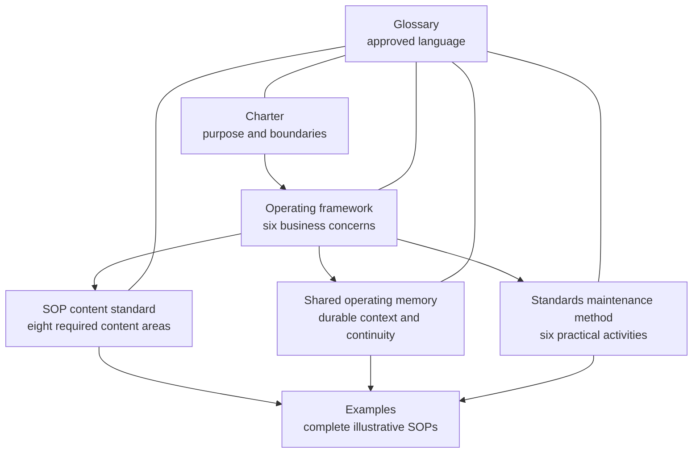

# Framework

This directory contains the canonical AI-Native Operating Framework.

## Reading Order

1. [Charter](charter.md) — mission, scope, commitments, stewardship, and
   non-goals.
2. [Operating framework](operating-framework.md) — the six concerns every
   business process must make clear.
3. [SOP content standard](sop-content-standard.md) — the eight areas every SOP
   must communicate.
4. [Shared operating memory standard](shared-operating-memory-standard.md) —
   how sources, context, decisions, state, evidence, handoffs, and lessons
   remain durable and governed.
5. [Standards maintenance method](standards-maintenance-method.md) — how
   organizations Understand, Document, Validate, Approve, Use, and Improve
   standards and SOPs.
6. [Glossary](glossary.md) — approved framework language.

## How the Core Fits Together

The charter bounds the framework. The operating framework defines what business
work must make explicit. The SOP standard defines what a complete procedure
must communicate. The shared operating memory standard explains how essential
operating knowledge remains durable, trustworthy, findable, and controlled.
The maintenance method explains how organizations create and keep standards
useful.

[Examples](../examples/README.md) demonstrate this relationship but do not add
framework requirements.

## Change Authority

Material changes follow the
[framework contribution SOP](../CONTRIBUTING.md) and
[Governance](../GOVERNANCE.md), and are explained in the
[decision record](../decisions/README.md). Project planning, reviews, and
historical documents under [`project/`](../project/README.md) are not canonical
framework content.
