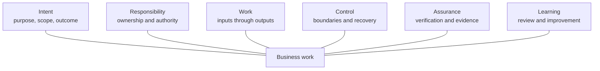

# AI-Native Operating Framework

**Status:** Approved initial framework baseline 
**Owner:** Brad Groux 
**Date:** 2026-07-30

## Definition

The AI-Native Operating Framework is an open business operating framework and
method for defining, documenting, applying, and improving the standards and
procedures through which people and AI perform work.

AI-native business operations assume that people and AI may both participate in
work under the same business standards and SOPs. AI participation is not
required in every process or activity, and accountable human ownership remains
explicit.

## What the Framework Does

The framework gives organizations a consistent way to make six business
concerns explicit:

1. Intent
2. Responsibility
3. Work
4. Control
5. Assurance
6. Learning

These concerns apply to existing business lifecycles and processes. They do not
form a mandatory sequence.

The framework also defines:

- the business content every SOP must communicate;
- how shared operating memory preserves sources, context, decisions, work
  state, evidence, handoffs, and lessons;
- the method used to create and maintain standards and SOPs;
- and examples showing how the framework applies across domains.

## Framework View

The concerns surround the work; they are not phases or a mandatory sequence.
Every business process expresses them in a form proportionate to its domain and
risk.

## What the Framework Does Not Do

The framework does not prescribe technology, a universal workflow, or a
mandatory document template. It does not define a separate operating model for
AI. It does not replace established management systems, professional standards,
laws, regulations, or accountable judgment.

Technology may be used while performing work. That technology remains part of
the organization's operating environment, not part of the framework.

## The Six Business Concerns

### 1. Intent

Intent establishes why the work exists and what it must accomplish.

A business process makes clear:

- its purpose;
- its scope and boundaries;
- the outcome it is expected to produce;
- the business need it serves;
- and the laws, policies, commitments, or other requirements that govern it.

Intent prevents activity from becoming detached from business purpose. It also
provides the basis for deciding whether the process should continue, change, or
stop.

### 2. Responsibility

Responsibility establishes who owns the work and who may act or decide.

A business process makes clear:

- its accountable owner;
- the people, teams, and AI that may participate;
- each participant's responsibilities;
- decision and approval authority;
- separation-of-duty requirements;
- and escalation ownership.

AI participation does not create an accountability gap. Authority must be
granted explicitly and remain within the boundaries established by the
business.

### 3. Work

Work describes what happens from initiation through output.

A business process makes clear:

- its trigger and prerequisites;
- required inputs and authoritative sources;
- activities and decision points;
- dependencies;
- handoffs;
- outputs;
- where material context, decisions, and current work state are recorded;
- and the state needed to resume interrupted work.

The framework does not prescribe how every process should flow. It requires the
actual work to be understandable to those responsible for performing,
supporting, reviewing, or receiving it.

### 4. Control

Control establishes the boundaries within which work may proceed.

A business process makes clear:

- applicable policies and rules;
- decision and approval controls;
- known risks;
- privacy, confidentiality, safety, or security requirements;
- information access, sharing, rights, and retention requirements;
- exceptions and their permitted treatment;
- escalation paths;
- stop conditions;
- and recovery or rollback expectations.

Controls should be proportionate to the work. They should protect the business
without turning every process into unnecessary bureaucracy.

### 5. Assurance

Assurance establishes how the organization knows the work was completed
properly.

A business process makes clear:

- completion criteria;
- expected quality;
- required checks and reviews;
- required evidence;
- the sources and provenance that support material claims;
- who verifies completion;
- how failures or discrepancies are handled;
- and where authoritative results are recorded.

Assurance distinguishes “activity occurred” from “the intended business outcome
was achieved to the required standard.”

### 6. Learning

Learning establishes how operating standards remain accurate and useful.

A business process makes clear:

- who maintains the standard;
- when review occurs;
- which events trigger an earlier review;
- how practitioner feedback is captured;
- how outcomes, exceptions, incidents, and evidence inform change;
- how material lessons enter shared operating memory and approved guidance;
- who approves revisions;
- and how change history is preserved.

Learning turns experience into better future operation rather than relying on
people or AI to rediscover the same lesson.

## Applying the Framework

An organization applies the framework to an existing process by:

1. examining the process through each of the six concerns;
2. resolving missing, unclear, or contradictory business meaning;
3. documenting the resulting standard or SOP;
4. validating it against real work, including exceptions and failure cases;
5. approving and using it through existing governance;
6. and improving it as evidence and requirements change.

The framework can be applied to:

- a new process being designed;
- an existing process being documented;
- an SOP being reviewed;
- a cross-functional handoff being repaired;
- responsibilities being clarified;
- controls or evidence being strengthened;
- or a process being prepared for participation by people, AI, or both.

## Relationship Between the Framework and SOPs

The framework defines the concerns and method. An SOP applies them to a specific
business process or activity.

An SOP does not need six matching headings. It must communicate the approved
business meaning clearly. The SOP content standard defines the minimum
information expected regardless of layout.

Recurring work is commonly documented as an SOP. Temporary or exceptional work
may instead use a time-bounded operating standard, plan, playbook, or procedure
suited to that program. The framework's six concerns still apply. When the
document directs repeatable activities within the temporary work, the SOP
content standard provides a proportionate completeness check. The document's
label does not reduce its requirements for ownership, authority, control,
assurance, or learning.

Policies, role descriptions, forms, checklists, decision records, training
materials, and other documents may support an SOP. They do not substitute for
missing business meaning.

## Shared Operating Memory

Organizations applying the framework establish a proportionate shared
operating-memory practice or show how existing knowledge, records, and work
management practices meet the same need.

Shared operating memory is the controlled, durable body of sources, context,
decisions, work state, evidence, handoffs, and lessons that allows authorized
people and AI to continue, verify, and improve work over time.

It prevents essential operating knowledge from depending solely on one
participant's recollection, private conversation history, or temporary model
context. It does not make every stored item authoritative and does not require
one repository or technology.

The [shared operating memory standard](shared-operating-memory-standard.md)
defines:

- what deserves durable capture;
- what business meaning a durable item communicates;
- how authority, provenance, freshness, and uncertainty remain visible;
- how people and AI find, assess, use, capture, verify, and hand off memory;
- how access, privacy, rights, retention, correction, and recovery apply;
- and how approved lessons return to standards and SOPs.

Each process SOP still identifies the specific sources, records, evidence,
handoffs, and state relevant to that work. The shared practice supplies
consistent cross-process controls and continuity.

## People and AI

People and AI use the same approved standards and SOPs. The framework does not
require a parallel machine representation, separate agent instructions, or
separate AI-only operating memory.

Good documentation is:

- clear enough to interpret consistently;
- complete enough to perform the work;
- explicit about authority and constraints;
- specific about evidence and completion;
- honest about exceptions and uncertainty;
- and maintained as the business changes.

Those qualities improve understanding for every reader.

## Organizational Interoperability

The framework uses interoperability in an organizational sense.

People, teams, and AI interoperate when they share:

- business language;
- purpose and expected outcomes;
- responsibilities and authority;
- understandable work and handoffs;
- controls and escalation paths;
- evidence and completion expectations;
- and maintained shared operating memory.

Interoperability does not require every participant to use the same technology.
It requires the work to remain understandable across organizational boundaries.

## Independence From Technology

The framework remains unchanged when an organization changes:

- software;
- AI models;
- automation tools;
- communication systems;
- data platforms;
- knowledge repositories and retrieval systems;
- or service providers.

Tool-specific instructions may exist within an organization's SOP when they are
necessary to perform the work. Those instructions describe the organization's
current procedure; they do not become framework requirements.

## Quick Review

A process is ready to be documented or improved through the framework when its
owner can answer:

### Intent

- Why does this process exist?
- What is inside and outside its scope?
- What outcome and requirements govern it?

### Responsibility

- Who owns the outcome?
- Who performs, decides, approves, and receives the work?
- Where does authority stop and escalation begin?

### Work

- What starts the process?
- What inputs, activities, decisions, handoffs, and outputs matter?
- Where are material context, decisions, and current state recorded?
- How can interrupted work resume from that state?

### Control

- Which policies, risks, approvals, exceptions, and stop conditions apply?
- Which access, sharing, privacy, rights, and retention controls apply to the
  operating memory?
- How does the process recover when something goes wrong?

### Assurance

- What does complete and correct mean?
- What checks and evidence demonstrate it?
- Which sources support material claims?
- Who verifies and records the authoritative result?

### Learning

- Who maintains the standard?
- What triggers review or revision?
- How are lessons captured, approved, and returned to shared operating memory?

If the answers are unclear, the framework has identified work that must be
resolved before documentation alone can make the process reliable.

## Related Documents

- [Charter](charter.md)
- [SOP content standard](sop-content-standard.md)
- [Shared operating memory standard](shared-operating-memory-standard.md)
- [Standards maintenance method](standards-maintenance-method.md)
- [Framework examples](../examples/README.md)
- [SOP for contributing framework examples](../examples/CONTRIBUTING.md)
- [Approved glossary](glossary.md)
- [Accepted decisions](../decisions/README.md)
- [Stage 2 specification](../project/specifications/stage-2.md)
