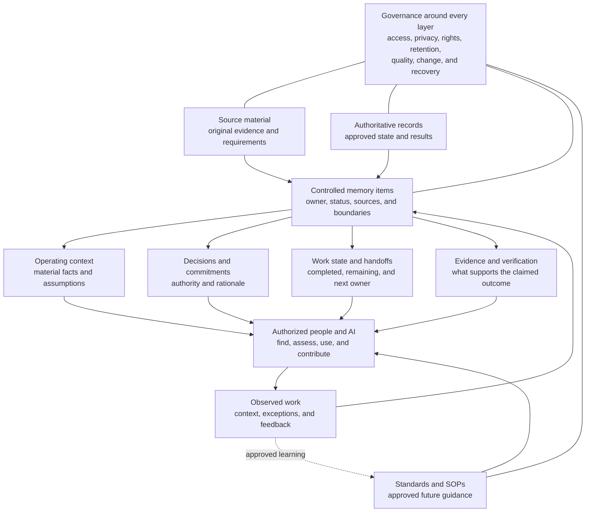
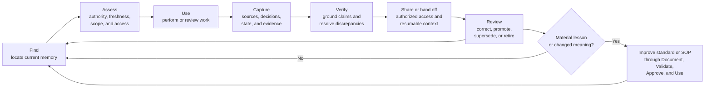

# Shared Operating Memory Standard

**Status:** Approved initial framework baseline 
**Owner:** Brad Groux 
**Effective date:** 2026-07-30 
**Review triggers:** Material framework change, observed continuity failure,
loss or misuse of operating knowledge, repeated unsupported decisions,
privacy or records incident, technology migration, or evidence that people or
AI cannot reliably find and use current operating context

## Purpose

This standard defines the business requirements for preserving and sharing the
operating knowledge that people and AI need to continue, verify, and improve
work over time.

It answers a practical question left unresolved when individual SOPs are
considered alone:

> How does an organization keep the sources, context, decisions, work state,
> evidence, handoffs, and lessons used across many processes durable,
> trustworthy, findable, and appropriately controlled?

The standard governs business meaning and operating quality. It does not
prescribe a technical memory architecture.

## Definition

**Shared operating memory** is the controlled, durable body of sources,
context, decisions, work state, evidence, handoffs, and lessons that allows
authorized people and AI to continue, verify, and improve work over time.

Shared operating memory may be held in one managed repository or distributed
across several systems. What matters is that participants can determine:

- what exists;
- where the authoritative material resides;
- what it means and covers;
- who owns and may use it;
- how current and trustworthy it is;
- how it relates to the work;
- and what happens when it changes, conflicts, expires, or must be removed.

## Why It Matters

Work becomes fragile when essential context exists only in:

- one person's recollection;
- one AI conversation or temporary model context;
- private messages unavailable to the next participant;
- undocumented assumptions;
- unexplained files;
- summaries with no sources;
- or systems whose authority and retention are unclear.

Clear SOPs reduce that fragility, but SOPs alone do not preserve every source,
decision, active state, handoff, exception, or lesson generated while work is
performed. A shared operating-memory practice provides the continuity around
the SOP.

## Relationship to the Framework

Shared operating memory connects four existing framework concerns. It is not a
seventh concern.

| Framework concern | Operating-memory responsibility |
|---|---|
| Work | Preserve the inputs, decisions, current state, outputs, dependencies, and handoffs needed to perform or resume work. |
| Control | Apply authority, access, privacy, confidentiality, security, rights, retention, stop, and recovery requirements to operating knowledge. |
| Assurance | Ground claims in identifiable sources, preserve required evidence, record verification, and distinguish authoritative results from commentary. |
| Learning | Capture feedback and lessons, review patterns, promote approved improvements, and preserve material change history. |

The eight requirements in the
[SOP content standard](sop-content-standard.md) also remain unchanged. Each SOP
still identifies its own sources, recorded state, handoffs, controls, evidence,
and maintenance. This standard supplies shared rules for managing those
materials across processes.

## Scope

This standard applies to operating knowledge needed across time, participants,
or handoffs, including:

- source material used to understand or govern work;
- interpretations and syntheses of that material;
- business context and material facts;
- decisions, approvals, commitments, and their authority;
- active work state and resumable handoffs;
- verification and completion evidence;
- exceptions, incidents, corrections, and recovery records;
- standards, SOPs, policies, and supporting guidance;
- and lessons that may improve future work.

It applies whether the participants are people, AI, or both.

Operational data is part of shared operating memory when its context,
authority, state, or evidentiary meaning must persist for later work. This
standard does not require copying all business data into a memory repository.
An authoritative system may retain the data while operating memory preserves
the controlled reference and the meaning needed to use it correctly.

## Boundaries and Non-Goals

Shared operating memory does not replace:

- an authoritative system of record;
- records-management or legal-hold obligations;
- data governance;
- privacy, confidentiality, security, or access-control programs;
- professional or regulatory recordkeeping;
- business continuity and disaster recovery;
- or accountable human judgment.

It coordinates how operating knowledge is understood and used alongside those
authorities.

The framework does not require:

- one repository;
- one folder structure or naming convention;
- Markdown or any other file format;
- Git or another version-control system;
- a knowledge graph, database, search engine, vector store, or retrieval
  method;
- a separate memory store for AI;
- automated ingestion or summarization;
- or a machine-specific schema or representation.

## Shared Operating Memory View

The diagram shows logical relationships, not required systems or a mandatory
flow. One artifact may serve several roles, and one role may be supplied by
several controlled systems.

## Operating Memory Classes

Classifying material by its business role helps readers judge how it may be
used. Organizations may use different labels or combine classes when meaning
remains clear.

### Source Material

Original or directly obtained material used to ground work.

Examples include policies, contracts, meeting records, submitted forms,
exports, observations, research, correspondence, and externally issued
requirements.

Keep sources intact when required for evidence or provenance. A source may be
authoritative for one matter and irrelevant or non-authoritative for another.

### Synthesis

A summary, explanation, comparison, index, or analysis derived from sources.

A synthesis improves understanding and recall but does not silently replace its
sources. It identifies material sources, its author or responsible maintainer,
its scope, its as-of date, and meaningful uncertainty.

### Operating Context

Durable facts, assumptions, constraints, relationships, definitions, and
background needed to understand or continue work.

Context distinguishes current facts from historical facts, assumptions,
proposals, and unresolved questions.

### Decision or Commitment

A material choice, approval, rejection, authorization, obligation, or accepted
risk.

The memory identifies the decision, deciding authority, date, scope, rationale,
conditions, dissent when material, and resulting action. A note about a
decision is not proof that the author had authority to make it.

### Work State and Handoff

The information required for another authorized participant to continue,
review, receive, or recover work.

It records what is complete, what remains, the current owner, next action,
dependencies, decisions, risks, exceptions, evidence, and where current
materials reside.

### Evidence and Authoritative Record

Material retained to support a business claim, verification, obligation, or
official state.

The organization identifies which system or record is authoritative. Copies,
indexes, links, and summaries remain subordinate unless the responsible
authority designates otherwise.

### Standard, SOP, or Approved Guidance

Approved future-facing direction for how work is governed or performed.

Lessons, working notes, or observed practice do not silently become an approved
standard. Promotion requires the appropriate documentation, validation, and
approval.

### Learning and Change History

Feedback, patterns, exceptions, incidents, review results, corrections, and
material changes used to improve future operation.

Learning records why guidance changed or why it remained unchanged when the
decision is material.

## Memory Authority

Storage does not create authority. Search ranking, recency, confident wording,
AI generation, repeated copying, or inclusion in a shared repository also do
not create authority.

An organization makes the authority of memory understandable:

- governing law, policy, contracts, and professional requirements govern the
  matters within their scope;
- designated systems of record govern the official state assigned to them;
- approved decisions govern only within the deciding authority's scope;
- approved standards and SOPs govern future work within their scope;
- source material supports the claims it can actually evidence;
- synthesis explains sources but does not override them;
- indexes and links help locate material but do not replace it;
- and working notes, conversation history, personal recollection, and model
  memory remain provisional until captured and verified appropriately.

The framework does not impose one universal precedence order because domains
assign authority differently. The operating-memory practice identifies the
responsible authority and the conflict path.

## Minimum Business Meaning of a Durable Memory Item

A durable memory item communicates enough meaning for an authorized reader to
judge and use it correctly. Proportionately, that includes:

- a clear subject or title;
- purpose and scope;
- content class or intended use;
- accountable owner or maintainer;
- author or contributing source when relevant;
- creation, effective, observation, or as-of date;
- current status, approval, and authority;
- material sources and provenance;
- facts, decisions, assumptions, uncertainty, and unresolved questions kept
  distinguishable;
- sensitivity, access, rights, retention, or handling requirements;
- affected work, related records, and superseded material;
- next action, recipient, or handoff state when work continues;
- review trigger or expected freshness;
- and material change history.

These are content expectations, not mandatory fields, front matter, headings,
or a machine schema. A low-risk item may communicate them in a few sentences.
A high-impact record may require a controlled form and several approvals.

## What Deserves Durable Capture

Capture information when losing it would foreseeably cause a participant to:

- repeat material investigation;
- act without a governing source;
- misunderstand current state or scope;
- miss a decision, approval, commitment, dependency, or deadline;
- lose required evidence;
- repeat an exception, incident, defect, or failed workaround;
- hand off incomplete or unsafe work;
- rely on superseded guidance;
- or fail to improve a standard from meaningful experience.

Common capture triggers include:

- receipt of a new authoritative source;
- a material change in business state;
- an accountable decision or approval;
- a commitment to another party;
- completion, verification, or acceptance of work;
- transfer of responsibility;
- interruption requiring later resumption;
- an exception, incident, correction, or recovery;
- a changed requirement, authority, control, or risk;
- and a repeated lesson that may belong in an SOP or standard.

Do not preserve material merely because storage is available. Avoid:

- trivial activity logs with no future operating value;
- unnecessary duplication;
- unsupported speculation presented as fact;
- unreviewed AI output presented as authoritative;
- secrets or sensitive data without an authorized need and control;
- personal information beyond the legitimate business purpose;
- material the organization lacks the right to retain or share;
- and context whose retention creates more risk than value.

## Participant Use Protocol

People and AI follow the same business protocol. An organization may integrate
these expectations into existing work rather than create a separate sequence.
The same protocol does not grant identical access or authority. Each participant
acts only within the permissions and responsibilities assigned to its role.

### Before Work

1. Locate the current standard, relevant context, authoritative sources,
   decisions, and active handoff.
2. Confirm scope, status, owner, access, freshness, and authority.
3. Resolve or escalate material conflicts, missing context, or inaccessible
   sources.
4. For high-impact work, inspect the source or authoritative record rather than
   relying only on synthesis.

### During Work

1. Preserve material sources and source references.
2. Record decisions, approvals, assumptions, exceptions, and changed state at
   the point needed for reliable continuity.
3. Keep fact, inference, proposal, and uncertainty distinguishable.
4. Maintain the state another participant would need after interruption.
5. Apply access, privacy, rights, security, and retention requirements before
   capturing or sharing material.

### Before Handoff or Completion

1. Update the authoritative work state and related durable context.
2. Verify material claims against their sources.
3. Record completed and remaining work, ownership, dependencies, risks, and
   next action.
4. Confirm the recipient can locate and is authorized to use the material.
5. Preserve the identifiable version and required evidence.
6. Route lessons or repeated problems to the responsible standard or SOP
   maintainer.

## Operating Memory Loop

The loop emphasizes continuity and feedback. It does not require every memory
item to move through identical states or systems.

## Handoff Standard

A handoff carries enough context for an authorized recipient to act without
reconstructing the work from chat history or guessing what the sender meant.

Proportionately, it communicates:

- the outcome and scope;
- current state and as-of time;
- completed work and verification;
- remaining work and next action;
- current owner, recipient, and relevant authority;
- decisions, approvals, and commitments;
- source and evidence locations;
- dependencies, risks, exceptions, and stop conditions;
- sensitive handling or access requirements;
- unresolved questions and their owners;
- and the condition that constitutes acceptance of the handoff.

A link alone is not a complete handoff when the recipient cannot determine why
it matters, what changed, or what they are expected to do.

## Provenance, Confidence, and Uncertainty

Memory is trustworthy when its claims can be evaluated.

- Identify the source close enough to the claim for a reader to verify it.
- Preserve dates and scope for time-sensitive information.
- Distinguish direct observation from inference or summary.
- Describe confidence only when its basis is understandable.
- Mark unknown, disputed, or unresolved matters explicitly.
- Do not treat repetition across derivative notes as independent confirmation.
- Re-verify stale or high-impact claims before relying on them.
- Preserve material corrections so later readers do not repeat the error.

An AI-generated synthesis identifies its sources and remains unverified until
the required responsible participant reviews it. Human authorship alone does
not remove the need for sources or review.

## Organization, Findability, and Recall

Participants need a reliable way to discover relevant memory.

The organization:

- identifies the current entry point or index;
- uses stable, understandable names and relationships;
- separates or labels current, historical, draft, and superseded material;
- avoids uncontrolled duplicate sources of truth;
- links synthesis to sources and operating context to governing standards;
- provides search or navigation proportionate to the volume;
- makes access failures visible rather than silently omitting material;
- and maintains references when locations or technologies change.

Recall is not merely retrieving a result. The participant must be able to judge
whether the result is relevant, current, authoritative, complete enough, and
permitted for the intended use.

## Access, Privacy, Security, Rights, and Retention

Shared does not mean public or available to every participant.

The operating-memory practice defines:

- who may create, read, change, approve, share, archive, and dispose of each
  material class;
- how least privilege and separation of duty apply;
- which information must not enter a general memory location;
- how personal, confidential, proprietary, privileged, security-sensitive, or
  safety-sensitive information is minimized and protected;
- how source rights, licenses, permissions, and contractual restrictions are
  preserved;
- applicable retention, deletion, legal-hold, and disposition authority;
- how exports, copies, links, summaries, logs, and backups inherit controls;
- and what must happen when access or disclosure is incorrect.

Do not store credentials or secret values in operating notes. Refer to an
approved secret-management location when a procedure needs to identify where
authorized credentials are obtained.

Deleting a visible item may not delete its copies, history, backups, or
derivative summaries. The accountable privacy, security, legal, or records
authority determines the required containment and disposition.

## Verification, Conflict, and Correction

The operating-memory practice defines how participants:

- verify material claims;
- compare a synthesis with its source;
- detect stale, contradictory, incomplete, duplicated, or inaccessible memory;
- identify the authority responsible for resolving a conflict;
- contain harmful or materially incorrect guidance;
- correct the current item and affected derivatives;
- communicate a correction to affected participants;
- and preserve the reason and evidence for material corrections.

When two sources conflict, do not silently select the more convenient or recent
one. Record the conflict, stop dependent work when consequence requires it, and
route the issue to the authority responsible for the disputed meaning.

## Supersession, Retention, and Disposal

Current guidance must be distinguishable from history.

The organization:

- identifies the current approved version;
- marks or removes obsolete entry points;
- links superseded material to its replacement when retained;
- preserves material decision and change history;
- reviews memory whose value or accuracy decays with time;
- archives material only when it remains findable under appropriate controls;
- and disposes of material only under assigned authority and applicable
  retention, privacy, legal, contractual, and evidentiary requirements.

Archiving is not a substitute for a retention decision. Retention is not a
reason to present obsolete guidance as current.

## Promotion Into Standards and SOPs

A useful lesson becomes organizational learning only when it affects future
operation appropriately.

Promote a memory item into a standard, SOP, policy, checklist, training
material, or decision record when:

- the issue recurs or has material consequence;
- current guidance is missing, wrong, or ambiguous;
- a workaround has become common;
- an exception reveals a control or authority gap;
- evidence shows the expected outcome is not being produced;
- or a changed requirement alters how work should operate.

Promotion follows the
[standards maintenance method](standards-maintenance-method.md). Observation,
popularity, or successful use in one instance does not silently authorize a
new standard.

## AI Participation

AI may, within approved access and responsibility:

- search and retrieve operating memory;
- compare sources and versions;
- summarize or index material;
- draft context, decision, handoff, or review records;
- identify missing sources, uncertainty, conflicts, or stale references;
- suggest related memory and possible lessons;
- and help check consistency across affected documents.

AI does not:

- become the accountable owner or records authority;
- create business authority by recording a statement;
- invent missing facts, decisions, provenance, approval, or confidence;
- treat its own prior output as an independent source;
- promote a working note into approved guidance without authority;
- change, disclose, retain, or delete controlled information outside granted
  authority;
- or represent retrieval or fluent synthesis as verification.

The responsible human owner remains accountable for business authority,
control, and approval.

## Resilience and Recovery

Operating memory must remain usable through foreseeable failure.

Proportionate controls address:

- accidental edit or deletion;
- unavailable repositories or source systems;
- broken links and moved materials;
- conflicting concurrent changes;
- incomplete synchronization;
- corruption or loss;
- unauthorized change;
- technology migration;
- and loss of the person who maintained the context.

Recovery identifies:

- the last trustworthy state;
- who may restore it;
- how integrity and access are verified;
- how work performed during the interruption is reconciled;
- how affected participants are notified;
- and what incident or review record must be retained.

Version history can support recovery, but recovery also depends on identity,
access, backup, review, and restoration controls.

## Proportionality

A small, low-risk team may satisfy this standard with a short shared index,
controlled documents, explicit source links, and a simple handoff practice.

A large, high-impact, or regulated organization may distribute operating
memory across systems of record, controlled document repositories, case
systems, evidence stores, and records archives with formal classification,
approval, retention, legal hold, audit, and recovery.

The required business meaning remains recognizable even when implementation
depth differs.

## Review Checklist

### Scope and Ownership

- [ ] The organization knows which operating knowledge requires durable
      capture.
- [ ] Accountable ownership, maintainers, contributors, recipients, and control
      authorities are clear.
- [ ] The practice identifies what existing systems remain authoritative.

### Sources and Trust

- [ ] Material claims can be traced to identifiable sources.
- [ ] Fact, synthesis, decision, assumption, uncertainty, and working context
      are distinguishable.
- [ ] Status, approval, authority, scope, and freshness can be judged.
- [ ] Conflicts and corrections have accountable paths.

### Work and Handoffs

- [ ] Participants can find the current standard, context, decisions, state,
      and evidence needed for their work.
- [ ] Interrupted work can resume from recorded state.
- [ ] Handoffs identify completed and remaining work, owners, next actions,
      sources, risks, and acceptance.
- [ ] Lessons can reach responsible SOP and standard maintainers.

### Controls

- [ ] Access, privacy, confidentiality, security, rights, retention, deletion,
      and recovery requirements are explicit.
- [ ] Secrets and unnecessary sensitive information are excluded.
- [ ] Copies, summaries, exports, history, links, logs, and backups receive
      appropriate controls.
- [ ] AI participation remains within approved access and authority.

### Maintenance and Resilience

- [ ] Current, draft, historical, and superseded material are distinguishable.
- [ ] Reviews address stale, duplicated, broken, or unused memory.
- [ ] Material can be restored and reconciled after foreseeable failure.
- [ ] Technology or location changes preserve meaning, authority, provenance,
      access, and change history.

## Common Failure Modes

- **Capture everything:** Volume grows while useful context becomes harder to
  find and control.
- **Chat as the record:** Material decisions and state remain trapped in
  conversation history.
- **Storage as authority:** A note is treated as true or approved merely because
  it is shared or searchable.
- **Summary without sources:** Readers cannot verify claims or distinguish
  synthesis from evidence.
- **Link-only handoff:** The recipient receives locations but no state, meaning,
  risk, or requested action.
- **Memory without ownership:** No one corrects, reviews, supersedes, or retires
  it.
- **Hidden uncertainty:** Assumptions or inference appear as fact.
- **Unreviewed AI promotion:** Generated content becomes operating guidance
  without accountable review.
- **Uncontrolled duplication:** Several copies appear authoritative and drift
  apart.
- **Permanent working notes:** Temporary context is retained indefinitely
  without value, rights, privacy, or retention review.
- **Archive as disposal:** Material is moved but remains uncontrolled and
  indefinitely retained.
- **Tool dependence:** Participants know how to operate a repository but not
  what the memory means or which record governs.
- **Learning that never returns:** Lessons are captured but never influence
  standards, SOPs, controls, or decisions.

## Applying the Standard

An organization can apply this standard by:

1. identifying the operating knowledge its work depends on;
2. locating current repositories, systems of record, informal channels, and
   continuity gaps;
3. assigning ownership and authority;
4. documenting proportionate capture, source, handoff, access, retention,
   correction, and recovery practices;
5. validating normal use, handoffs, conflicts, loss, correction, and migration;
6. approving the practice through existing governance;
7. using it across relevant processes;
8. and improving it from retrieval failures, incidents, stale context,
   repeated questions, and operating outcomes.

The practice may be one SOP or several linked standards integrated into
existing knowledge, records, project, case, or process management.

## Related Documents

- [Charter](charter.md)
- [Operating framework](operating-framework.md)
- [SOP content standard](sop-content-standard.md)
- [Standards maintenance method](standards-maintenance-method.md)
- [Glossary](glossary.md)
- [Shared operating memory decision](../decisions/0007-shared-operating-memory.md)
- [Shared operating memory example](../examples/11-shared-operating-memory-capture-and-handoff.md)
- [Illustrative operational file structures](../examples/shared-operating-memory-file-structures.md)
