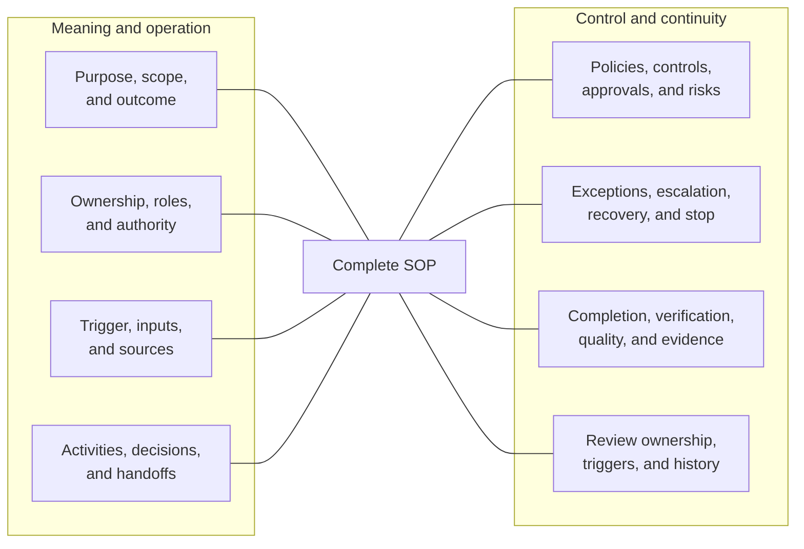
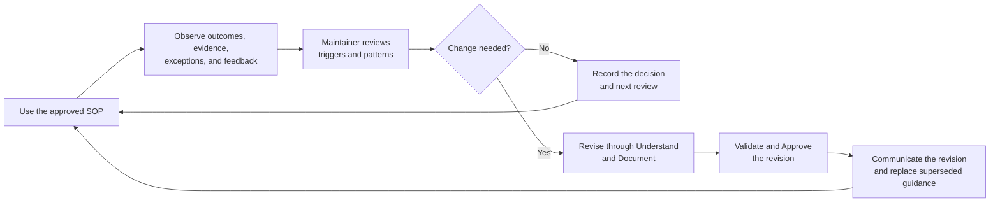

# Standard Operating Procedure Content Standard

**Status:** Approved initial framework baseline 
**Owner:** Brad Groux 
**Date:** 2026-07-30

## Purpose

This standard defines the minimum business information an SOP must communicate
under the AI-Native Operating Framework.

It governs content, not layout. An organization may use any structure, language,
medium, or supporting materials appropriate to the work as long as the required
business meaning is clear.

## Relationship to the Framework

The [operating framework](operating-framework.md) defines six business concerns:
Intent, Responsibility, Work, Control, Assurance, and Learning.

An SOP applies those concerns to a particular recurring business process or
activity. The eight content requirements below ensure that the SOP contains
enough information to guide, control, verify, and improve the work.

The [shared operating memory standard](shared-operating-memory-standard.md)
defines how sources, context, decisions, work state, evidence, handoffs, and
lessons remain durable and governed across processes. It does not add another
SOP content requirement.

## Core Rule

An SOP satisfies this content standard when a responsible reader can determine:

1. why the procedure exists and what it should accomplish;
2. who owns, performs, decides, approves, and receives the work;
3. what starts the work and which inputs or sources govern it;
4. how the work proceeds and what it produces;
5. which policies, controls, approvals, and risks apply;
6. what happens when normal work cannot continue;
7. how completion and correctness are verified;
8. and who keeps the procedure current.

Matching headings are not required. Clear business meaning is.

## SOP Anatomy at a Glance

The eight areas describe required meaning, not required headings or document
order.

## The Eight Content Requirements

### 1. Purpose, Scope, and Expected Outcome

The SOP makes clear:

- why the procedure exists;
- the business need it serves;
- what work is inside its scope;
- what related work is outside its scope;
- the expected outcome;
- and the governing requirements that materially shape the procedure.

The purpose should describe a business outcome, not merely the production of a
document or completion of activity.

### 2. Ownership, Participation, Responsibility, and Authority

The SOP makes clear:

- the accountable owner;
- the people, teams, and AI that may participate;
- each participant's responsibilities;
- who may make decisions;
- who may grant approvals;
- any separation-of-duty requirements;
- who receives the output;
- and where unresolved questions or conflicts escalate.

The SOP must not use AI participation to obscure accountable human ownership.
One person may hold several roles in a small organization when the work and its
controls permit it.

### 3. Trigger, Prerequisites, Inputs, and Authoritative Sources

The SOP makes clear:

- the event, request, schedule, condition, or decision that starts the work;
- conditions that must be true before work begins;
- required inputs;
- acceptable input quality;
- authoritative sources of facts, policy, or status;
- where those sources can be found and how their authority, scope, freshness,
  and access can be judged;
- and how missing, conflicting, outdated, or inaccessible inputs are handled.

A reader should not have to guess whether a chat, spreadsheet, application,
policy, record, or verbal instruction is authoritative.

### 4. Activities, Decisions, Dependencies, Handoffs, and Outputs

The SOP makes clear:

- the activities required to perform the work;
- material decision points and their criteria;
- dependencies on other work, roles, or organizations;
- handoffs and the information they must carry;
- expected outputs;
- where material context, decisions, outputs, and current work state are
  recorded;
- and how interrupted work can be resumed.

The procedure should be detailed enough to perform consistently without
documenting obvious actions that add no business meaning.

### 5. Policies, Controls, Approvals, and Risks

The SOP makes clear:

- applicable policies, commitments, laws, regulations, or professional
  requirements;
- required controls and why they matter;
- approval thresholds and authorities;
- known risks and required treatment;
- privacy, confidentiality, safety, security, information-sharing, source-rights,
  access, or retention requirements;
- and actions participants are not authorized to take.

Controls should be proportionate. A low-risk internal routine may need few
controls; safety-critical, regulated, financial, or high-impact work may need
substantially more.

### 6. Exceptions, Escalation, Recovery, and Stop Conditions

The SOP makes clear:

- expected exceptions;
- who may resolve each exception;
- when escalation is required;
- where escalation goes;
- conditions that require work to pause or stop;
- how failed or incomplete work is contained;
- how work is retried, reversed, restored, or resumed when appropriate;
- and what must be communicated or recorded.

An SOP that describes only the happy path is incomplete.

### 7. Completion, Verification, Quality, and Evidence

The SOP makes clear:

- what complete means;
- the expected quality of the outcome;
- required checks or reviews;
- who verifies completion;
- evidence that must be retained;
- the sources and provenance needed to support material claims;
- where the authoritative result is recorded;
- how discrepancies are handled;
- and when the output may be handed off or relied upon.

Evidence should support the business claim being made. Evidence that an activity
occurred does not necessarily prove that the intended outcome was achieved.

### 8. Review Ownership, Review Triggers, and Change History

The SOP makes clear:

- who maintains it;
- its approval status and responsible approver;
- when routine review occurs, if a fixed cadence is useful;
- events that trigger an earlier review;
- how practitioner feedback is considered;
- how material lessons and corrections enter shared operating memory;
- how revisions are approved and communicated;
- and how material change history is preserved.

Review triggers may include policy changes, incidents, repeated exceptions,
changed responsibilities, audit findings, business changes, or evidence that
the procedure no longer produces the expected outcome.

## SOP Feedback Loop

This loop makes feedback consequential. The SOP identifies who receives
feedback and evidence, what triggers review, how a change is approved, and how
the approved revision returns to use. The organization may choose feedback
channels appropriate to the work; the required outcome is a recorded and
accountable response rather than collection without action.

## Shared Operating Memory Across SOPs

Every SOP communicates the operating-memory meaning specific to its work:

- which sources and current records govern;
- which context, decisions, state, evidence, and exceptions require durable
  capture;
- where authorized participants find and update them;
- what a handoff must carry;
- which access, privacy, rights, retention, and recovery controls apply;
- and what learning should reach the SOP maintainer.

An organization may define repeated practices once in a shared operating-memory
SOP or equivalent controlled standard. Individual SOPs may reference that
practice, but the reference must still make the process-specific sources,
records, evidence, state, and handoffs identifiable.

A repository location, application name, or link does not supply missing
business meaning. A reader must be able to judge what the material is, whether
it is current and authoritative, how it may be used, and who owns it.

## Flexible Structure

Organizations may:

- combine related content;
- rename sections using established domain language;
- place detail in referenced policies, forms, checklists, maps, or role
  descriptions;
- use narrative, tables, diagrams, checklists, or combinations of them;
- and scale the depth of documentation to the work.

Referenced material must be identifiable and accessible to the people and AI
expected to perform or review the work. A reference cannot compensate for a
missing decision about ownership, authority, control, or completion.

## Proportionality

The standard applies proportionately.

A simple, low-risk procedure may satisfy all eight requirements in one page. A
complex or regulated process may require multiple linked documents and formal
review. The required business meaning remains the same even when the amount of
documentation differs.

Proportionality should consider:

- consequence of error;
- reversibility;
- legal, regulatory, contractual, privacy, or safety exposure;
- number of participants and handoffs;
- frequency and variability of the work;
- complexity of decisions;
- and reliance placed on the outcome.

## Documentation Quality

An SOP should:

- use direct, specific language;
- define unfamiliar or overloaded terms;
- identify owners and authorities by role rather than ambiguous groups;
- distinguish requirements from recommendations;
- separate facts, assumptions, and unresolved questions;
- identify authoritative sources;
- preserve meaningful exceptions and uncertainty;
- avoid unexplained acronyms and tool jargon;
- and remain understandable without an oral briefing.

These qualities benefit people and machines together. They do not require a
parallel machine-specific representation.

## Review Checklist

### Content Review

- [ ] Purpose, scope, expected outcome, and governing requirements are clear.
- [ ] Accountable ownership, participants, responsibilities, and authority are
      clear.
- [ ] Trigger, prerequisites, inputs, and authoritative sources are clear.
- [ ] Activities, decisions, dependencies, handoffs, outputs, and resumable
      state are clear.
- [ ] Policies, controls, approvals, and risks are clear and proportionate.
- [ ] Exceptions, escalation, stop conditions, and recovery are clear.
- [ ] Completion, verification, quality, and evidence are clear.
- [ ] Maintenance ownership, review triggers, approval, and change history are
      clear.
- [ ] Durable context, decisions, state, evidence, handoffs, and lessons use
      the organization's shared operating-memory practice proportionately.

### Normal-Work Review

- [ ] A qualified participant can recognize when the procedure should begin.
- [ ] Required inputs and authoritative sources can be located.
- [ ] Responsibilities and decisions are unambiguous.
- [ ] Handoffs carry enough information for the next participant to continue.
- [ ] Material work state can be resumed without relying on private
      recollection or conversation history.
- [ ] The expected output and evidence can be produced.

### Exception Review

- [ ] Missing, invalid, conflicting, or outdated inputs have a defined treatment.
- [ ] Common exceptions identify permitted resolution and escalation authority.
- [ ] Unavailable approvers or dependent parties do not create silent workarounds.
- [ ] Time limits, thresholds, and unresolved disagreements have a defined path.
- [ ] Work outside authority or policy stops or escalates.

### Failure and Recovery Review

- [ ] Harmful, unsafe, unlawful, or materially incorrect work can be stopped.
- [ ] Failed or partial work can be identified and contained.
- [ ] Retry, reversal, restoration, or resumption is described where applicable.
- [ ] Required notifications and evidence are preserved.
- [ ] The incident or failure can trigger review of the SOP.

## Common Failure Modes

- **Template compliance without clarity:** All headings exist, but ownership,
  authority, or completion remains ambiguous.
- **Happy-path documentation:** Normal steps are detailed while exceptions and
  recovery are absent.
- **Activity as outcome:** The SOP treats sending, reviewing, or recording
  something as proof that the business objective was achieved.
- **Hidden authority:** Participants are expected to infer who may decide,
  approve, or override.
- **Unbounded AI participation:** AI is allowed to act without the same business
  authority and control applied to other participants.
- **Stale references:** Linked policies, forms, roles, or systems no longer
  match the procedure.
- **Uncaptured continuity:** Material decisions or work state exist only in a
  participant's recollection or conversation history.
- **Storage as authority:** A shared or searchable item is treated as approved
  without sources, status, scope, or responsible authority.
- **Ownerless maintenance:** No one is responsible for reviewing evidence and
  updating the standard.

## Limits

Meeting this content standard does not prove that an SOP is lawful, safe,
effective, or professionally appropriate. Accountable owners must apply relevant
domain expertise, organizational policy, legal obligations, and professional
standards.

## Related Documents

- [Charter](charter.md)
- [Operating framework](operating-framework.md)
- [Shared operating memory standard](shared-operating-memory-standard.md)
- [Standards maintenance method](standards-maintenance-method.md)
- [Framework examples](../examples/README.md)
- [SOP for contributing framework examples](../examples/CONTRIBUTING.md)
- [Approved glossary](glossary.md)
- [SOP content decision](../decisions/0005-sop-content-standard.md)
