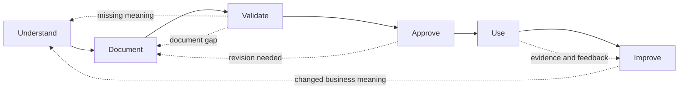

# Standards Maintenance Method

**Status:** Approved initial framework baseline 
**Owner:** Brad Groux 
**Date:** 2026-07-30

## Purpose

This method explains how an organization creates, approves, uses, reviews, and
improves business standards and SOPs under the AI-Native Operating Framework.

It contains six activities:

1. Understand
2. Document
3. Validate
4. Approve
5. Use
6. Improve

These activities maintain operating standards. They are not a lifecycle imposed
on the business processes being documented.

## Method at a Glance

The main path shows the practical progression toward an operating standard.
Dotted paths show deliberate return when evidence exposes a gap. They do not
turn the method into a lifecycle for the business process itself.

## Principles

### Start with actual work

Standards should reflect business purpose, governing requirements, and how work
is truly performed. Existing documents are evidence, not automatic truth.

### Resolve business meaning before polishing documents

Missing ownership, unclear authority, contradictory requirements, or undefined
completion cannot be repaired through formatting.

### Involve the people responsible for the work

Process owners, practitioners, recipients, approvers, and control owners hold
different knowledge. Useful standards incorporate the perspectives needed for
the work.

### Examine more than the happy path

Normal work, meaningful exceptions, and credible failure or recovery scenarios
must be considered.

### Approve through existing business governance

The method should fit the organization's existing authority and management
practices. It does not create a parallel bureaucracy.

### Treat use as part of the method

A standard is not finished merely because it was written and approved. It must
be available, understood, and used in the work it governs.

### Improve from evidence

Outcomes, exceptions, incidents, feedback, and changed requirements should lead
to deliberate review and revision.

### Preserve shared operating memory

Material sources, context, decisions, work state, evidence, handoffs, and
lessons should remain available under accountable controls. The method should
not depend on individual recollection or temporary conversation history.

## Roles

Organizations may combine roles when scale, risk, and separation-of-duty needs
allow.

### Accountable owner

Owns the business outcome and remains answerable for the operating standard.

### Standards author or facilitator

Gathers information, resolves documentation gaps with responsible participants,
and prepares the standard or SOP.

### Practitioners

Perform or support the work and contribute knowledge about normal operation,
exceptions, dependencies, and practical constraints.

### Control or policy authorities

Confirm that relevant legal, regulatory, contractual, safety, privacy, security,
financial, or organizational requirements are represented appropriately.

### Approver

Has authority to approve the standard for use. The accountable owner may also be
the approver.

### Maintainer

Monitors review triggers, coordinates revisions, preserves change history, and
keeps the approved standard and its material operating context accessible.

## Activity 1 — Understand

### Objective

Establish an accurate understanding of why the work exists, how it operates,
who owns it, and what governs it.

### Actions

- identify the accountable owner;
- clarify the purpose, scope, and expected outcome;
- observe or reconstruct the actual work;
- identify participants, decisions, approvals, and handoffs;
- gather existing SOPs, policies, forms, records, reports, and evidence;
- locate relevant shared operating memory, including active context, prior
  decisions, exceptions, and lessons;
- identify authoritative sources;
- compare documented work with actual practice;
- identify controls, risks, exceptions, incidents, and recovery needs;
- and record contradictions, assumptions, and unresolved questions.

People and AI may assist with collecting, organizing, comparing, or summarizing
information. Responsible people resolve business meaning and authority.

### Ready to Continue When

- the accountable owner is known;
- the business outcome and scope are clear enough to document;
- relevant practitioners and authorities have been identified;
- material sources and requirements are available or their absence is recorded;
- and unresolved questions have owners rather than being silently guessed.

### Output

A grounded understanding of the process and a visible list of gaps requiring
resolution.

## Activity 2 — Document

### Objective

Express the approved understanding as a clear business standard or SOP.

### Actions

- choose a structure appropriate to the domain and readers;
- address all eight areas in the
  [SOP content standard](sop-content-standard.md);
- use the six framework concerns to check completeness;
- use established business language and define ambiguous terms;
- identify ownership and authority explicitly;
- distinguish required actions from guidance;
- link supporting policies, forms, checklists, or records;
- identify which sources, context, decisions, state, evidence, handoffs, and
  lessons require durable capture;
- describe exceptions, escalation, stop conditions, and recovery;
- define completion, verification, and evidence;
- and state maintenance ownership and review triggers.

### Ready to Continue When

- all eight content requirements are present;
- unresolved business decisions are visible;
- referenced material is identifiable;
- and the draft is complete enough to walk through realistic scenarios.

### Output

A reviewable draft standard or SOP.

## Activity 3 — Validate

### Objective

Determine whether the draft accurately and clearly represents the work,
including conditions outside normal operation.

Validation here means business review of the draft. It is not a technology test
or a claim that the framework itself has been proven.

### Participants

Include the accountable owner and enough practitioners, recipients, approvers,
or control authorities to represent the process proportionately.

### Normal Scenarios

Walk through:

- a typical trigger and valid inputs;
- each material activity and decision;
- expected handoffs;
- required approvals;
- completion, verification, and evidence;
- whether participants can find, assess, update, and hand off the required
  operating memory;
- and the final authoritative record or output.

### Exception Scenarios

Walk through examples such as:

- missing, incomplete, conflicting, or outdated inputs;
- unclear decision criteria;
- unavailable participants or approvers;
- rejected handoffs;
- threshold or timing breaches;
- policy exceptions;
- and disagreement about authority or completion.

### Failure and Recovery Scenarios

Walk through credible cases involving:

- unsafe, unlawful, unauthorized, or materially incorrect work;
- failed or partial completion;
- loss of required evidence;
- unavailable, stale, conflicting, or incorrect operating memory;
- interruption and resumption;
- reversal, restoration, retry, or rollback where applicable;
- required notification;
- and incidents that should trigger process review.

### Ready to Continue When

- participants agree the draft describes the intended business operation;
- material ambiguities and contradictions are resolved or explicitly deferred;
- normal, exception, and failure paths are understandable;
- controls and evidence are proportionate;
- and remaining limitations are visible to the approver.

### Output

A reviewed draft and a record of issues resolved, deferred, or rejected.

## Activity 4 — Approve

### Objective

Authorize the standard or SOP for business use.

### Actions

- confirm the accountable owner;
- confirm required business, policy, control, or professional reviews occurred;
- review unresolved limitations and accepted risks;
- confirm the approval authority;
- identify the approved version and effective date;
- establish maintenance ownership and review triggers;
- record the decision and its authority in shared operating memory;
- and communicate any implementation or transition conditions.

Approval should reflect the consequence of the work. A routine internal
procedure may need one owner; higher-risk or regulated work may require several
authorities.

### Ready to Continue When

- the responsible authority has approved the standard;
- the effective version is identifiable;
- ownership and review triggers are assigned;
- and conditions for use are clear.

### Output

An approved business standard or SOP.

## Activity 5 — Use

### Objective

Make the approved standard part of actual business operation.

### Actions

- make the current approved standard accessible;
- communicate material changes;
- provide necessary orientation or training;
- retire or clearly supersede outdated versions;
- ensure required supporting material is available;
- perform work according to the standard;
- preserve required evidence;
- capture material decisions, work state, handoffs, exceptions, and lessons
  under the shared operating-memory practice;
- and provide a clear path for questions, exceptions, and feedback.

People and AI use the same approved business documentation. Tool-specific
instructions may appear when required by the organization's current procedure,
but they do not become framework requirements.

### Ready to Continue When

- intended participants can find and understand the approved standard;
- outdated instructions are not presented as current;
- work can be performed with the required controls and evidence;
- and feedback or exception paths are available.

### Output

An operating standard that guides real work.

## Activity 6 — Improve

### Objective

Keep the standard accurate, useful, and aligned with business needs.

### Review Inputs

Consider:

- business outcomes;
- verification results and retained evidence;
- recurring questions or workarounds;
- retrieval failures, stale context, unsupported summaries, and incomplete
  handoffs;
- exceptions and escalations;
- incidents, defects, complaints, or audit findings;
- practitioner and recipient feedback;
- changed responsibilities or authorities;
- changed policies, laws, contracts, risks, or business conditions;
- and evidence that the procedure no longer produces the expected outcome.

### Actions

- determine whether change is required;
- reopen Understand when the underlying business meaning has changed;
- update the draft through Document;
- repeat proportionate Validate and Approve activities;
- communicate the revision;
- update affected shared operating memory and correct superseded entry points;
- preserve material change history;
- and retire superseded instructions.

### Complete When

- evidence and feedback have been considered;
- necessary changes are approved and in use;
- unchanged decisions have a recorded rationale when material;
- and the next review responsibility or trigger remains clear.

### Output

An improved standard and preserved organizational learning.

## Iteration

The six activities are ordered for clarity, but they are not rigid gates.

- Document may reveal that more understanding is required.
- Validate may expose missing authority, controls, or business decisions.
- Approve may return the draft for revision.
- Use may reveal practical constraints not found during review.
- Improve may reopen any earlier activity.

The organization should return to the activity needed to resolve the issue
rather than forcing incomplete work forward.

## Proportionality

The method scales with the work.

For a low-risk routine, one person may understand, document, validate, approve,
and maintain a short SOP with a lightweight peer review.

For high-impact or regulated work, the same method may involve several
practitioners, formal control review, scenario workshops, documented approvals,
training, and scheduled reassessment.

The method remains recognizable even when the depth and number of participants
change.

## Method Review Checklist

### Understand

- [ ] The accountable owner, purpose, scope, and expected outcome are clear.
- [ ] Actual work and existing documentation were examined.
- [ ] Relevant operating memory, prior decisions, exceptions, and lessons were
      examined.
- [ ] Authorities, sources, requirements, risks, exceptions, and gaps are known.

### Document

- [ ] All eight SOP content requirements are addressed.
- [ ] The language and structure fit the business domain.
- [ ] Authority, controls, exceptions, completion, and maintenance are explicit.
- [ ] Required durable context, state, evidence, handoffs, and lessons are
      identifiable.

### Validate

- [ ] Relevant owners, practitioners, recipients, and control authorities
      participated proportionately.
- [ ] Normal work was walked through.
- [ ] Meaningful exceptions were walked through.
- [ ] Credible failure and recovery scenarios were walked through.
- [ ] Required operating memory can be found, assessed, handed off, and
      recovered.
- [ ] Ambiguities, contradictions, and limitations are visible.

### Approve

- [ ] The responsible authority approved an identifiable version.
- [ ] Accepted limitations and risks are known.
- [ ] Effective date, maintenance owner, and review triggers are set.

### Use

- [ ] Intended participants can access and understand the current standard.
- [ ] Superseded instructions are retired or clearly marked.
- [ ] Required evidence, feedback, and exception paths are available.
- [ ] Material decisions, current state, handoffs, and lessons enter shared
      operating memory.

### Improve

- [ ] Outcomes, evidence, exceptions, incidents, and feedback are reviewed.
- [ ] Necessary revisions repeat proportionate documentation, validation, and
      approval.
- [ ] Material change history and future review ownership are preserved.

## Common Failure Modes

- Writing an idealized process without understanding actual work.
- Treating existing documentation as unquestionable truth.
- Asking practitioners for steps while excluding accountable owners or control
  authorities.
- Polishing language before resolving ownership, authority, or completion.
- Validating only the normal path.
- Approving a document without assigning maintenance.
- Publishing a standard without retiring outdated instructions.
- Preserving the SOP while losing the sources, decisions, state, or evidence
  needed to use it.
- Collecting feedback without making or explaining decisions.
- Allowing unapproved workarounds to become the real process.

## Related Documents

- [Charter](charter.md)
- [Operating framework](operating-framework.md)
- [SOP content standard](sop-content-standard.md)
- [Shared operating memory standard](shared-operating-memory-standard.md)
- [Framework examples](../examples/README.md)
- [SOP for contributing framework examples](../examples/CONTRIBUTING.md)
- [Approved glossary](glossary.md)
- [Standards maintenance decision](../decisions/0006-standards-maintenance-method.md)
